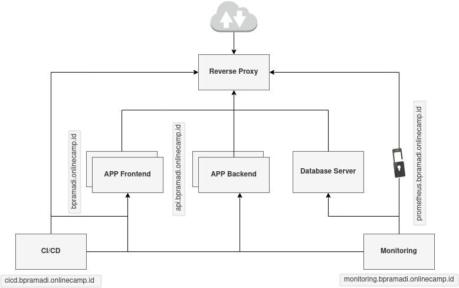

# Final Task

Melakukan pembuatan infrastucture

  

# Kebutuhan

Adapun rinciannya sebagai berikut :

- OS : Linux Ubuntu 20.04 LTS
- Docker
- Databases : PostgreSQL
- VMs : Multipass
- CI/CD : Jenkins
- Webserver : Nginx
- Monitoring : Prometheus, Node exporter, Grafana
- Tools : Ansible

# Penyelesaian

- [Repository](repository.md)
- [Server](server.md)
- [user](user.md)
- [SSH](ssh.md)
- [Database](database.md)
- [Web Server](webserver.md)
- [Deployment](deployment.md)
- [CI-CD](cicd.md)
- [Monitoring](monitoring.md)
- [Auth](auth.md)
