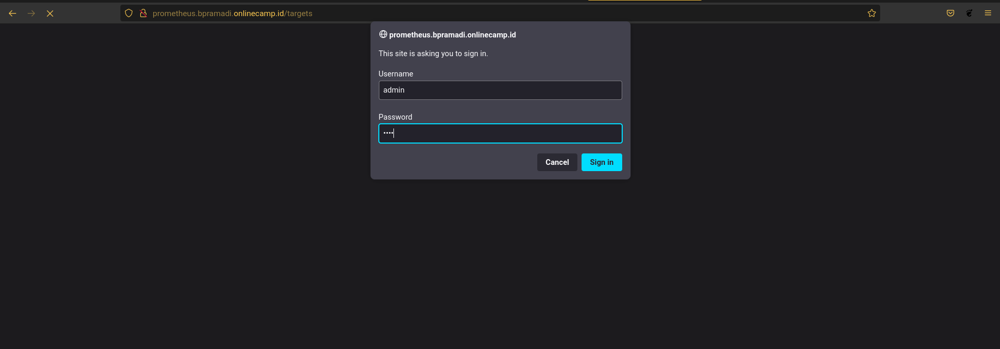

# Auth 

### Auth Prometheus
1. Install apache2-utils ``sudo apt install apache2-utils``
2. Buat direktori untuk menyimpan file password yang dibuat. Lalu buat password untuk user admin 
   
   

3. Menambahkan script untuk autentication di file prometheus

   
  
4. Test konfig ``sudo nginx -t`` dan restart nginx `` sudo systemctl restart nginx``
   
5. Buka prometheus website

    

### Auth Grafana
1. Login ke website monitoring
2. Buka Configuration - Data Source
3. Edit Promtheus data source
4. Pada bagian Auth, enable ``Basic Auth``
5. Input User dan password prometheus auth
6. Save & Test
