# CI/CD Jenkins

### Install Jenkins Docker

- Buat file docker-compose untuk instalasi jenkins didalam direktory `docker-files`
  
```
version: '3.9'
services:
  jenkins:
    image: jenkins/jenkins:lts
    ports:
      - 8080:8080
      - 50000:50000
    privileged: true
    user: root
    container_name: jenkins
    volumes:
      - ~jenkins:/var/jenkins_home
      - /var/run/docker.sock:/var/run/docker.sock
      - /usr/local/bin/docker:/usr/local/bin/docker   
```
- Kemudian buat file ansible-playbook yang berisi perintah untuk instalasi jenkins pada server cicd
```
- name: Setup CI/CD Jenkins Docker
  hosts: app
  become: true
  tasks:
    - name: Copy docker compose
      copy:
        src: docker-files/docker-compose-jenkins.yml 
        dest: /home/adi/jenkins/

    - name: Run docker compose
      shell:
        cmd: "docker-compose -f docker-compose-jenkins.yml up -d"
        chdir: /home/adi/jenkins/

```

   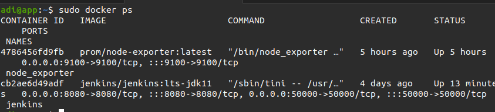 

### Setup Jenkins
1. Install plugin publish over ssh dan slack notification (optional)
 
   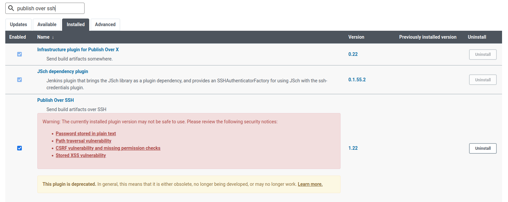

2. Setup Publish over ssh

   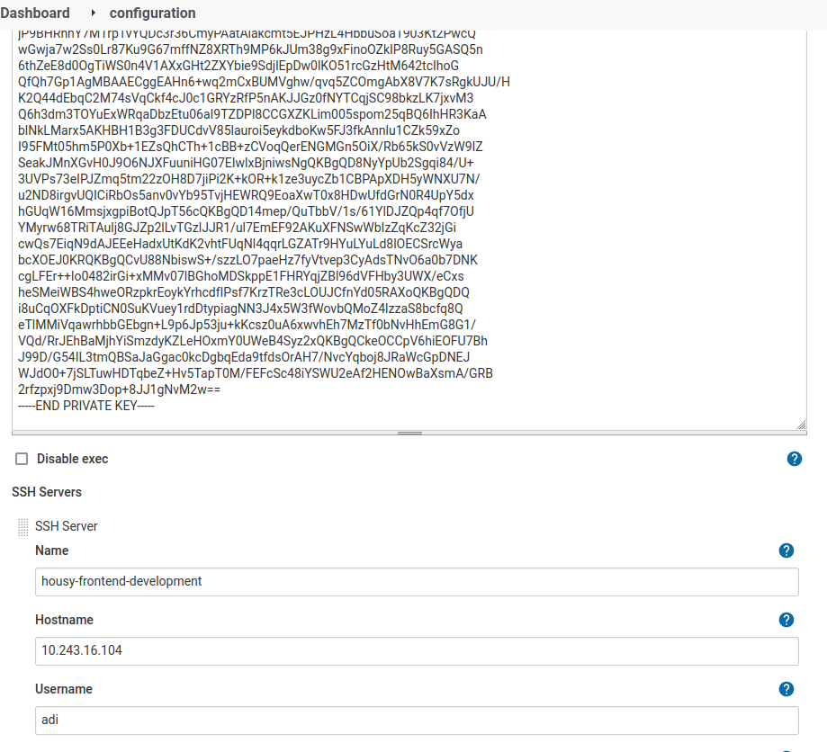

3. Membuat Credentials
   
   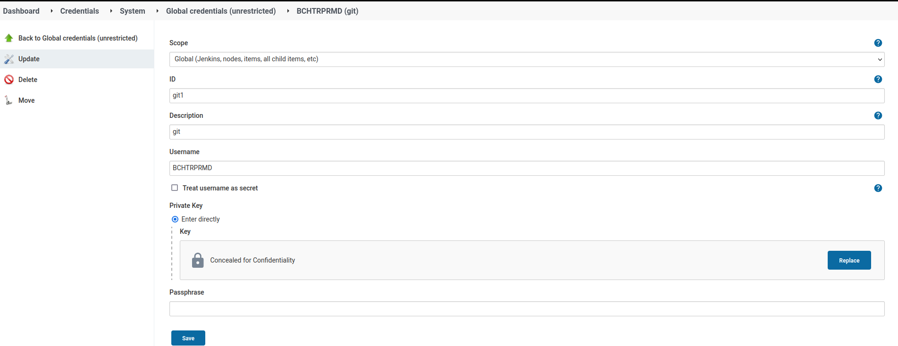

### Setup jenkins job frontend
1. Buat freestyle project
2. Configure, setup source code management

   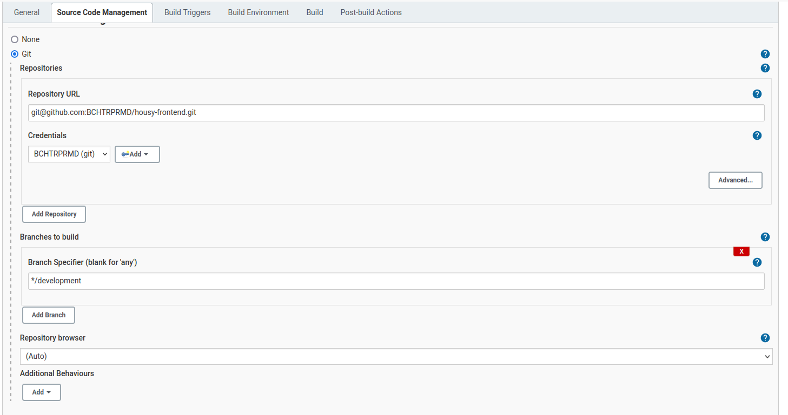

3. Setup build triggers

   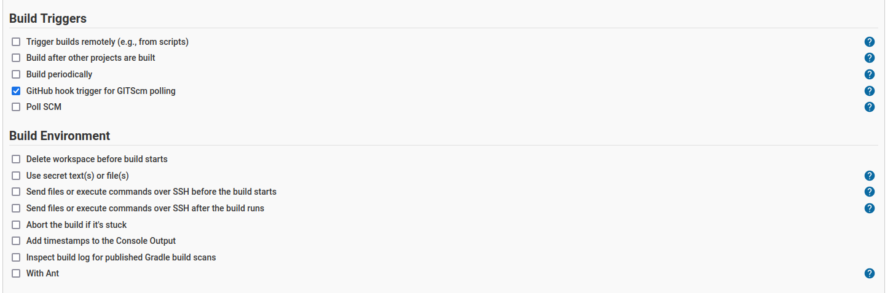

4. Setup build command 

   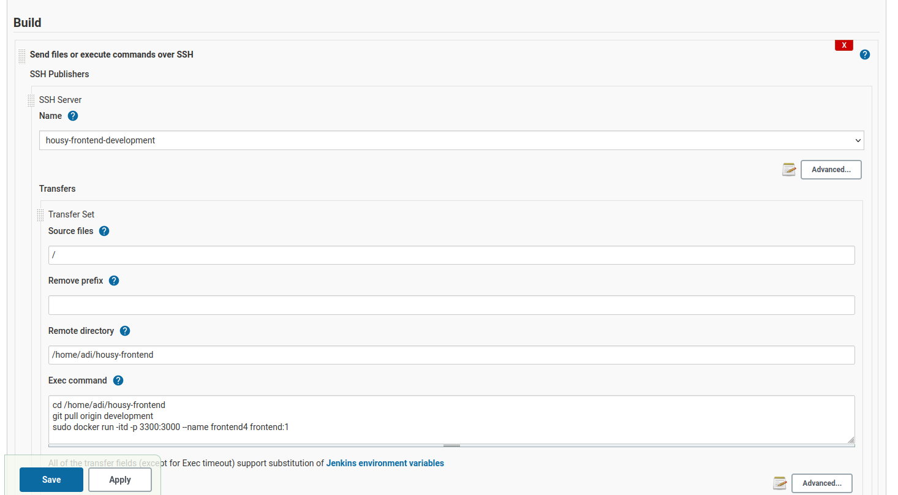

5. Save

6. Test build
    
   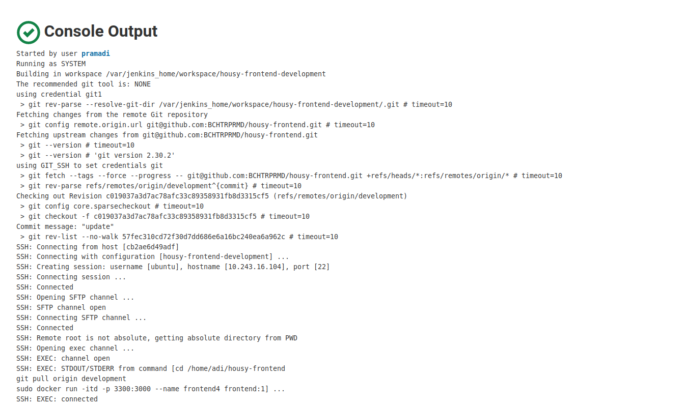


### Setup jenkins job backend
1. Buat freestyle project
2. Configure, setup source code management

3. Setup build triggers

   

4. Setup build command 

   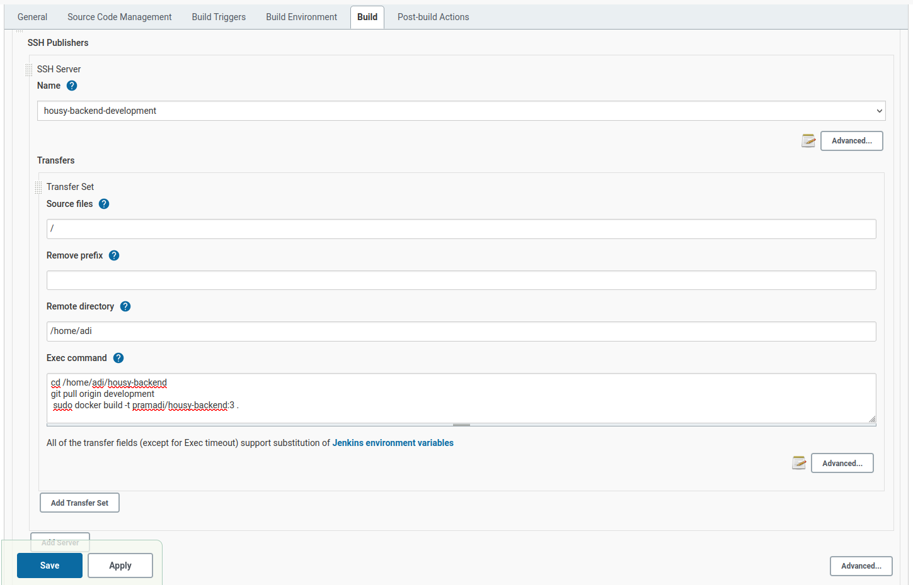

5. Save

6. Test build
    
   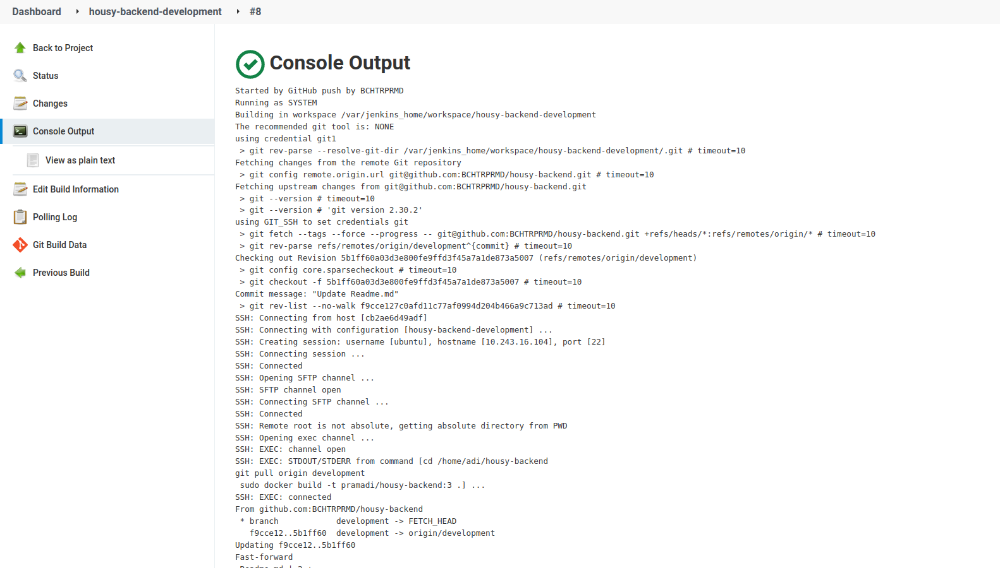


### Setup GitHub Webhook 
1. Generate url menggunakan ngrok `./ngrok http 8080`
2. Melakukan setup configuration jenkins dengan menambahkan url

   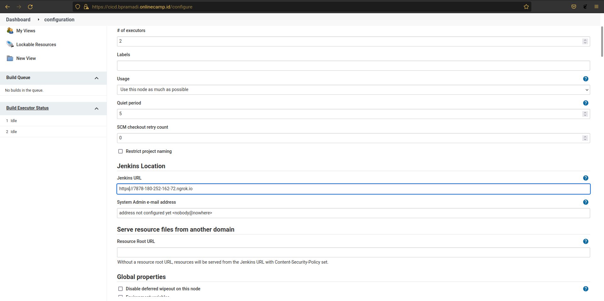

3. Apply & save 

4. Menambahkan menu konfigurasi Github Servers dan `salin url yang ditampilkan`

   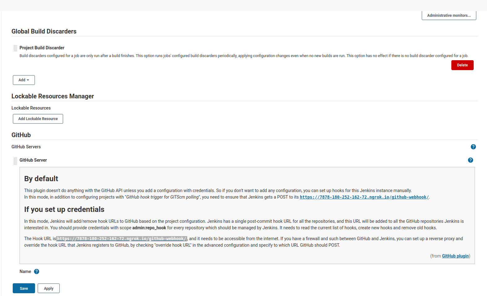

5. Login akun github
6. Membuka repository backend app
7. Settings 
8. Masuk ke Webhook
9. Tambahkan url yang telah disalin sebelumnya di Payload URL

   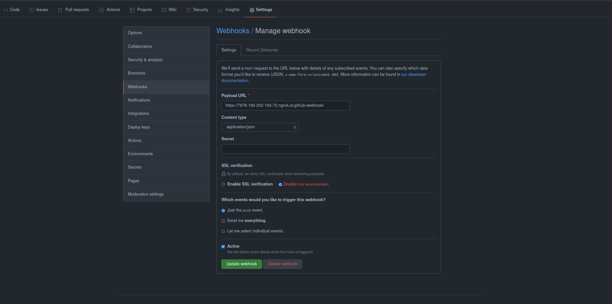

10. Simpan
11. Melakukan hal yang serupa pada repository frontend app
12. Melakukan perubahan pada repository untuk melakukan trigger 
    
    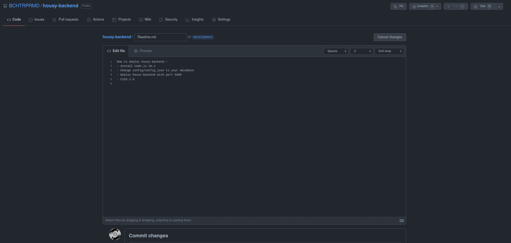
    
    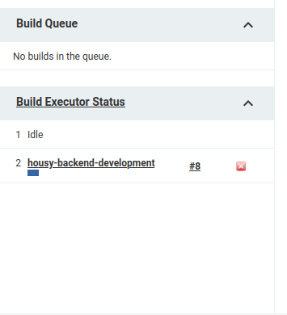
    
    