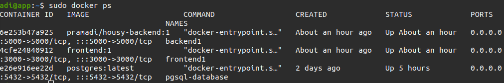
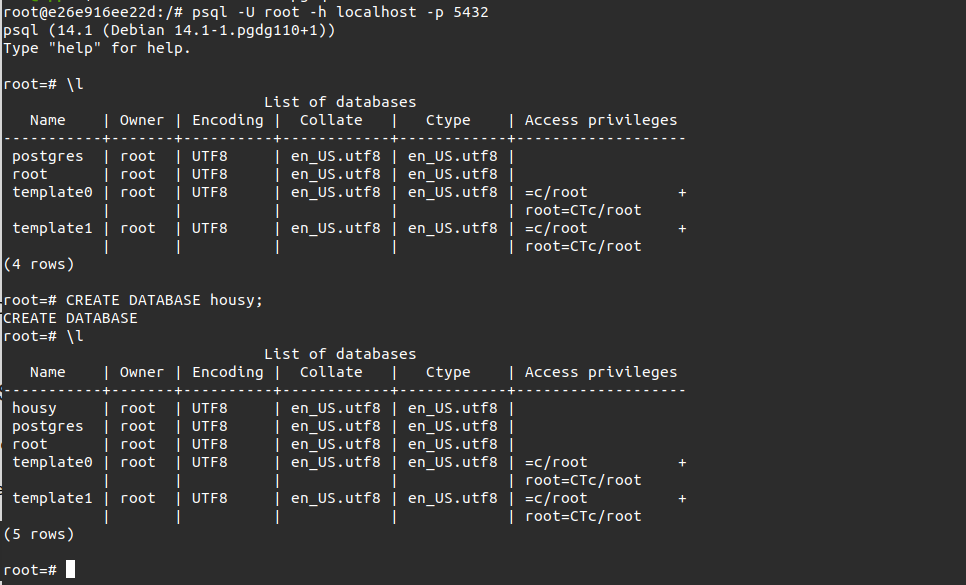

# Setup Database (Docker)
1. Melakukan pemasangan Docker pada server
2. Membuat file ``docker-compose.yml``
   ```
    version: '3.9'
    services:
      postgresql:
        image: postgres:latest
        container_name: pgsql-database
        environment:
          POSTGRES_USER: root
          POSTGRES_PASSWORD: root
        ports:
          - 5432:5432
        volumes:
          - /home/adi/pgsql/data:/var/lib/postgresql/data/

   ```
3. Save dan menjalankan ``docker-compose up -d``
4. Melakukan perintah `sudo docker ps` untuk mengecek container telah berjalan
   
   

### Setup pgsql

1. Membuat database ``housy`` di pgsql
   
   


