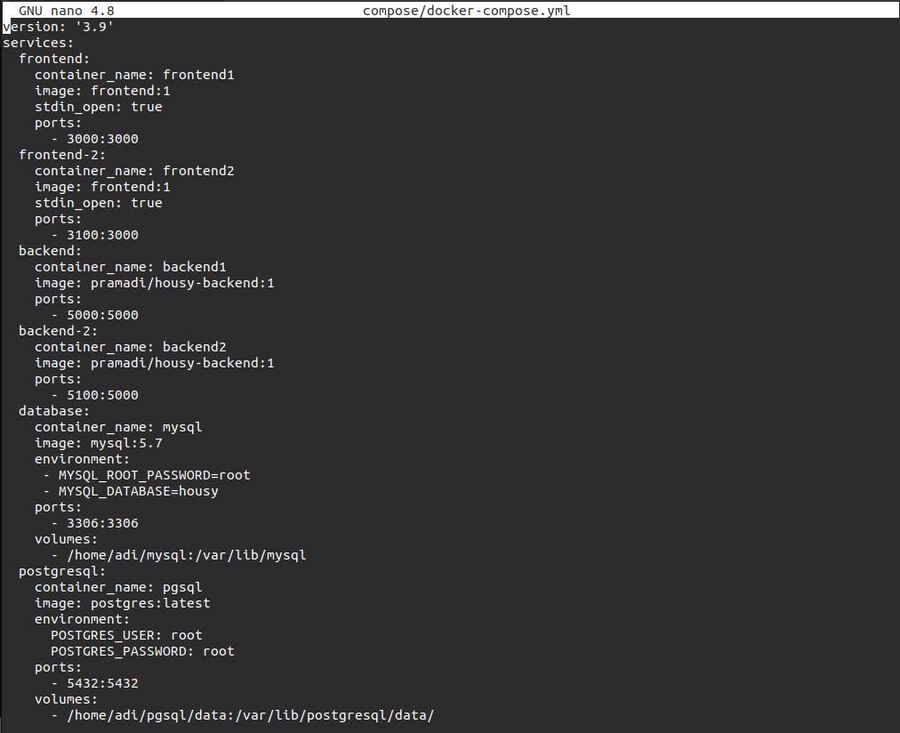
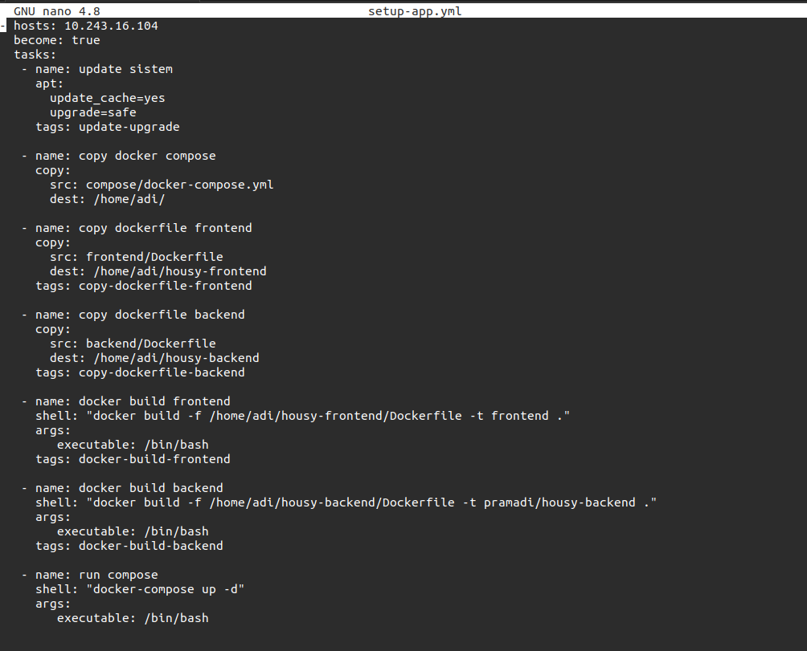
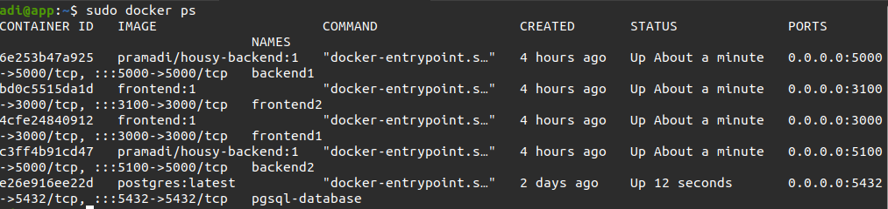
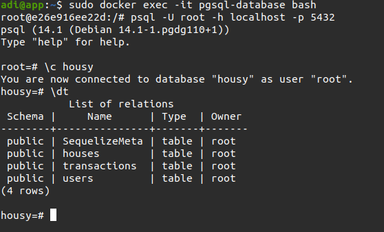
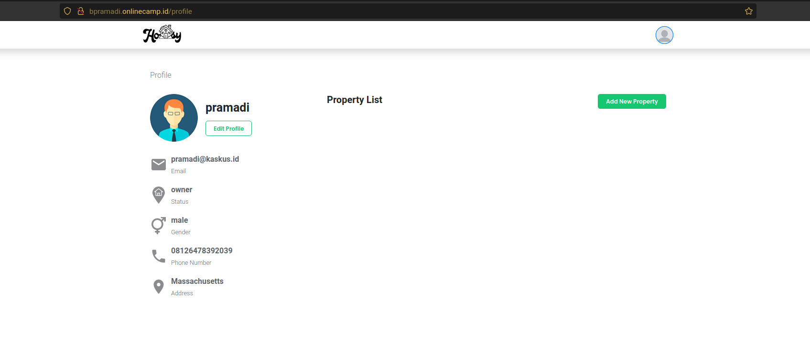
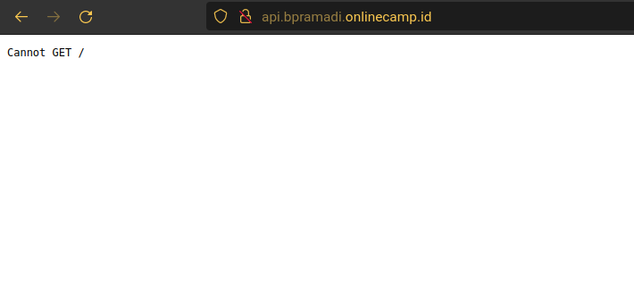

# Deployment

### Clone Repository App
1. Login ssh server app
2. Clone app ``git clone git@github.com:BCHTRPRMD/housy-frontend.git``
3. Clone app ``git clone git@github.com:BCHTRPRMD/housy-backend.git``


### Setup and Deploy App
1. Membuat docker file di dalam folder `frontend`
   
   ```
    FROM node:10
    WORKDIR /app 
    COPY . .
    RUN npm install
    EXPOSE 3000
    CMD ["npm", "start"]

   ``` 
2. Membuat docker file di dalam folder `backend`
   
   ```
    FROM node:10
    WORKDIR /app
    COPY . .

    RUN npm install
    RUN npm install -g sequelize-cli
    RUN npx sequelize db:migrate

    EXPOSE 5000
    CMD ["npm", "start"]
   ``` 
3. Membuat `docker-compose.yml` di dalam folder `compose`
   
   

4. Membuat task untuk setup app di ansible
   
   

5. Menjalankan ansible-playbook `ansible-playbook setup-app.yml`

6. Melakukan perintah `sudo docker ps` untuk mengecek container telah berjalan
   
   

7. Mengakses hasil migrate   
   
   

8. Melakukan akses menuju web browser dengan memasukan domain/ip aplikasi dan melakukan registrasi atau login
   
   

   