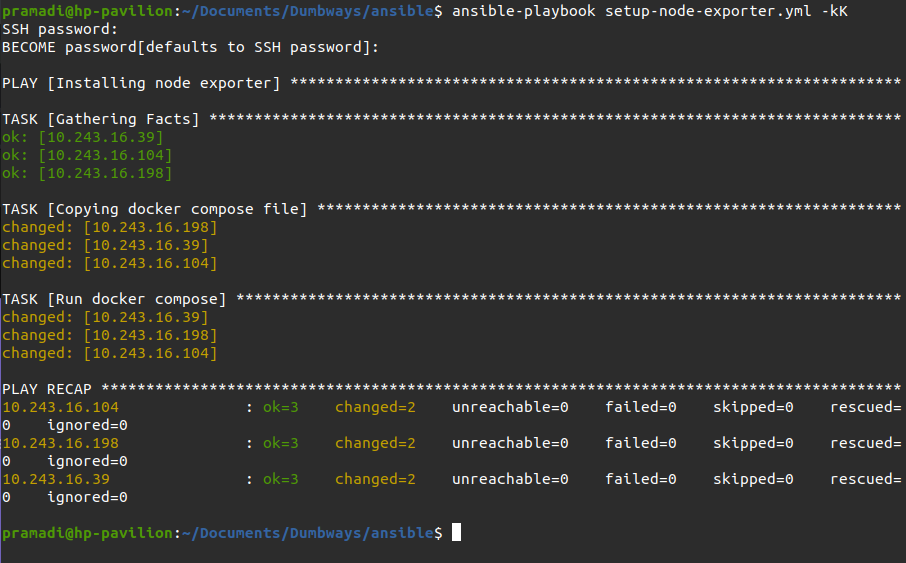
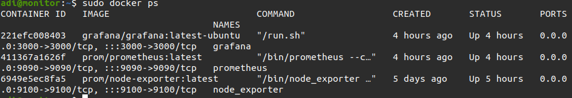
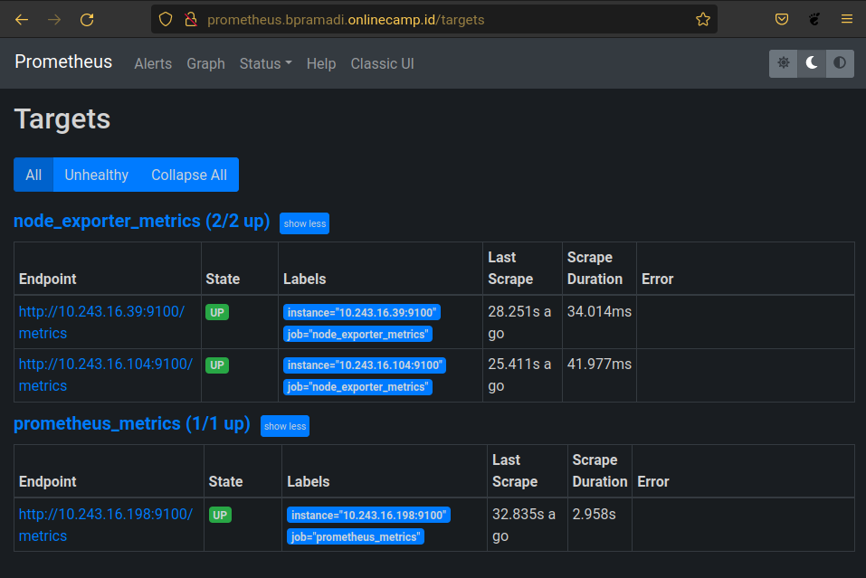
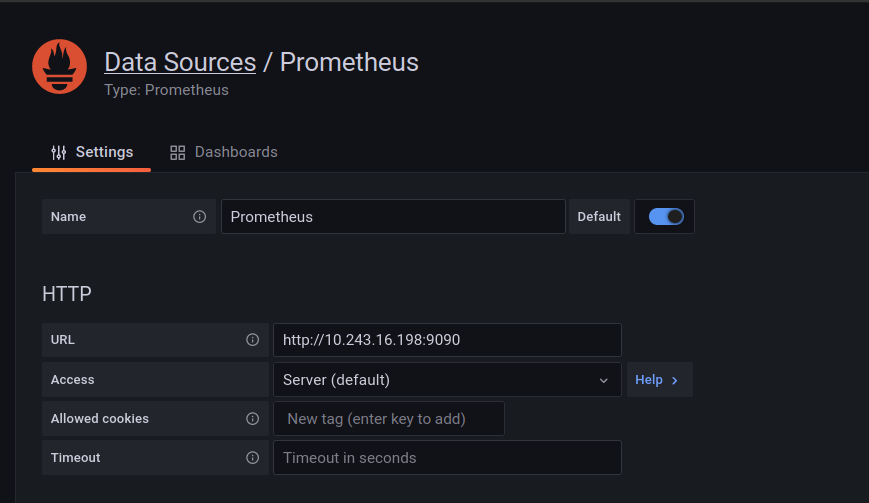
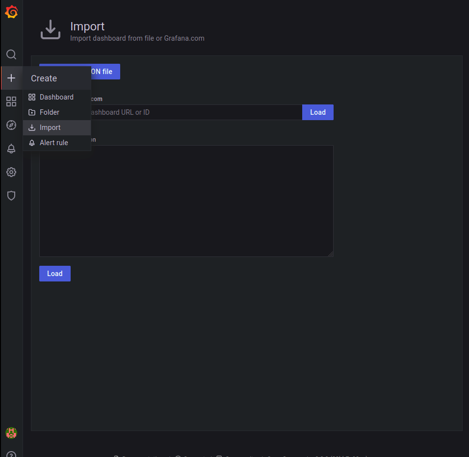
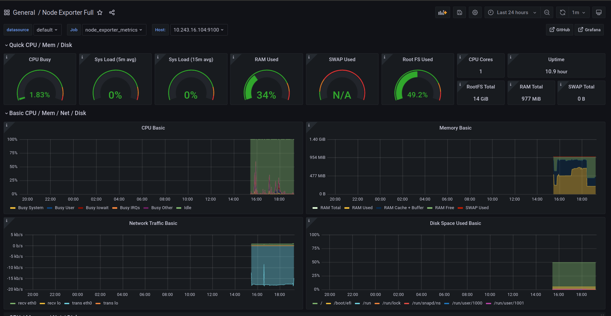

# Monitoring Prometheus - Grafana

### Install Node Exporter

1. Buat docker-compose file
   ```
    version: '3.9'

    services:
      node_exporter:
        image: prom/node-exporter:latest
        container_name: node_exporter
        ports:
          - 9100:9100
        command:
          - '--path.procfs=/host/proc'
          - '--path.rootfs=/rootfs'
          - '--path.sysfs=/host/sys'
          - '--collector.filesystem.mount-points-exclude=^/(sys|proc|dev|host|etc)($$|/)'
        restart: unless-stopped
        volumes:
          - /proc:/host/proc:ro
          - /sys:/host/sys:ro
          - /:/rootfs:ro
   ```
2. Buat yaml file untuk ansible
   ```
      - name: Installing node exporter
        hosts: all
        become: true
        tasks:
          - name: Copying docker compose file
            copy:
                src: docker-files/node-exporter.yml
                dest: /home/adi/docker-node-exporter/

          - name: Run docker compose
            shell:
                cmd: "docker-compose -f node-exporter.yml up -d"
                chdir: /home/adi/docker-node-exporter/
   ```
3. Run ``ansible-paybook docker-node-exporter.yml -kK``

   

### Install Prometheus-Grafana

1. Mengakses server monitoring
2. Membuat file docker compose

   ```
        version: '3.9'
        services:
        prometheus:
        image: prom/prometheus:latest
        container_name: prometheus
        restart: unless-stopped
        volumes:
            - /home/adi/prometheus.yml:/etc/prometheus/prometheus.yml
        command:
            - '--config.file=/etc/prometheus/prometheus.yml'
            - '--storage.tsdb.path=/prometheus'
            - '--web.console.libraries=/etc/prometheus/console_libraries'
            - '--web.console.templates=/etc/prometheus/consoles'
            - '--web.enable-lifecycle'
        ports:
            - 9090:9090

        grafana:
        image: grafana/grafana:latest-ubuntu
        container_name: grafana
        volumes:
            - /home/adi/grafana/data:/var/lib/grafana
        ports:
            - 3000:3000
        user: "1000"
        restart: unless-stopped

   ```
4. Buat file ``prometheus.yml``  untuk setup server yang akan dimonitoring
   
   ```

        global:
        scrape_interval: 10s

        scrape_configs:
        - job_name: 'prometheus_metrics'
        scrape_interval: 10s
        static_configs:
            - targets: ['10.243.16.198:9100']
        - job_name: 'node_exporter_metrics'
        scrape_interval: 5s
        static_configs:
            - targets: ['10.243.16.39:9100','10.243.16.104:9100']
   
   ```
5. Run ``docker-compose up -d``

   

   


### Setup Grafana

1. Login ke Grafana `monitoring.bpramadi.onlinecamp.id`
2. Setup datasource prometheus
3. Masuk ke configuration -> data source
4. Pilih prometheus
   
   

5. Pada menu create pilih import dan salin id dashboard
   
   

6. Pilih dashboard yang sesuai kebutuhan pada https://grafana.com/grafana/dashboards/
7. Kemudian klik load dan import
   
   