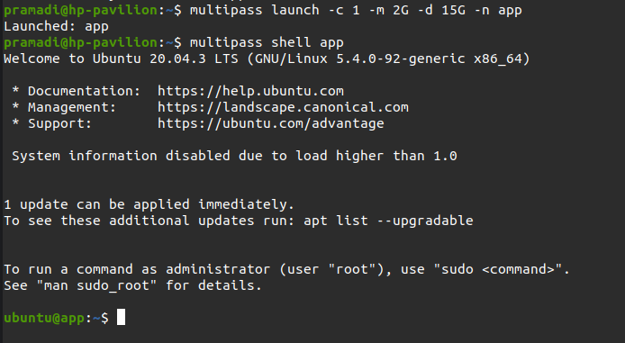
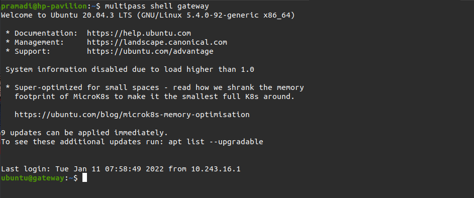
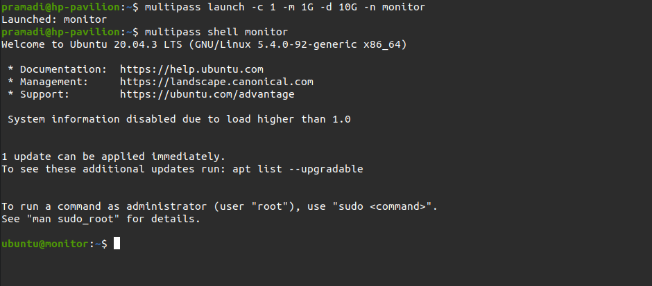
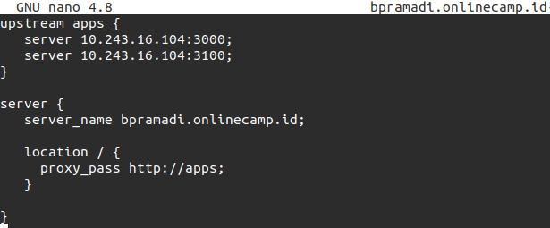
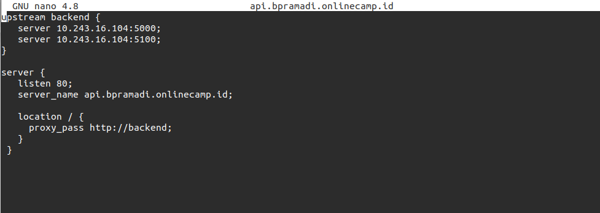

# Server

Membuat instance di Multipass

1. Melakukan pemasangan multipass `sudo snap install multipass`
2. Setup server seperti langkah berikut :

#### Server Apps
1. OS ubuntu 20 
2. Memory 2 Gb
3. Storage 15 Gb

  

#### Server Webserver(Nginx)
1. OS ubuntu 20 
2. Memory 1 Gb
3. Storage 10 Gb
   
  

#### Server Monitoring
1. OS ubuntu 20 
2. Memory 1 Gb
3. Storage 10 Gb
   
  

### Setup Load balance untuk apps frontend dan backend
1. Login Webserver instance
2. Masuk ke /etc/nginx
3. Edit file config app frontend

  

5. Save
6. Edit file config app backend
   
  

7. Save
8. Test config ``sudo nginx -t``

