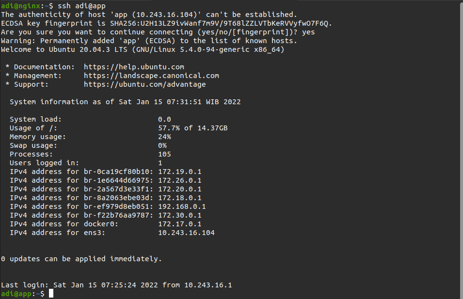
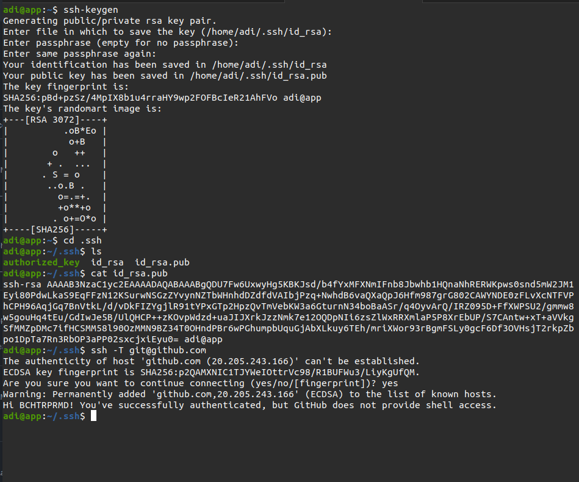
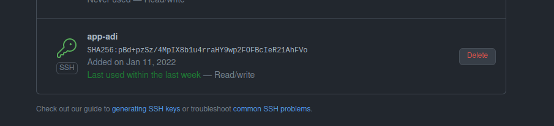

# SSH

### SSH Key for access the server without username & password
1. Generate authorized key
2. ``ssh-keygen``
3. Masuk ke server/instance
4. Buat file dan folder  ``.ssh/authorized_key``
5. Edit ``authorized_keys``, copy paste generated key dari step 2
6. Simpan
7. Mengirimkan folder .ssh menuju server yang dituju `scp -r .ssh adi@ip:/home/adi`
8.  Login ssh ke server `ssh adi@ip/hostname`

### SSH Key for access the git without username & password
1. Generate SSH key `ssh-keygen`
2. Membuka ssh key yang telah di generate `cat id_rsa.pub`
3. Login ke github
4. Tambahkan ssh key yang telah dibuat
5. Kemudian test koneksi ke github

 

 

