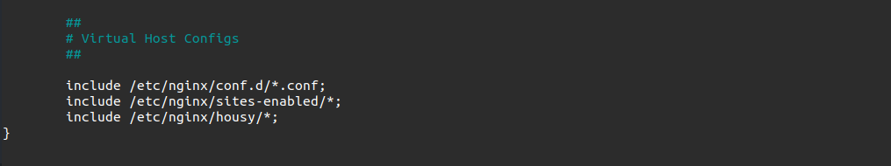

### Setup Nginx Reverse Proxy

1. Login web server, Install nginx.
2. Buat folder config `housy` dan simpan di ``/etc/nginx/``
3. Masuk ke dalam folder config.
4. Buat config frontend ``bpramadi.onlinecamp.id``
   ```
    upstream apps {
      server 10.243.16.104:3000;
      server 10.243.16.104:3100;
    }

    server {
      listen 80;
      server_name bpramadi.onlinecamp.id;

      location / {
        proxy_pass http://apps;
      }
    }

   ```
5. Simpan.
6. Buat config backend ``api.bpramadi.onlinecamp.id``
   ```
    upstream backend {
      server 10.243.16.104:5000;
      server 10.243.16.104:5100;
    }
    server {
      listen 80;
      server_name api.bpramadi.onlinecamp.id;

      location / {
        proxy_pass http://backend;
      }
    }
   ```
7. Simpan.
8.   Buat config monitoring ``monitoring.bpramadi.onlinecamp.id``
     ```
     server {
       listen 80;
       server_name monitoring.bpramadi.onlinecamp.id;
 
       location / {
        proxy_pass http://10.243.16.187:3000;
      }

     }

     ```
9.   Simpan
10.  8.   Buat config prometheus ``prometheus.bpramadi.onlinecamp.id``
     ```
     server {
       listen 80;
       server_name prometheus.bpramadi.onlinecamp.id;
 
       location / {
        proxy_pass http://10.243.16.187:9090;
      }

     }

     ```
11.  Simpan
12.  Buat config jenkins ``cicd.bpramadi.onlinecamp.id``
     ```
     server {
       listen 80;
       server_name prometheus.bpramadi.onlinecamp.id;
 
       location / {
        proxy_pass http://10.243.16.104:8080;
      }

     }

     ```
13.  Simpan
14. Include folder config ke dalam ``nginx.conf``
     
    

15.  Test konfig ``sudo nginx -t``


