# Pemasangan Aplikasi Frontend dan Reverse Proxy

Reverse Proxy merupakan sebuah fitur/modul di dalam sebuah webserver, yang berfungsi untuk melakukan port forwarding suatu request, dari public request menuju ke dalam sistem.

# Pemasangan Aplikasi

- Menjalankan perintah `ssh pramadi@192.168.0.223` dan memasukan password yang telah dibuat pada terminal, untuk masuk ke server

  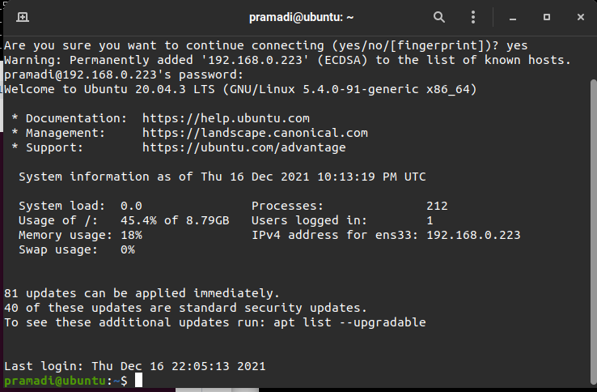

- Menggunakan perintah `git clone https://github.com/sgnd/dumbflix-frontend.git` untuk mengclone aplikasi yang akan digunakan.
- Menjalankan perintah `curl -o- https://raw.githubusercontent.com/nvm-sh/nvm/v0.39.0/install.sh | bash`

  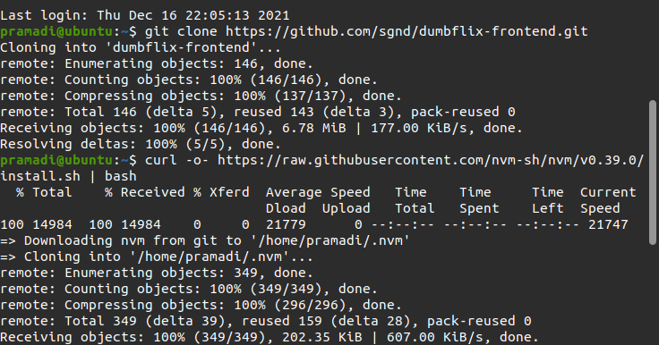

- Menjalankan perintah `exec bash` digunakan apabila nvm tidak terdeteksi
- jika sudah terinstall untuk mengecek lakukan perintah `nvm -v`
- Menjalankan perintah `nvm install 14` untuk pemasangan nodejs versi 14

  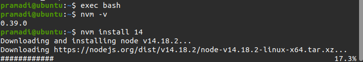

- Menjalankan perintah `node -v` dan `npm -v` untuk mengecek version npm dan node yang telah terpasang
- Menjalankan perintah `cd dumbflix-frontend` untuk masuk ke direktori yang telah di clone
- Menjalankan perintah `npm install`

  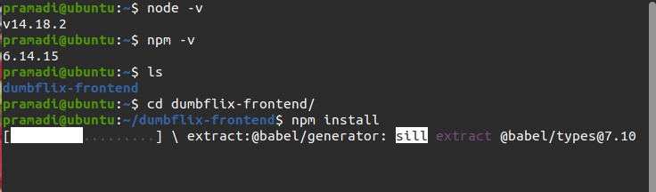

- Menjalankan perintah `npm start`

  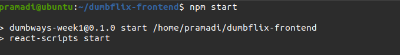

- Mengakses web browser dan memasukan ip dan port aplikasi `192.168.0.223:3000`

  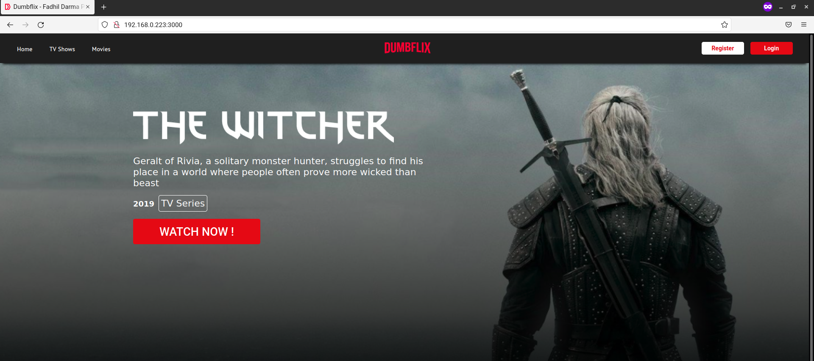

# Reverse Proxy

- Melakukan pemasangan Nginx dengan menjalankan perintah `sudo apt install nginx`
- Menjalankan perintah `sudo systemctl status nginx`

  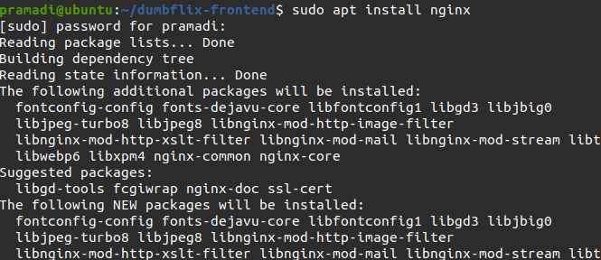

  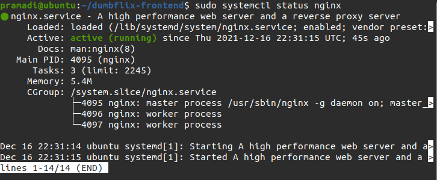

- Menjalankan perintah `cd /etc/nginx` untuk berpindah direktori
- Membuat folder dengan menjalankan perintah `sudo mkdir dumbflix`
- Menjalankan perintah `sudo nano nginx.conf` untuk melakukan penambahan folder yang telah dibuat kedalam `nginx.conf` dengan memasukan `include /etc/nginx/dumbflix/*;` ke dalam file tersebut
- Menjalankan perintah `sudo chown user:user folder` untuk mengganti permission pada folder dari root menjadi user pramadi
- Masuk kedalam direktori dumbflix dan membuat sebuah file yang berisi konfigurasi reverse proxy dengan perintah `sudo nano dumbflix.xyz`

  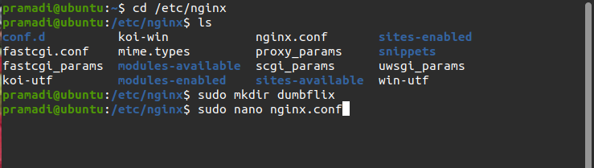

  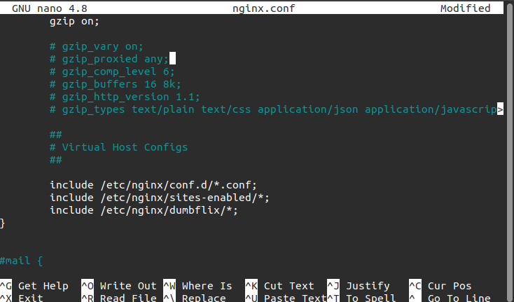

  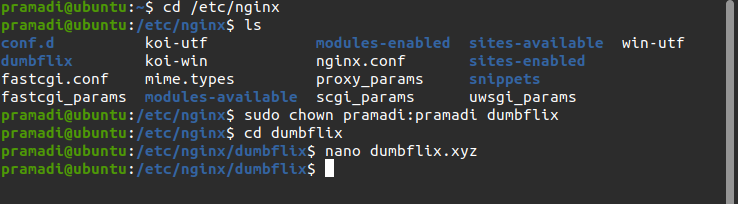

  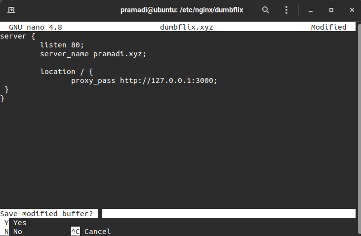

- Apabila konfigurasi telah dibuat klik `ctrl + x` lalu tekan `y` dan `enter`
- Menjalankan perintah `sudo nginx -t` untuk melakukan pengecekan konfigurasi
- Menjalankan perintah `sudo systemctl reload nginx` untuk memuat ulang konfigurasi nginx

  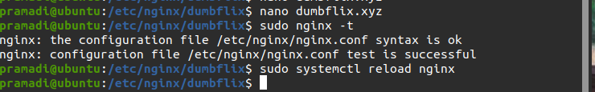

- Membuat virtual host dengan berpindah ke local / komputer dan masuk ke file /etc/hosts dengan menjalankan `sudo nano /etc/hosts` , setelah itu tambahkan `192.168.0.223 pramadi.xyz`

  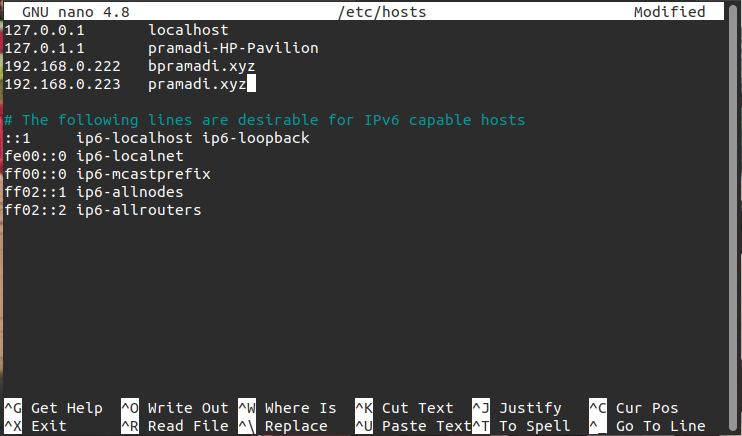

- setelah itu kita coba ping untuk melihat apakah sudah connect atau belum. `ping pramadi.xyz`

  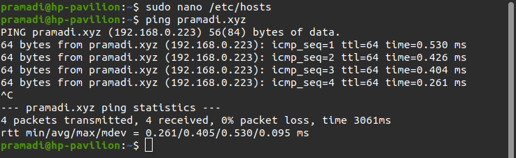

- Selanjutnya kembali server dan masuk ke directory yang telah di clone `cd dumbflix-frontend`
- Menjalankan perintah `npm start`

  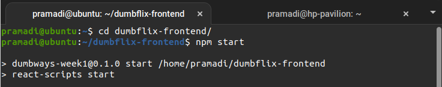

- Mengakses web browser dan memasukan domain `pramadi.xyz`

  
