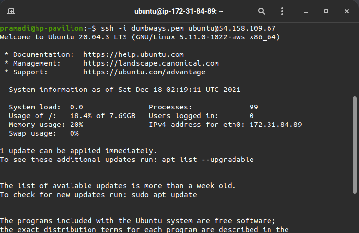

# AWS Server App and Reverse Proxy

# Install Frontend in Server App

- Membuka terminal dan masuk kedalam Server appp AWS

  

- Menjalankan perintah `sudo apt update` `sudo apt upgrade`
- Melakukan clone app Frontend dengan menjalankan perintah `git clone https://github.com/sgnd/dumbflix-frontend.git`
- Menjalankan perintah `cd dumbflix-frontend` untuk berpindah direktori
- Menjalankan perintah `curl -o- https://raw.githubusercontent.com/nvm-sh/nvm/v0.39.0/install.sh | bash`

  

- Menjalankan perintah `exec bash` untuk mendeteksi nvm
- Menjalankan perintah `nvm install 14`
- Menjalankan perintah `node -v` `dan npm -v`
- Selanjutnya menjalankan `nvm use 14`
- Kemudian `npm install`

  

- Melakukan pemasangan pm2 dengan menggunakan perintah `npm install pm2 -g`, untuk menjalankan aplikasi Frontend

  

- Menjalankan perintah `pm2 ecosystem simple` untuk membuat ecosystem

  

- Melakukan perubahan pada file `ecosystem.config.js` dengan menggunakan perintah `sudo nano ecosystem.config.js`

  

- Apabila sudah lakukan `ctrl + x` lalu `y` dan `enter
- Melakukan perintah `pm2 start ecosystem.config.js` untuk menjalankan aplikasi

  

- Membuka web browser dan mengakses Frontend dengan memasukan ip server dan port app `54.158.109.67:3000`

# Reverse Proxy

- Membuka terminal dan masuk kedalam Server `gateway` AWS `ssh -i dumbways.pem ubuntu@54.163.110.219`

  

- Menjalankan perintah `sudo apt update` `sudo apt upgrade`
- Melakukan pemasangan nginx `sudo apt install nginx`
- Melakukan pengecekan status nginx dengan menjalankan perintah ` sudo systemctl status nginx`


- Masuk kedalam direktori nginx `cd /etc/nginx/`
- jika sudah buat directory baru `sudo mkdir dumbflix`
- Menjalankan perintah `sudo chown user:user folder` untuk mengganti permission pada folder dari root menjadi user devops
- Menjalankan perintah `sudo nano nginx.conf` untuk melakukan penambahan folder yang telah dibuat kedalam `nginx.conf` dengan memasukan `include /etc/nginx/dumbflix/*;` ke dalam file tersebut
- Masuk ke dalam folder dumbflix `cd dumbflix`
- Membuat file konfigurasi dengan menjalankan perintah `nano bpramadi.onlinecamp.id`

  ```
  server {
            listen 80;
            server_name bpramadi.onlinecamp.id;

            location / {
  	        proxy_pass http://172.31.84.89:3000;
          }
       }

  ```

- Menjalankan perintah sudo nginx -t untuk melakukan pengecekan konfigurasi
- Menjalankan perintah `sudo systemctl reload nginx` untuk memuat ulang konfigurasi nginx

  

  

  

- Selanjutnya mengarahkan domain dengan ip publik server yang dipakai untuk reverse proxy dan uncheck proxy status.

  

- Mengakses web browser dan memasukan domain `http://bpramadi.onlinecamp.id/`

  
