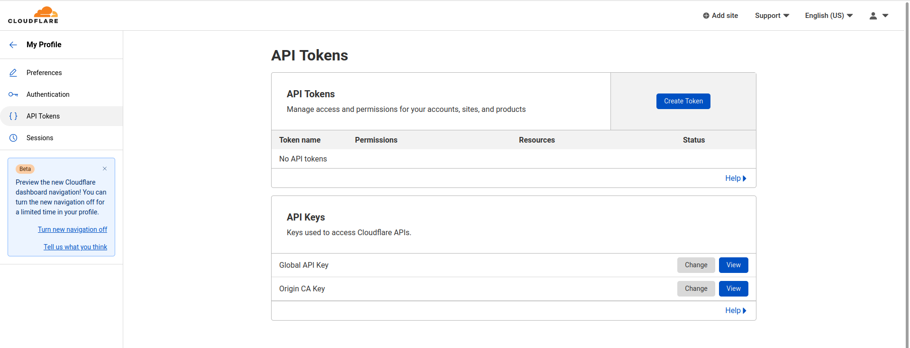
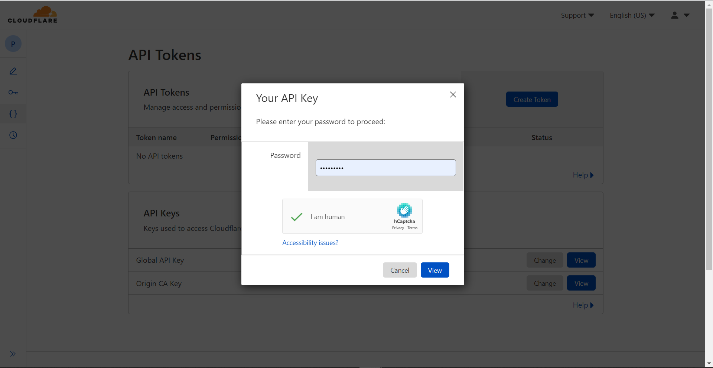
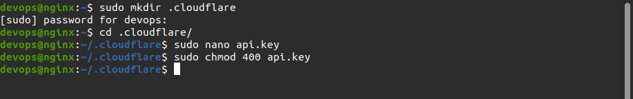
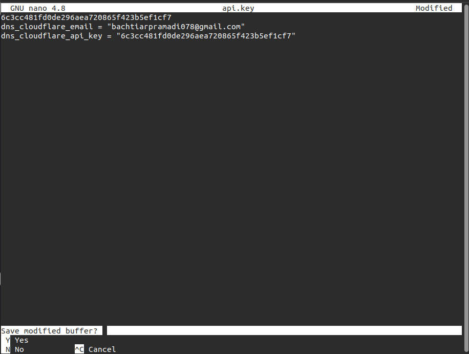
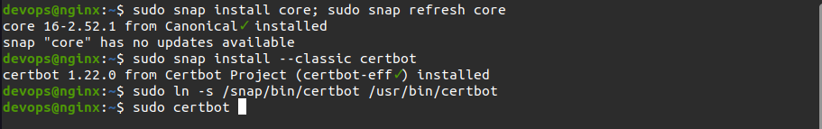
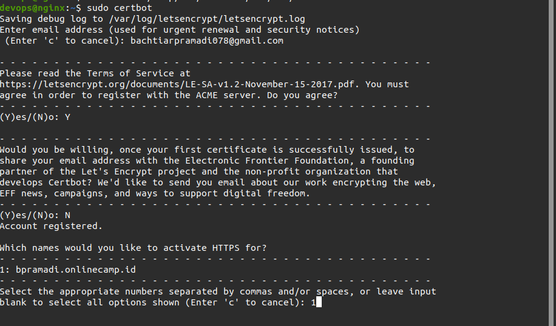
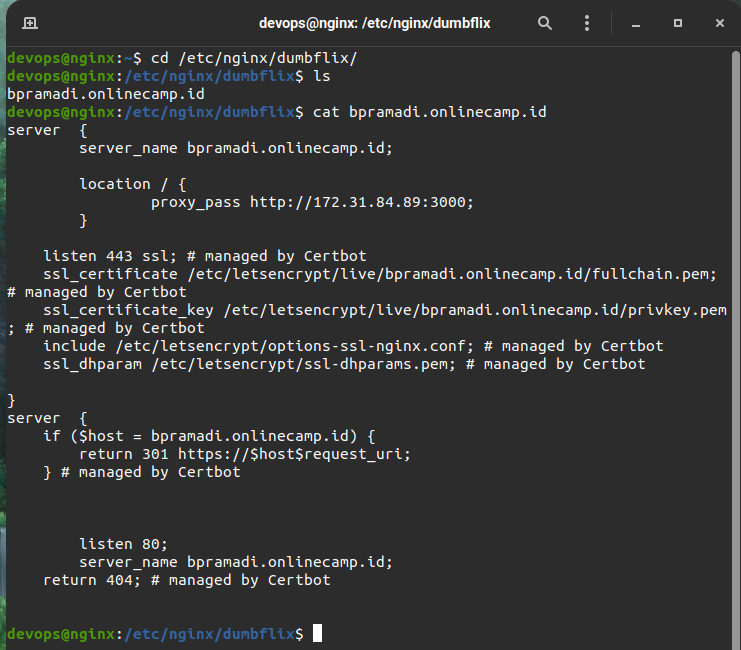
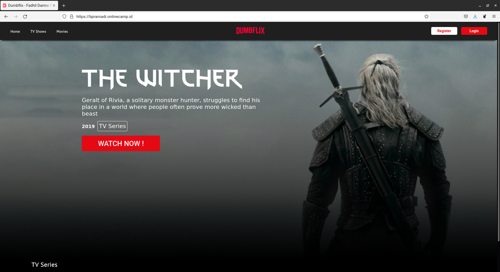

# AWS SSL Configuration

- Masuk ke Dashboard Cloudflare
- Pilih Menu My profile
- Pilih API TOKENs

  

- Pilih `view` pada kolom `Global Api Key` dan Masukan `password` serta centang kolom `I am human` .
- Lalu akan keluar API key kalian

  

- Selanjutnya masuk ke server aws yg menjadi gateway lalu membuat folder dengan menjalankan perintah`sudo mkdir .cloudflare`
- Menjalankan perintah `cd .cloudflare/` untuk masuk ke direktori yang telah dibuat
- Membuat file api.key untuk menambahkan email dan API key didalamnya, dengan menjalankan perintah `sudo nano api.key`
- Apabila sudah lakukan `ctrl + x` lalu `y` dan `enter
- Menjalankan perintah `sudo chmod 400 api.key`

  

  

- Menjalankan perintah `sudo snap install core; sudo snap refresh core`
- Apabila sudah lakukan pemasangan Certbot `sudo snap install --classic certbot`
- Menjalankan perintah `sudo ln -s /snap/bin/certbot /usr/bin/certbot`

  

- Menjalankan perintah `sudo certbot`, lalu memasukan email dan memilih file mana yang akan diaktifkan dengan https

  

- Apabila proses sudah selesai, lakukan pengecekan sertifikasi dengan masuk ke `cd /etc/nginx/dumbflix`
- Menjalankan perintah `cat bpramadi.onlinecamp.id` untuk menampilkan perubahan

  

- Menjalankan perintah sudo nginx -t untuk melakukan pengecekan konfigurasi

- Mengakses web browser dan memasukan domain `https://bpramadi.onlinecamp.id/`

  
