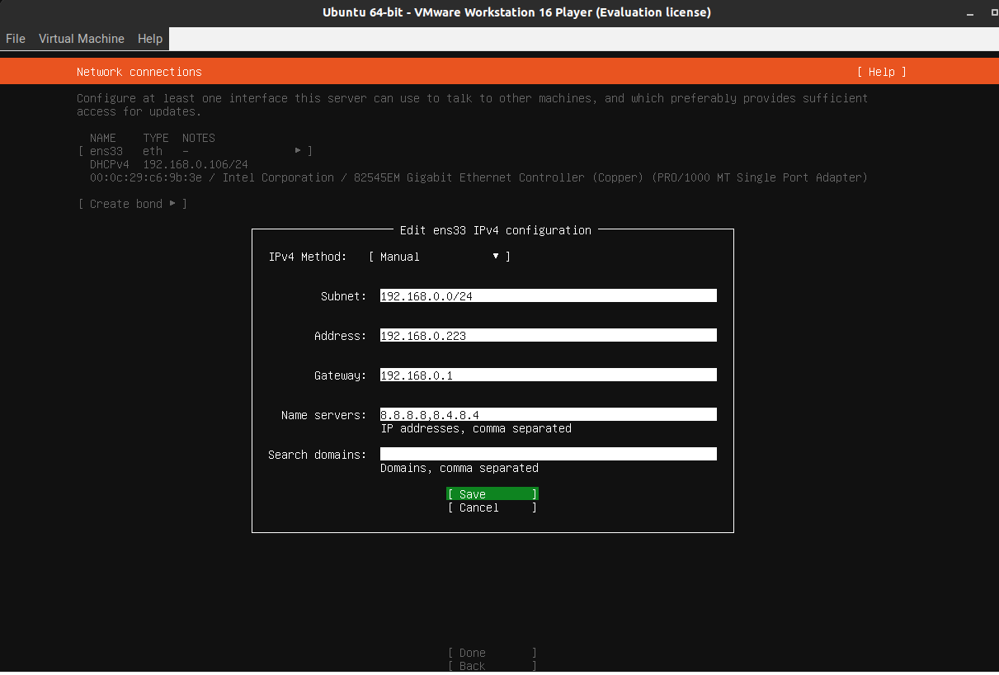

# VMware Install Ubuntu server and Setup Network

## Persiapan VMware.

- Melakukan download VMware pada link berikut. `https://www.vmware.com/products/workstation-player.html`
- Apabila sudah diunduh masuk ke terminal. dan masuk ke directory yang berisi file VMware yang telah diunduh.
- Menjalankan perintah `sudo sh VMware-Player-Full-16.2.1-18811642.x86_64.bundle` untuk melakukan instalasi.
- Tunggu hingga proses pemasangan selesai dan VMware siap digunakan.

## Pemasangan ubuntu server pada VMware.

Adapun Langkah-Langkahnya sebagai berikut :

- Membuka VMware yang telah di install sebelumnya

  

- Download ISO ubuntu server di website `https://ubuntu.com download/server` dan memilih opsi pemasangan manual.
- Masuk ke VMware lalu tekan `Create a new virtual machine`
- Apabila telah masuk ke tampilan seperti gambar dibawah silahkan pilih `use ISO image` lalu masukan ISO image yang telah diunduh.

  

- Memasukan personalize linux sesuai kebutuhan.

  

- Memasukan nama sesuai virtual machine yang akan dijalankan dan pilih lokasi virtual machine sesuai penempatan yang diinginkan

  

- Memasukan ukuran disk yang dibutuhkan.

  

- Apabila telah selesai tekan customize hardware dan dapat disesuaikan sesuai kebutuhan atau seperti gambar dibawah.

  

  

  

  

- Apabila semua tahapan diatas telah dilakukan, kemudian tekan `close` lalu tekan `finish`
- Selanjutnya masuk ke Virtual Machine yang sudah dibuat dan tekan `power on`
- Tunggu hingga muncul pilihan bahasa.

  

- Pilih bahasa dan Keyboard layout yang akan digunakan pada sistem operasi.

  

  

  

- Melakukan konfigurasi `IPv4 Method manual (DHCP)` untuk penggunaan IP Static pada Network Conections

  

  

- Konfigurasi proxy dan ubuntu archive mirror

  

  )

- Membuat partisi server dengan memilih `custom storage layout`

  

  

  

- Melakukan konfigurasi profile untuk login ke dalam sistem

  

- Melakukan install OpenSSH dengan memilih Install OpenSSH server

  

- Berikut merupakan proses instalasi ketika berlangsung

  

- Apabila pemasangan telah selesai, tekan `Reboot now`
- Melakukan login menggunakan username dan password yang telah dibuat

  

- Melakukan perintah `ping google.com` untuk mencoba apakah telah terhubung dengan internet atau belum.

  

- Apabila akan melakukan setup network lanjutan, dapat menjalankan perintah `cd /etc/netplan` dan masuk ke file `sudo nano 00-installer-config.yaml`

- Pada file tersebut dapat dilakukan perubahan sesuai dengan kebutuhan terkait ip, gateway, ataupun nameservers addresses, setelah selesai melakukan setup, selanjutnya menjalankan perintah `netplan apply` untuk mengkonfirmasi setiap perubahannya.

  

  

  
