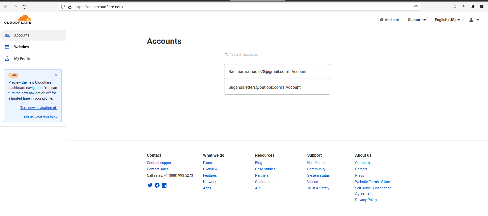
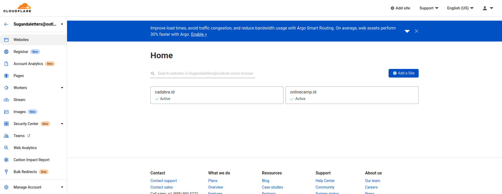

# Custom Domain for Backend App

- Masuk ke cloudflare yang telah di invite oleh mentor
- Melakukan login dan pilih account email mentor

  

- Pada halaman Home pilih `onlinecamp.id`

  

- Pilih menu DNS dan tekan `Add record`
- Melakukan set type `A` lalu masukan nama dan ip address aws server `gateway`. `api.bpramadi` `54.163.110.219`
- Uncheck proxy status
- Tekan `save`

  
