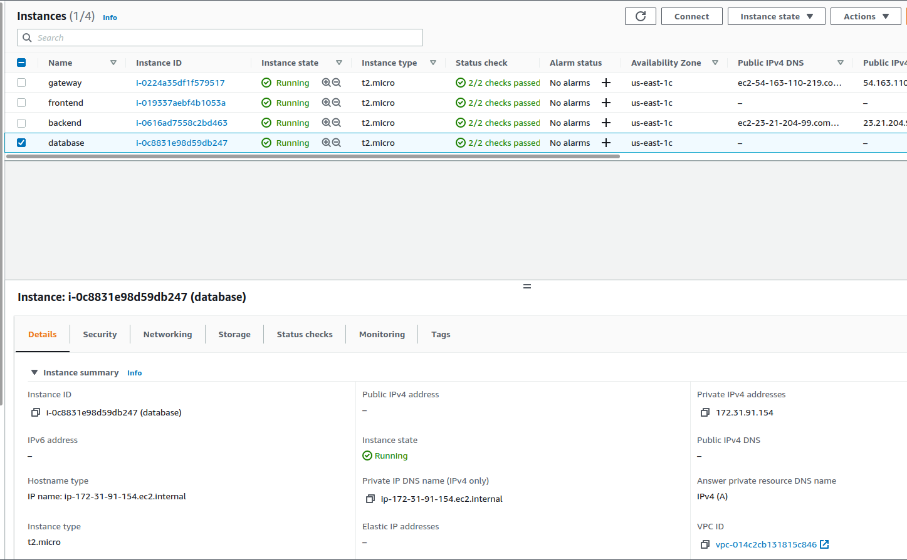
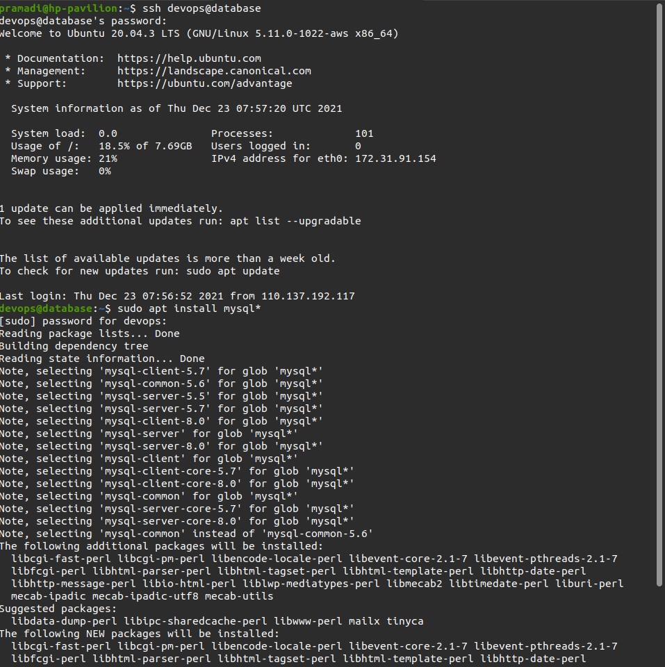
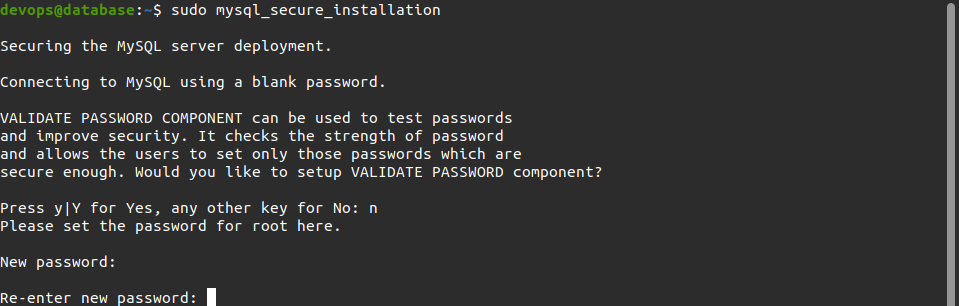
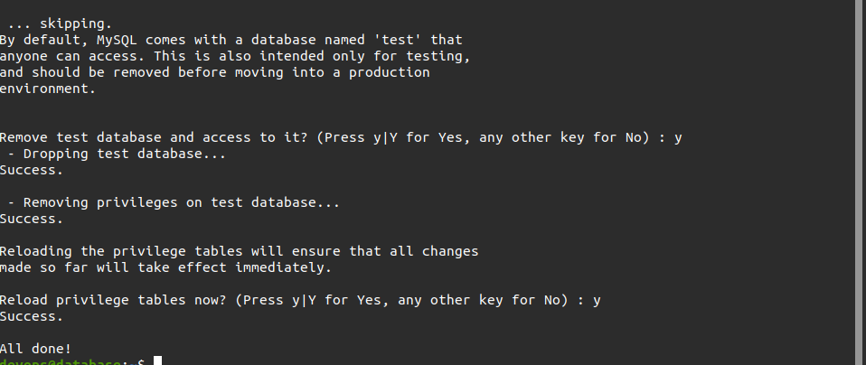
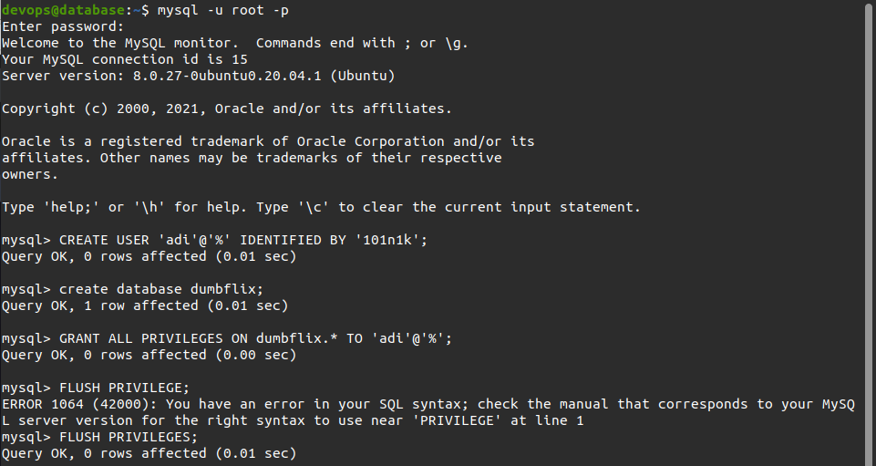
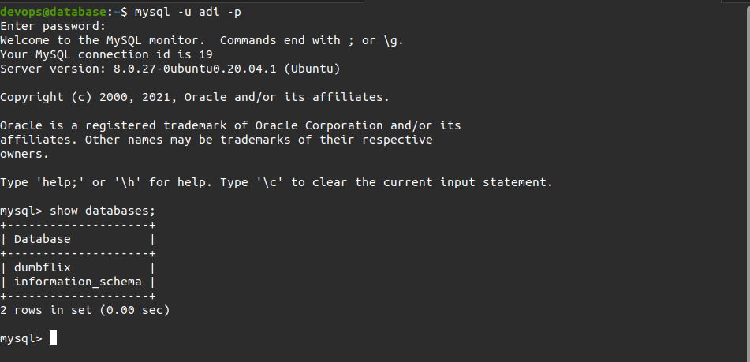
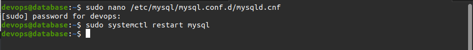
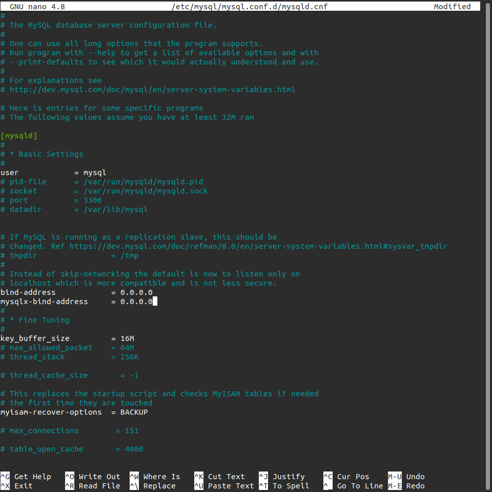

# Setup Database

- Melakukan Login ke AWS console
- Membuat server untuk backend dan database dengan memilih `Launch a Virtual Machine With EC2`, adapun spesifikasinya sebagai berikut:

  - Ubuntu Server 20.04 LTS
  - t2.micro
  - Auto-assign Public IP `Disable`
  - Storage 8Gb
  - Security group All trafic
  - Private IP

  

- Masuk ke server melalui terminal dengan menjalankan perintah `ssh -i dumbways.pem ubuntu@ 52.4.212.149` atau `ssh devops@database`
- Menjalankan perintah `sudo apt update` dan `sudo apt upgrade`
- Melakukan pemasangan mysql dengan perintah `sudo apt install mysql-server` atau `sudo apt install mysql*`
  

- Menjalankan perintah `sudo mysql_secure_installation` untuk melakukan konfigurasi keamananan database
- Menambahkan password dan melengkapi database persyaratan pemasangan mysql

  

  

- Mengakses mysql dengan masuk ke root menggunakan `sudo mysql -u root -p`
- Membuat user dengan menggunakan perintah `CREATE USER 'adi'@'%' IDENTIFIED BY 'password';`
- Menjalankan perintah `create database dumbflix;` untuk membuat database
- Menjalankan perintah `GRANT ALL PRIVILEGES ON dumbflix.* TO 'adi'@'%';`
- Menjalankan perintah `FLUSH PRIVILEGES;` untuk melakukan restart

  

- Mengakses mysql dengan masuk ke user yang telah dibuat menggunakan `sudo mysql -u adi -p` dan masukan password
- Menjalankan perintah `show databases;` untuk menampilkan database yang telah dibuat

  

- Melakukan konfigurasi pada file `mysqld.cnf` dengan menjalankan perintah `sudo nano /etc/mysql/mysql.conf.d/mysqld.cnf
- Mengubah `bind address` dan `mysqlx-bind-address` menjadi `0.0.0.0` / IP public
- Apabila telah selesai lakukan restart pada mysql service `sudo systemctl restart mysql`

  

  
