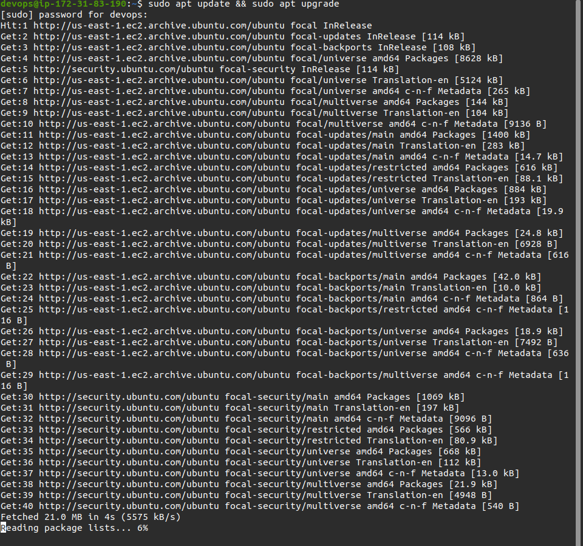

# Deployment Backend App

## Clone Repository Backend App

- Menjalankan perintah `ssh devops@35.175.159.53` dan memasukan password yang telah dibuat pada terminal, untuk masuk ke server
- Menggunakan perintah `git clone https://github.com/sgnd/dumbflix-backend.git` untuk melakukan clone aplikasi yang akan digunakan.

  

- Menjalankan perintah `sudo apt update && sudo apt upgrade`

  

- Menjalankan perintah curl -o- https://raw.githubusercontent.com/nvm-sh/nvm/v0.39.0/install.sh | bash
- Menjalankan perintah `exec bash` digunakan apabila nvm tidak terdeteksi
- Menjalankan perintah `nvm install 14` untuk pemasangan nodejs versi 14

  

- Menjalankan perintah `cd dumbflix-backend` untuk masuk ke direktori yang telah di clone
- Menjalankan perintah `npm install`

  

- Menjalankan perintah `cp .env.example .env`

  

- Melakukan konfigurasi file `config.json` dengan menyesuaikan username, password, nama database sesuai database pada mysql dan host address sesuai ip server database.

  

  

## Import database with sequelize

- Melakukan pemasangan sequelize-cli dengan perintah `npm install --save-dev -g sequelize-cli`

  

- Menjalankan perintah `sequelize db:migrate` untuk melakukan migrate ke database yang telah dibuat

  

- Masuk ke server database, lalu mengakses mysql dengan menjalankan perintah `mysql -u adi -p`
- Menjalankan perintah `show databases;` untuk menampilkan database yang telah dibuat
- Menampilkan data yang telah di migrate dari backend menggunakan perintah `use dumbflix;` lalu `show tables;`

  

## Deploy Backend App

- Melakukan perintah `pm2 start ecosystem.config.js` untuk menjalankan aplikasi backend

  
