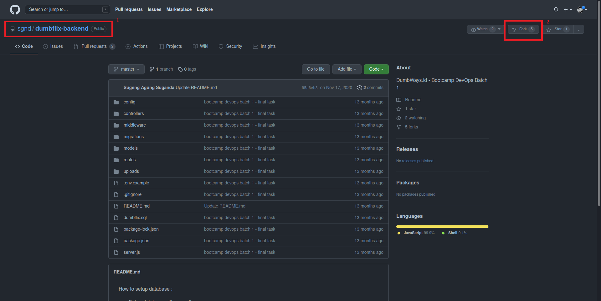
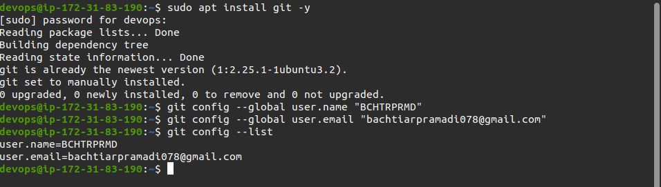
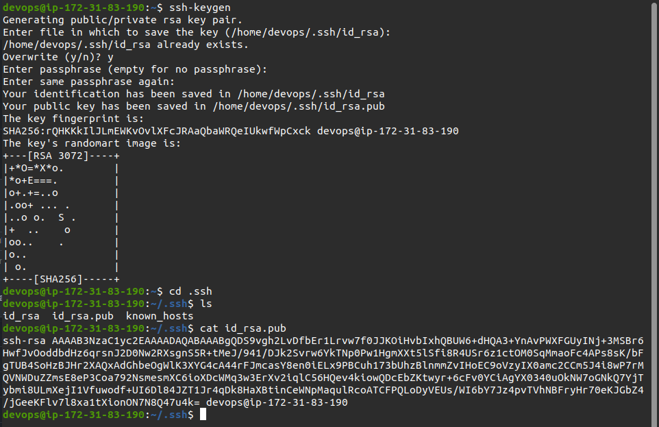
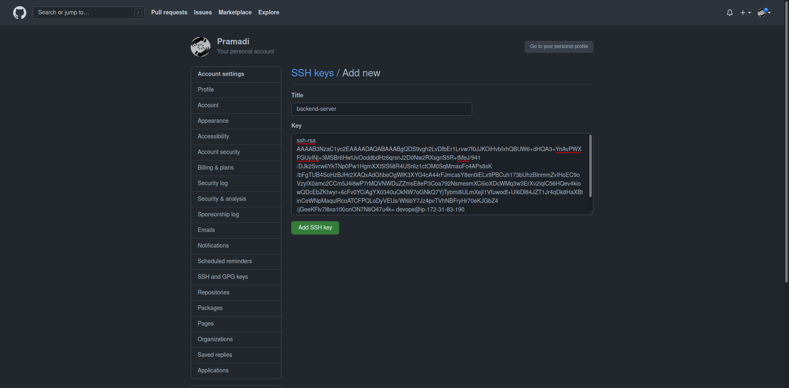
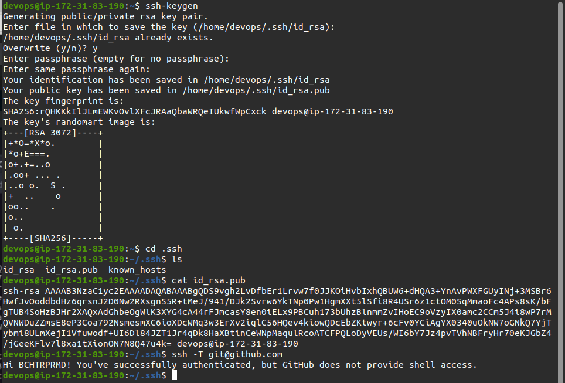
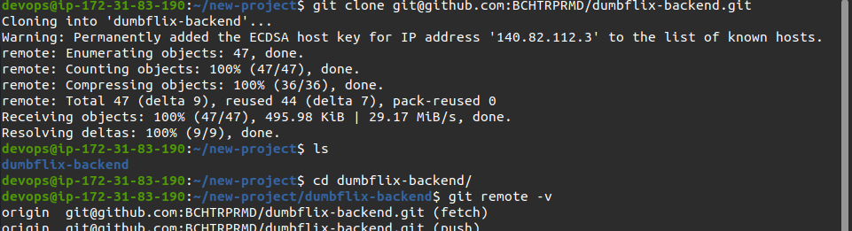
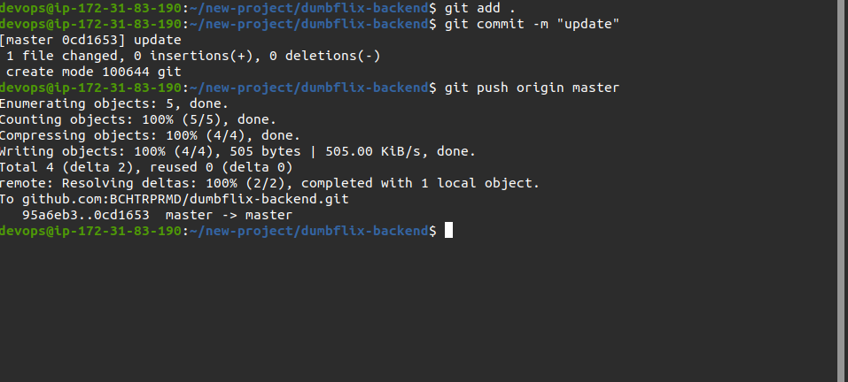

# Install Git and SSH Key

## Fork Repository.

- Melakukan Login ke Akun Github
- Mengakses repository backend apps yang akan di fork `https://github.com/sgnd/dumbflix-backend`
- Pada Halaman repository dumbflix-backend, tekan Fork dan repository akan otomatis ditambahkan ke repository akun pribadi yang dimiliki

  

## Pemasangan SSH Key.

Adapun Langkah-Langkahnya sebagai berikut :

- Masuk ke server atau instance yang telah dibuat di AWS
- Melakukan pemasangan Git dengan perintah `sudo apt install git -y`
- Menjalankan perintah `git config --global user.name "username"`, lalu `git config --global user.email "email"` untuk mengatur konfigurasi tertentu seusai kebutuhan pengguna, seperti menambahkan username dan email.
- Menjalankan perintah `git config --list`

  

- Melakukan generate ssh key dengan menjalankan perintah `ssh-keygen`
- Menjalankan perintah `cd .ssh` untuk berpindah direktori
- Menjalankan perintah `cat id_rsa.pub` untuk menampilkan isi file
- Menyalin isi teks dari file `id_rsa.pub` ke menu SSH and GPG keys pada github setting

  

- Masuk ke Github account
- Mengakses settings, lalu pada bagian Account settings pilih menu SSH and GPG keys
- Pilih New SSH Key, masukan title lalu ssh key yang telah disalin tadi
- Tekan Add SSH key

  

- Menjalankan perintah `ssh -T git@github.com` untuk melakukan mengecek koneksi ke github

  

## Perintah Git.

- Menjalankan perintah `git clone git@github.com:BCHTRPRMD/dumbflix-backend.git` untuk membuat salinan repository lokal
- Menjalankan perintah `cd dumbflix-backend` untuk berpindah direktori
- Menjalankan `git remote -v` untuk melihat remote yang telah dibuat

  

- Melakukan perintah untuk memperbaharui setiap perubahan yang terjadi pada server git dengan menjalankan `git pull origin master`
- Melakukan penambahan file ke index dengan menjalankan perintah `git add .`
- Menjalankan perintah `git commit -m "update"` untuk melakukan commit pada setiap perubahan
- Menjalankan perintah `git push origin master` untuk melakuka ipload data yang ada pada database git lokal ke git di server.

  
