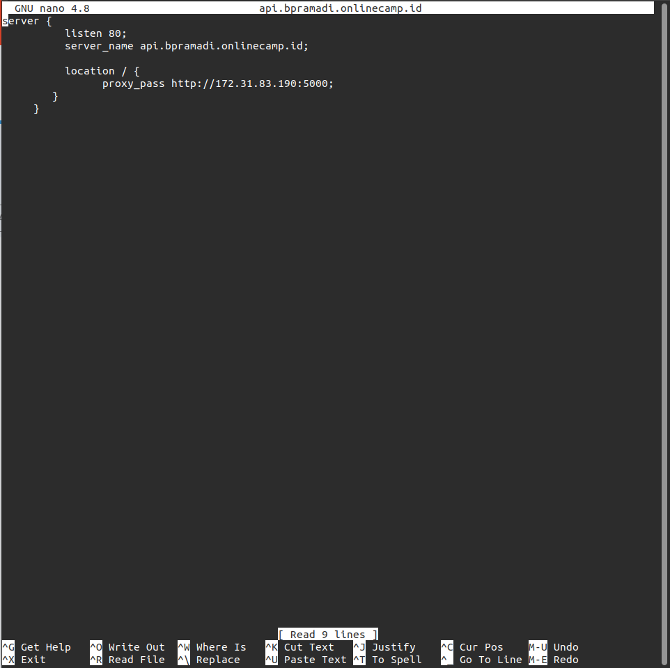

# Reverse Proxy for Backend App

- Membuka terminal dan masuk kedalam Server `gateway` AWS yang telah dibuat sebelumnya `ssh -i dumbways.pem ubuntu@54.163.110.219` atau `ssh devops@nginx`

  

- Masuk kedalam direktori nginx `cd /etc/nginx/dumbflix`
- Membuat file konfigurasi dengan menjalankan perintah `sudo nano api.bpramadi.onlinecamp.id`

  

- Menjalankan perintah `sudo nano nginx.conf` untuk melakukan penambahan folder yang telah dibuat kedalam `nginx.conf` dengan memasukan `include /etc/nginx/dumbflix/*;` ke dalam file tersebut
- Menjalankan perintah sudo nginx -t untuk melakukan pengecekan konfigurasi
- Menjalankan perintah `sudo systemctl reload nginx` untuk memuat ulang konfigurasi nginx

  

  

- Mengarahkan domain dengan ip publik server yang dipakai untuk reverse proxy dan uncheck proxy status.

  

- Mengakses web browser dan memasukan domain `http://api.bpramadi.onlinecamp.id/`

  
