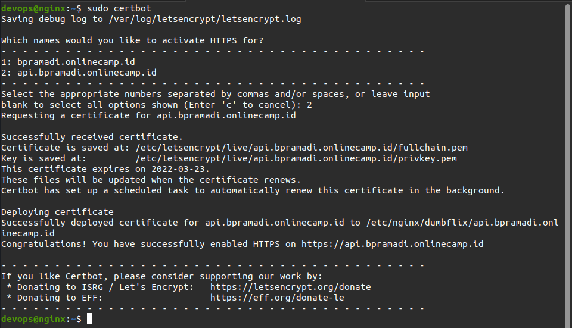
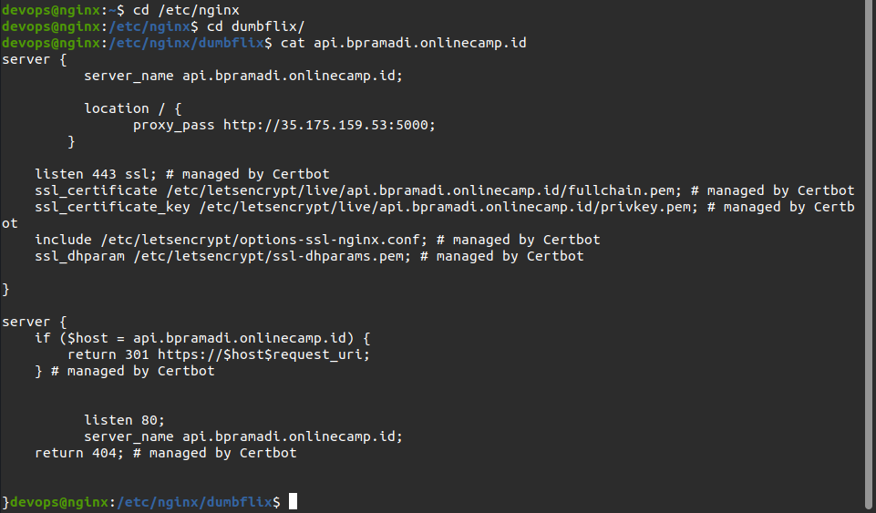
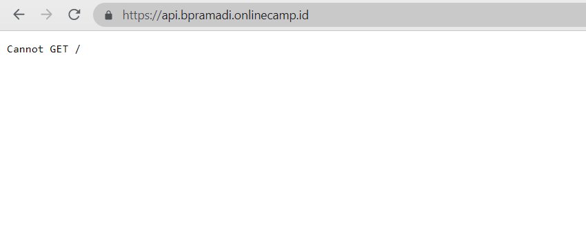
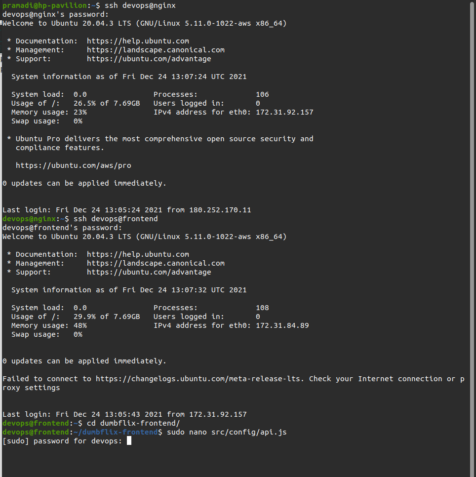
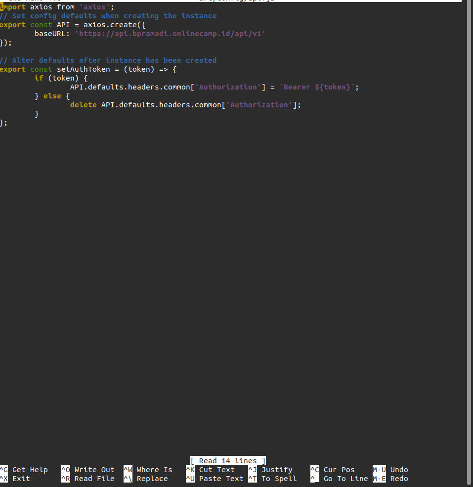
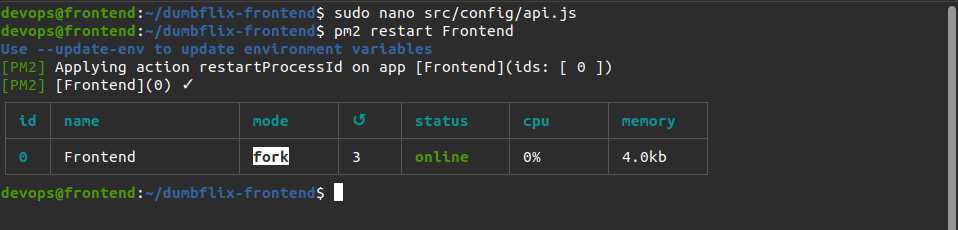
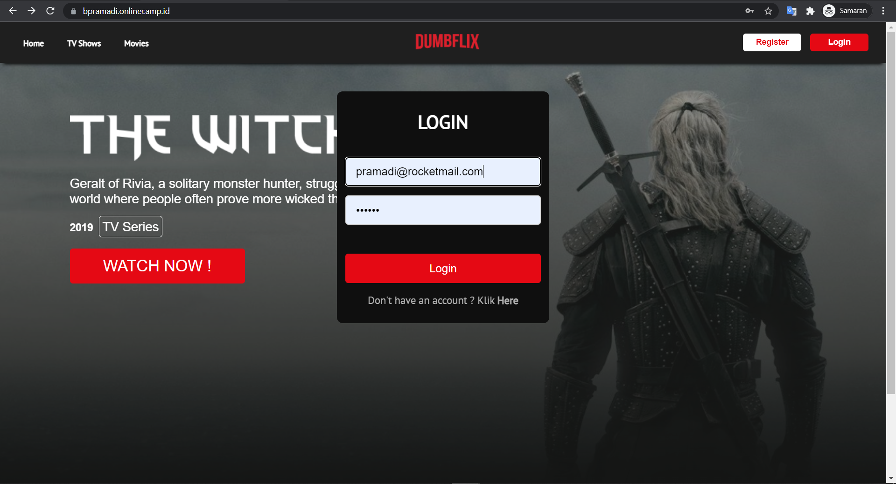
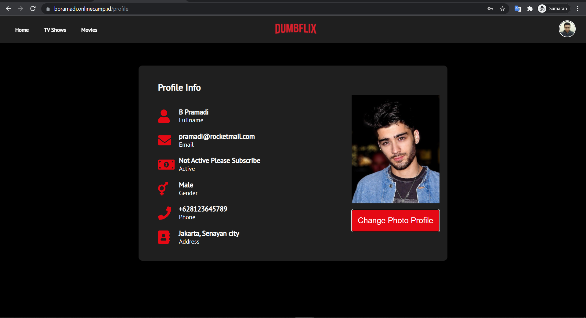

# SSL Configuration for Backend App

## Konfigurasi SSL

- Mengakses server gateway menggunakan perintah `ssh devops@nginx`
- Menjalankan perintah `sudo certbot`, lalu pilih 2 `api.bpramadi.onlinecamp.id untuk diaktifkan dengan https

  

- Apabila proses sudah selesai, lakukan pengecekan sertifikasi dengan masuk ke `cd /etc/nginx/dumbflix`
- Menjalankan perintah `cat bpramadi.onlinecamp.id` untuk menampilkan perubahan

  

- Menjalankan perintah sudo nginx -t untuk melakukan pengecekan konfigurasi
- Menjalankan perintah sudo systemctl restart nginx

- Mengakses web browser dan memasukan domain `http://api.bpramadi.onlinecamp.id/`

  

## Konfigurasi Frontend

- Mengakses server frontend menggunakan perintah `ssh devops@frontend`
- Melakukan konfigurasi pada file api.js untuk mengarahkan baseurl ke domain backend app dengan menjalankan perintah `sudo nano /src/config/api.js/`

  

  

- Melakukan restart app menggunakan `pm2 restart Frontend`

  

## Akses Website

- Mengakses web browser dan memasukan domain `https://bpramadi.onlinecamp.id/` dan login

  

  
