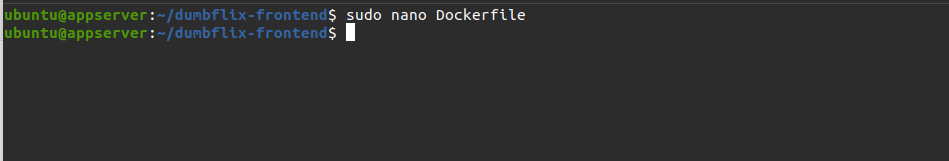
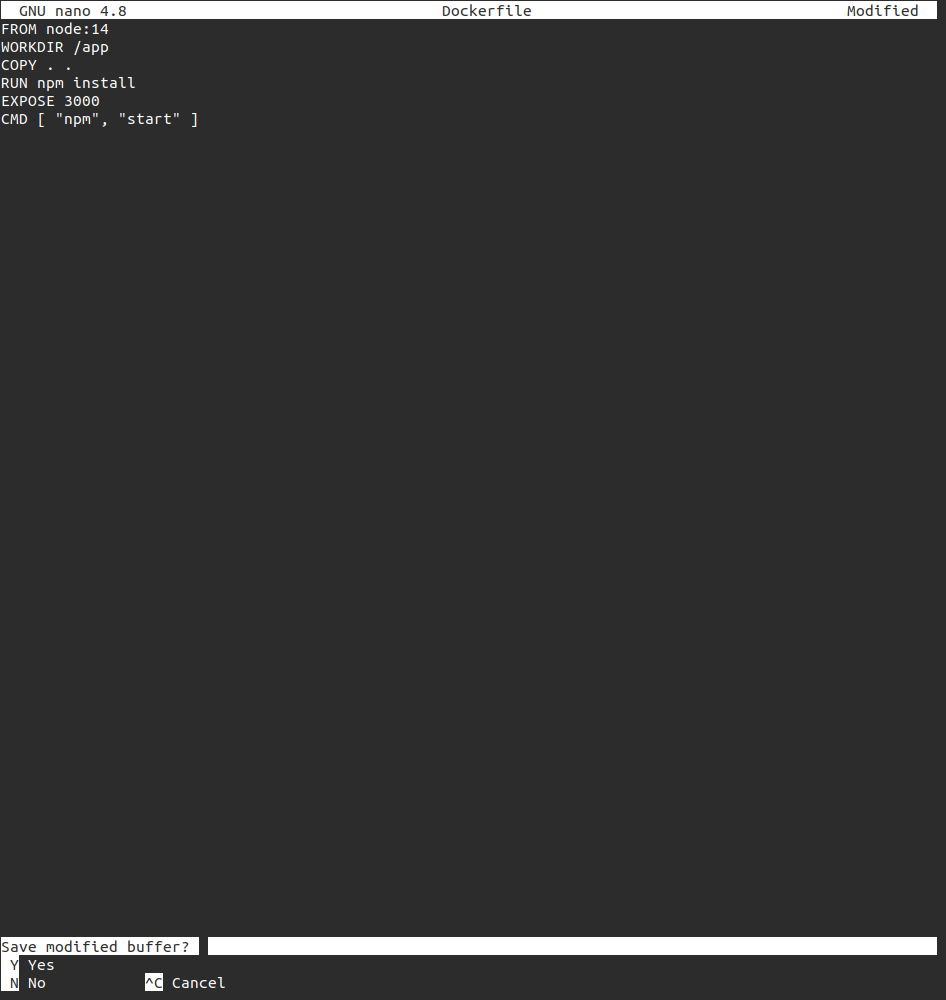
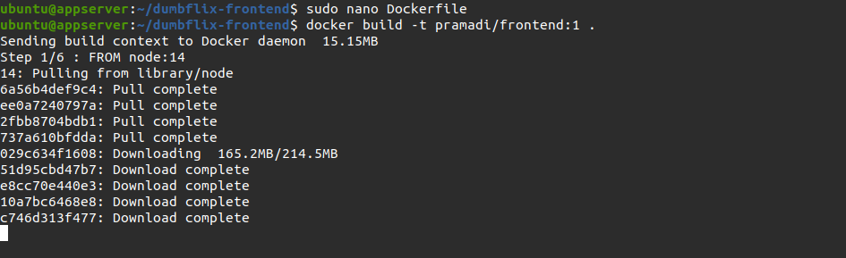
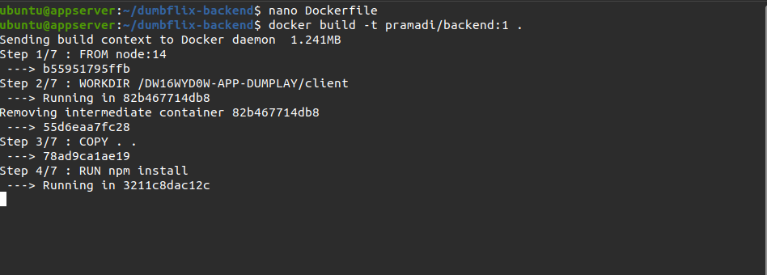
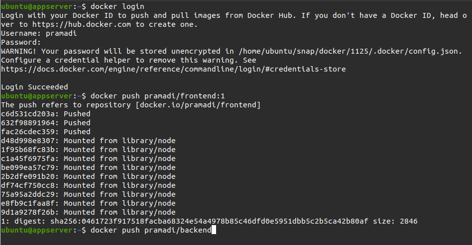
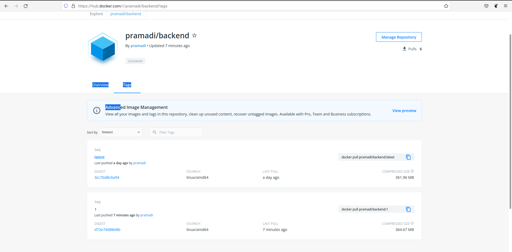

# Create Docker Image

1. Masuk ke server `appserver` dan lakukan update & upgrade
2. Clone app frontend dan backend `git clone git@github.com:sgnd/dumbflix-backend.git` dan `git clone git@github.com:sgnd/dumbflix-frontend.git`

3. Selanjutnya buat Dockerfile untuk frontend

    <br />
    <br />

4. Melakukan build menjadi image

    <br />

5. kemudian buat Dockerfile untuk backend

   ```
   FROM node:14
   WORKDIR /app
   COPY . ..
   RUN npm install
   EXPOSE 5000
   CMD [ "npm","start" ]

   ```

6. Kemudian build menjadi image
    <br />

7. Push image frontend & backend ke dockerhub
    <br />

8. Melakukan login ke `hub.docker.com/u/username`
    <br />
