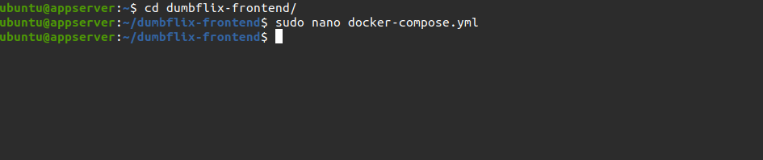
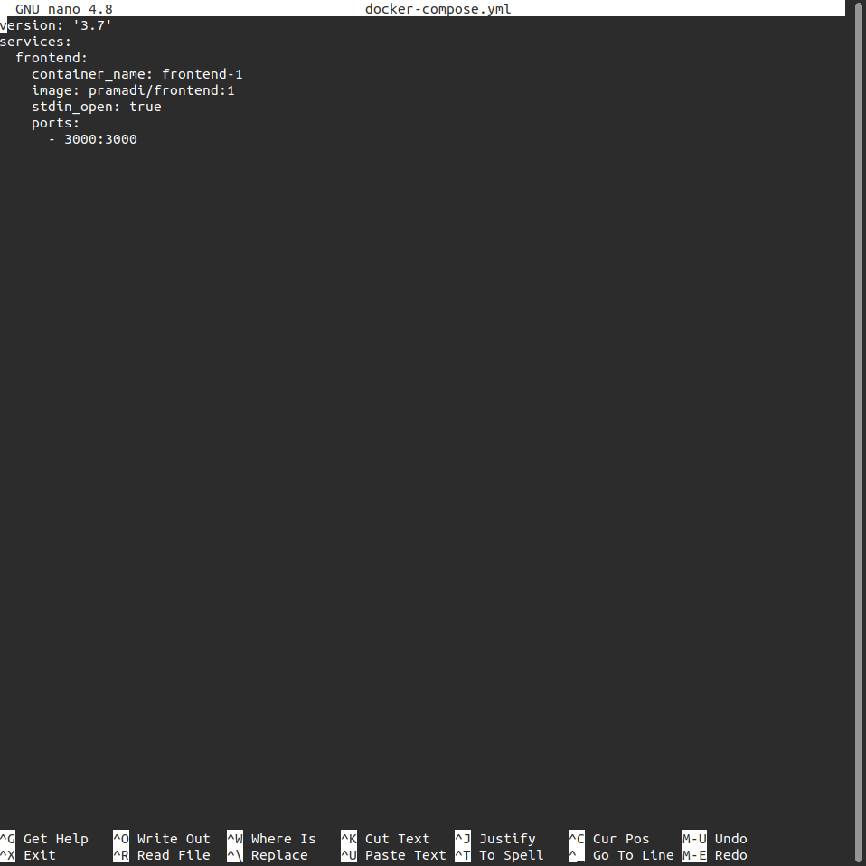
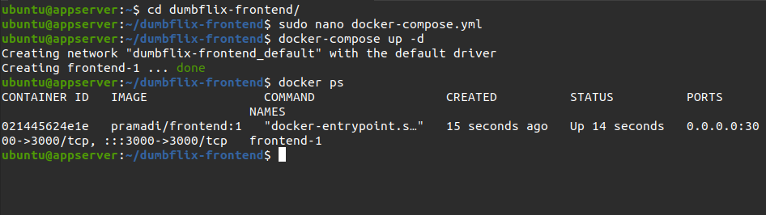
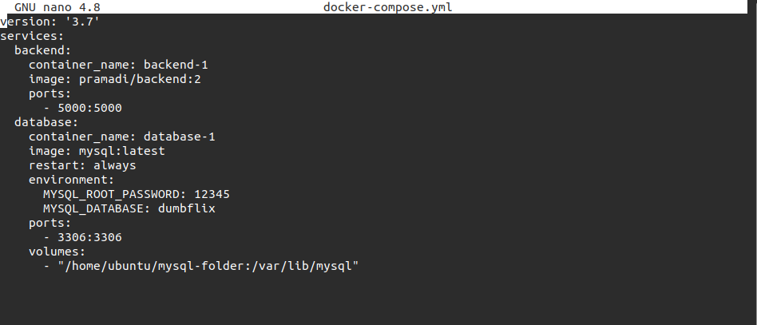
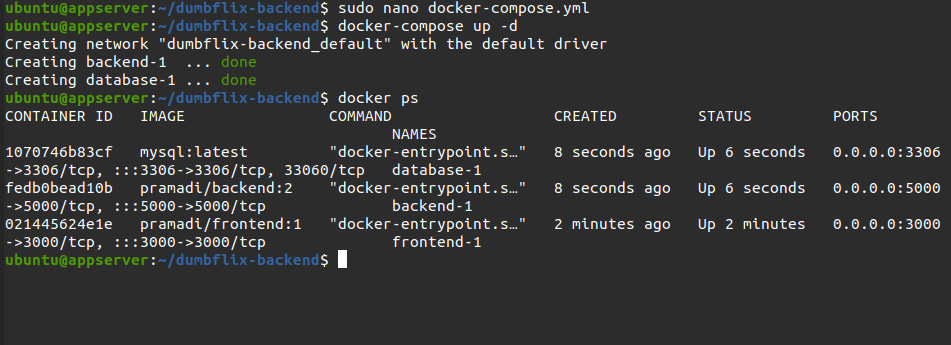

# Install Application

### App Frontend

1. Login server appserver.

  

2. Melakukan akses ke direktori yang telah di clone

  

3. Buat file docker-compose.yml

  

4. Jalankan compose `docker-compose up -d`
5. Container berhasil dijalankan

  

### App Backend & Database

1. Login server appserver.

2. Melakukan akses ke direktori yang telah di clone `cd dumbflix-backend`

3. Buat file docker-compose.yml

  

4. Jalankan compose `docker-compose up -d`

5. Container berhasil dijalankan

  
