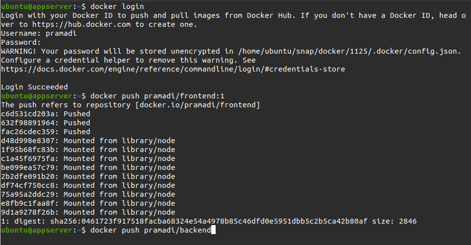

# Install Docker

## Install docker di server

1. Masuk ke server `appserver`.

    <br />

2. Update dan upgrade sistem.
3. Tambahkan GPG key docker.

   ```
   curl -fsSL https://download.docker.com/linux/ubuntu/gpg | sudo gpg --dearmor -o /usr/share/keyrings/docker-archive-keyring.gpg
   ```

4. Tambahkan repository docker

   ```
   echo \
   "deb [arch=$(dpkg --print-architecture) signed-by=/usr/share/keyrings/docker-archive-keyring.gpg] https://download.docker.com/linux/ubuntu \
   $(lsb_release -cs) stable" | sudo tee /etc/apt/sources.list.d/docker.list > /dev/null
   ```

    <br />

5. Update `sudo apt-get update`.
6. Install docker `sudo apt-get install docker-ce docker-ce-cli containerd.io`.
   cicd.bpramadi.onlinecamp.id

    <br />

7. Untuk server gateway dan jenkins lakukan hal yang sama dari step 1 - 6.

## Login docker hub

1. Buat akun docker di `hub.docker.com`.

    <br />

2. Mengakses terminal dan masuk ke server, login docker menggunakan akun hub.docker yang telah dibuat tadi.
3. `docker login`
4. Masukan username dan password.

    <br />
