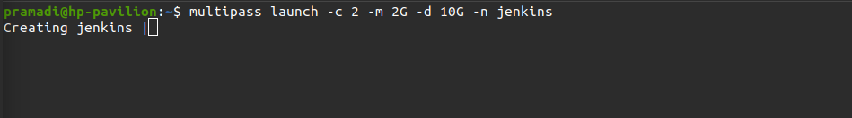
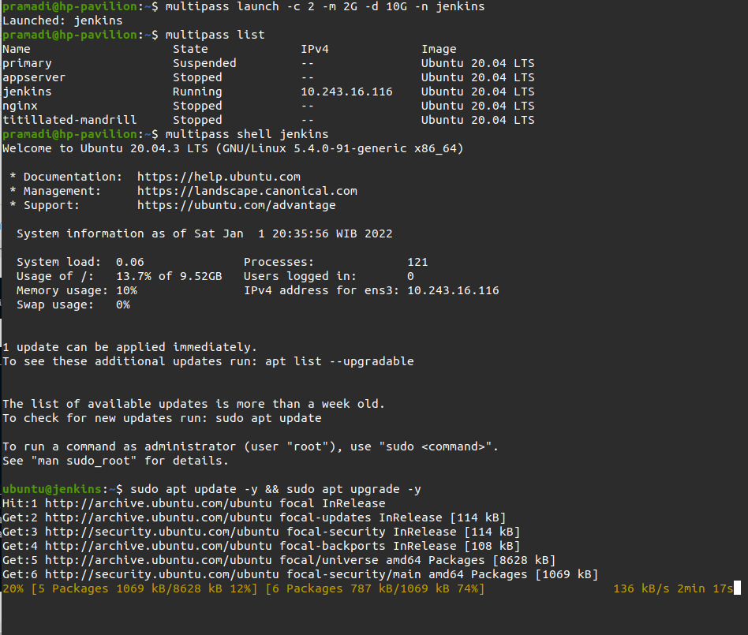
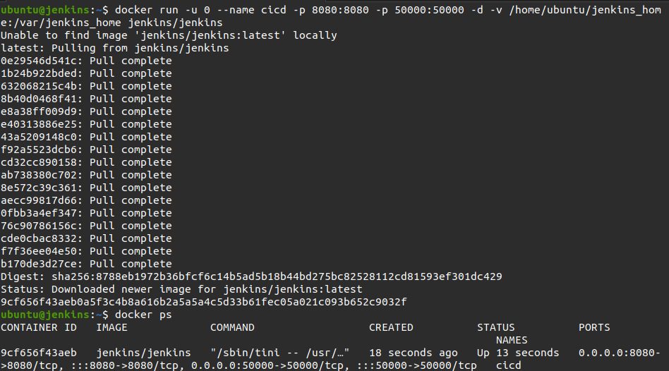
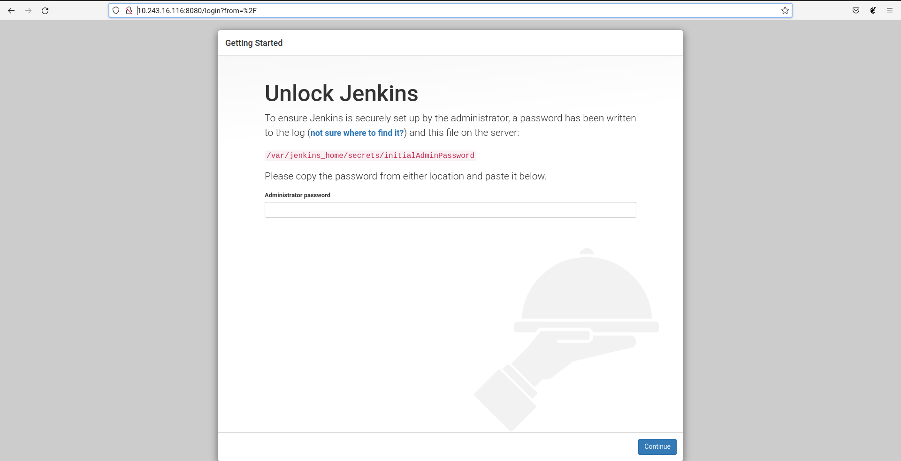
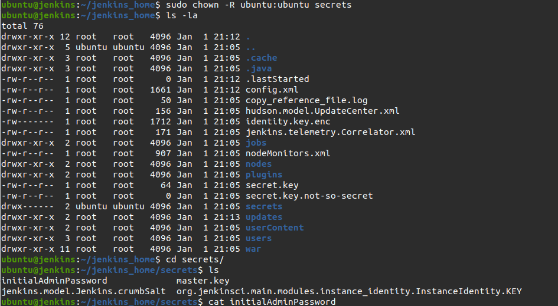
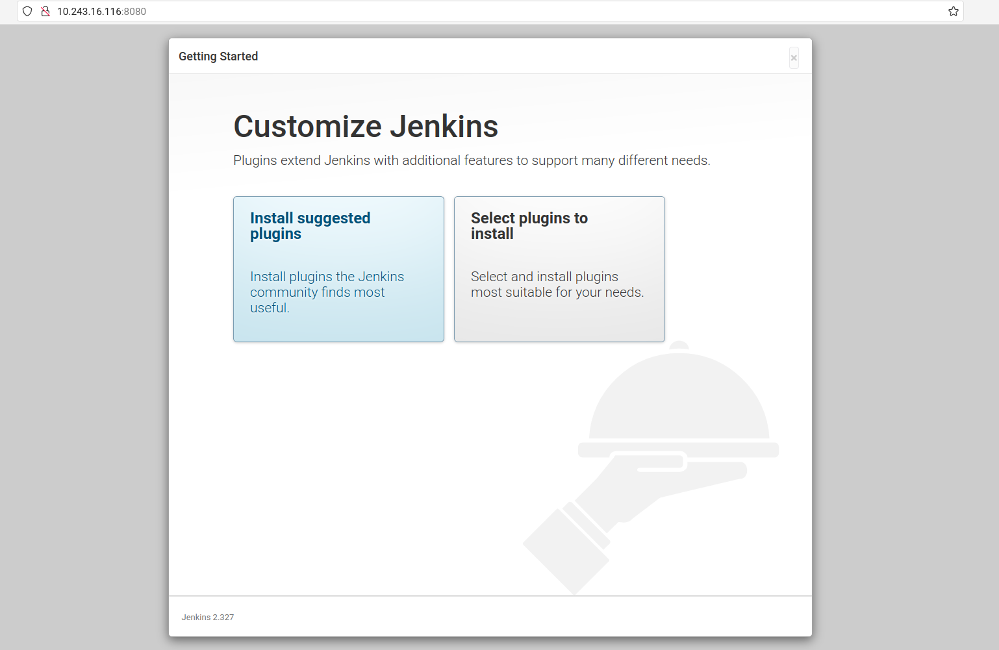
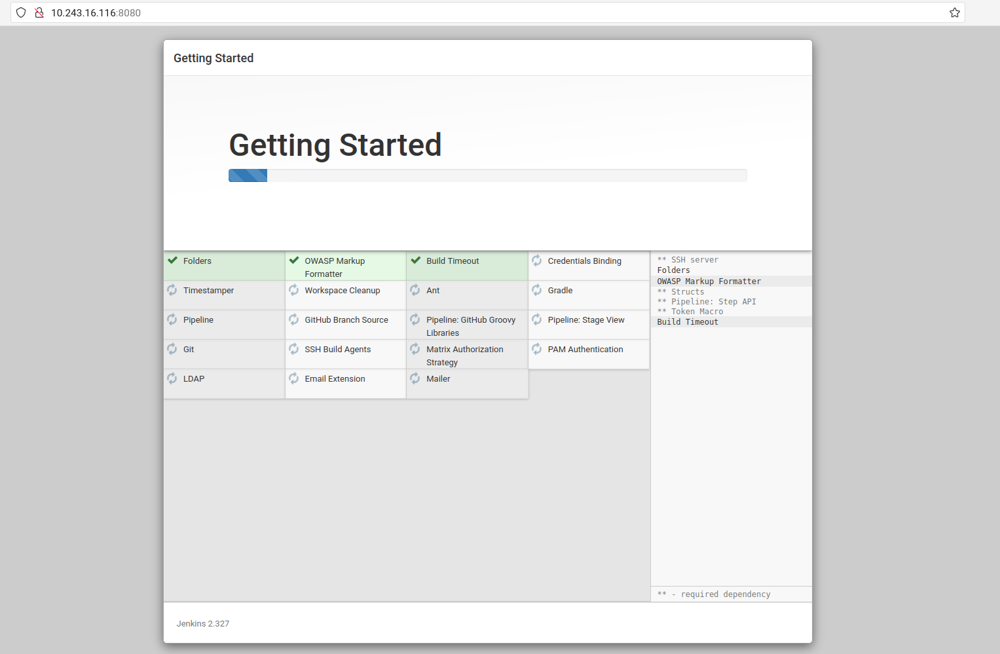
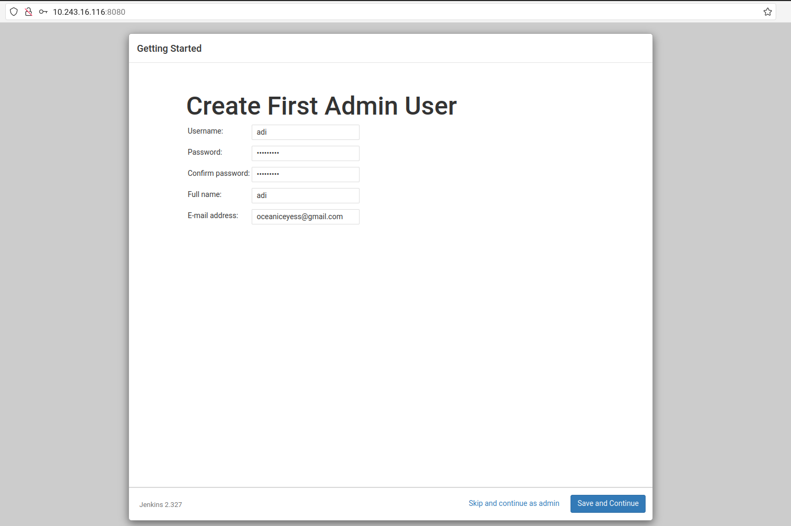
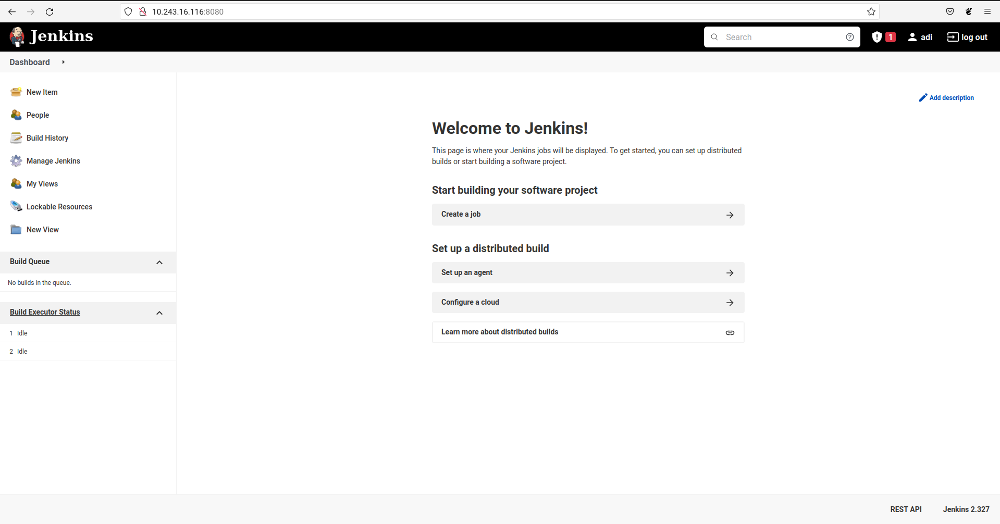
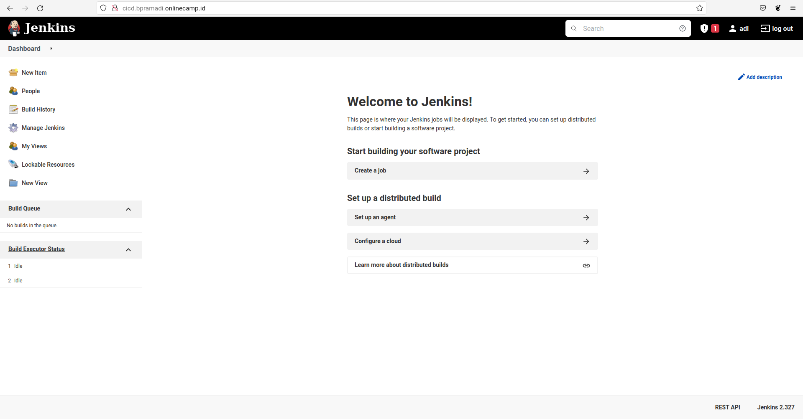

# Install Jenkins

Adapun langkahnya sebagai berikut :

1. Membuat server jenkins dengan menjalankan perintah sebagai berikut

    <br />

2. Menjalankan perintah `sudo apt update` dan `sudo apt upgrade`

    <br />

3. Kemudian install jenkin dengan perintah berikut `docker run -u 0 --name ci-cd -p 8080:8080 -p 50000:50000 -d -v /home/ubuntu/jenkins_home:/var/jenkins_home jenkins/jenkins`

    <br />

4. Mengakses terminal dan perintah seperti dibawah lalu copy secrets keys tersebut lalu masukan ke dalam jenkins. cat /var/jenkins_home/secrets/initialAdminPassword

    <br />

    <br />

5. pilih customize jenkins yang `install sugested plugins`

    <br />

6. Tunggu hingga proses selesai.

    <br />

7. Kemudian buat user dan password untuk login ke jenkins

    <br />

8. Konfigurasi jenkins URL.

    <br />

9. Halaman dashboard jenkins.

    <br />

### Custom domain jenkins

1. Login akun cloudflare.

2. Pilih akun dan domain.

3. Masuk ke menu DNS.

4. Memasukan subdomain untuk jenkins `cicd.bpramadi.onlinecamp.id`

5. Save.

[Install Docker](assets/jenkins-11.png) <br />

### Setup Reverse Proxy for Jenkins

1. Login ke server gateway
2. Masuk ke folder nginx `/etc/nginx/`
3. Buat konfigurasi file `cicd.bpramadi.onlinecamp.id`.

   ```
   server {
       listen 80;
       server_name cicd.bpramadi.onlinecamp.id;

       location / {
   	    proxy_pass http://10.243.16.116:8080;
       }
   }

   ```

4. Simpan, Test `sudo nginx -t`, restart nginx `sudo service nginx restart`
5. Buka browser buka arahkan ke `cicd.bpramadi.onlinecamp.id`

 <br />
