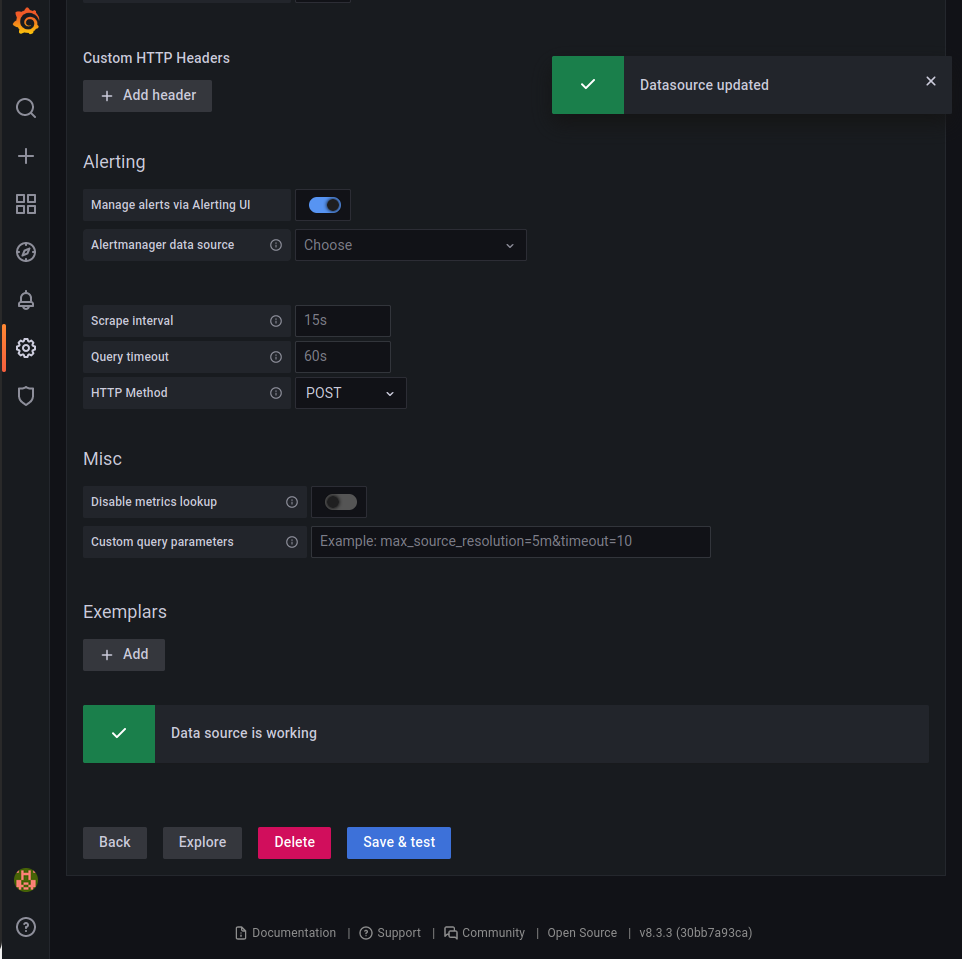
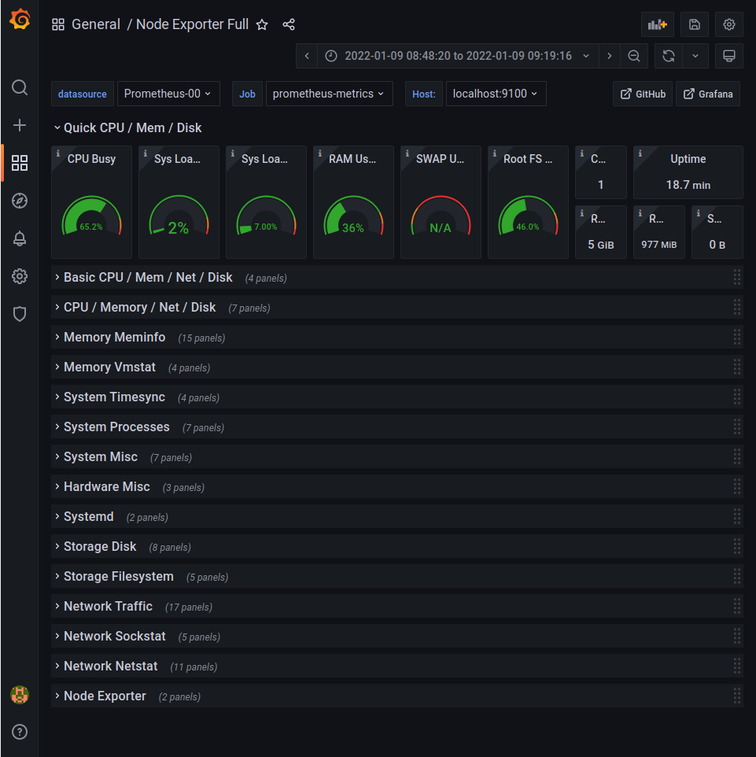

### Menghubungkan server monitoring dengan server lain

1. Memasang node_exporter pada server yang akan dimonitoring
2. Jika sudah terinstall tambahkan alamat server kedalam file prometheus.yml

```
sudo nano /etc/prometheus/prometheus.yml
```

```
global:
  scrape_interval: 10s

scrape_configs:
 - job_name: 'prometheus-metrics'
   scrape_interval: 10s
   static_configs:
      - targets: ['localhost:9090']
 - job_name: 'node_exporter_metrics'
   scrape_interval: 5s
   static_configs:
       - targets: ['localhost:9100','<ipservertarget>:9100','<ipservertarget>:9100']
```

3. Melakukan restart aplikasi prometheus
   dan buka web browser, pilih targets untuk melihat apakah sudah terkoneksi atau belum

   

### Menampilkan data yang dimonitoring dari server

1. Konfigurasi data source

- Pada bagian Configuration pilih data source

  

- Pilih prometheus

  

- Pada halaman setting grafana prometheus masukkan URL prometheus.

  

- Pilih `save & test` dan apabila berhasil terkonfigurasi akan muncul notifikasi bahwa `data source is working`

  

1. Menampilkan informasi server

- Pada menu create pilih import dan salin id dashboard

  

- Pilih dashboard yang sesuai kebutuhan pada `https://grafana.com/grafana/dashboards/`

- Pilih node exporter quickstart kemudian salin ID kedalam kolom `import via grafana.com`

  

- kemudian klik `load` dan `import`
- Apabila sudah dapat dilihat tampilan dashboard akan menampilkan informasi dari server yang akan dimonitor seperti penggunaan CPU, memory, RAM, dan Network
