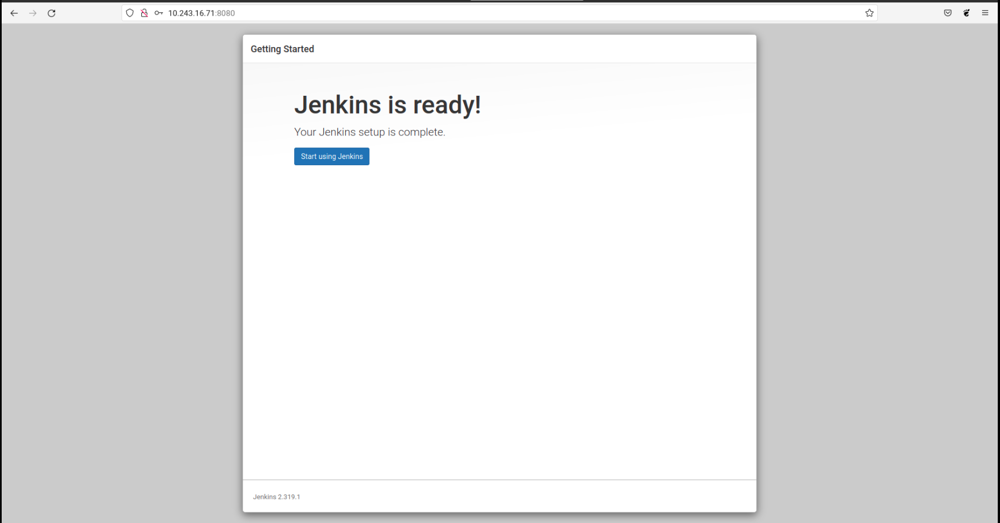

# Setup Server with Ansible

### Install Ansible in Ubuntu

1. Konfigurasi PPA
   ```
   sudo apt update
   sudo apt install software-properties-common
   sudo add-apt-repository --yes --update ppa:ansible/ansible
   ```
2. Install Ansible `sudo apt install ansible`

### Membuat Inventori / host server

1. Buat directory untuk menyimpan file-file ansible 
2. Masuk ke dalam folder buat file `hosts` untuk menyimpan hostname server

   ```
   [ansible]
   10.243.16.71 ansible_user=ubuntu
   [server_b]
   10.243.16.111 ansible_user=ubuntu
   ```

3. Kemudian buat file yang berisi sshkey untuk masuk kedalam server dan ubah kepemilikan berkas sudo chmod 400 sshkey.pem
4. Ping hosts untuk memastikan koneksi ansible dan server berfungsi `sudo ansible all --key-file sshkey.pem -i hosts -m ping`

   

### Setup Custom ansible.cfg file

1. Buat file `ansible.cfg`
2. Masukkan config  sebagai berikut
   
   ```
   [defaults]
   inventory = hosts # nama file inventori untuk menyimpan serverhost
   private_key_file = sshkey.pem #ssh-key guna akses server

   ```

3. Save config

### Ansible-Playbook Setup nginx server

1. Buat file yml `nginx.yml`
2. Buat task update dan upgrade system
3. Buat task install nginx
4. Berikut adalah yml codenya:

   ```
   ---
   - name: Setup Nginx
     hosts: all
     become: true
     tasks:
       - name: Update system
         apt:
           update_cache: yes
       - name: Upgrade system
         apt:
           upgrade: yes

       - name: Install Nginx
         apt:
           name: nginx
           state: present
           update_cache: yes
   ```

5. Save
6. Execute perintah ansible-playbook `ansible-playbook nginx.yml`

   

7. Check nginx dengan URL

   

### Ansible-Playbook Setup database server

1. Buat file yml `databse.yml`
2. Buat task update dan upgrade system
3. Buat task install mysql-server
4. Berikut adalah yml codenya:

   ```
   ---
   - name: Setup Database
     hosts: all
     become: true
     tasks:
       - name: Update system
         apt:
           update_cache: yes
       - name: Upgrade system
         apt:
           upgrade: yes

       - name: Install Mysql-Server
         apt:
           name: mysql-server
           state: present

   ```
5. Execute perintah ansible-playbook `ansible-playbook database.yml`

   

### Ansible-Playbook Install docker

1. Buat file yml untuk instalasi docker di server `docker.yml`
2. Masukkan kode berikut

   ```
   ---
   - name: Setup Docker & Docker Compose
     hosts: all
     become: true
     tasks:
       - name: Update system
         apt:
           update_cache: yes

       - name: Upgrade system
         apt:
           upgrade: dist

       - name: Setup repository
         shell: "sudo apt-get install ca-certificates curl gnupg lsb-release"
         args:
           executable: /bin/bash

       - name: Add docker GPG key
         apt_key:
           url: https://download.docker.com/linux/ubuntu/gpg
           state: present

       - name: Add docker repository
         apt_repository:
           repo: deb https://download.docker.com/linux/ubuntu focal stable
           state: present

       - name: Update system
         apt:
           update_cache: yes

       - name: Install docker engine
         apt:
           name: "{{item}}"
           state: latest
           update_cache: yes
         loop:
           - docker-ce
           - docker-ce-cli
           - containerd.io

       - name: Install stable release docker compose
         shell: sudo curl -L "https://github.com/docker/compose/releases/download/1.29.2/docker-compose-$(uname -s)-$(uname -m)" -o /usr/local/bin/docker-compose
         args:
           executable: /bin/bash

       - name: Apply executable permission to the binary
         shell: "sudo chmod +x /usr/local/bin/docker-compose"
         args:
           executable: /bin/bash

   ```

3. Save kemudian execute command `ansible-playbook docker.yml`
   
   

### Ansible-Playbook Install docker Jenkins

1. Buat file docker-compose.yml untuk pemasanhan jenkins didalam direktori `docker-files`, karena tahap ini akan melakukan pemasangan versi docker
   
2. Masukkan kode berikut
   ```
   version: '3.9'
   services:
     jenkins:
       image: jenkins/jenkins:lts-jdk8
       ports:
         - 8080:8080
         - 50000:50000
       privileged: true
       user: root
       container_name: jenkins
       volumes:
         - ~/jenkins:/var/jenkins_home
         - /var/run/docker.sock:/var/run/docker.sock
         - /usr/local/bin/docker:/usr/local/bin/docker
   ```
3. Save
4. Buat file yml untuk setup jenkinsnya `jenkins.yml`

5. Masukkan kode berikut:

   ```
   ---
   - name: Setup CI/CD Jenkins Docker
     hosts: all
     become: true
     tasks:
       - name: Copy docker compose
         copy:
           src: docker-files/docker-compose.yml
           dest: /home/ubuntu/

       - name: Run docker compose
         shell: "docker-compose up -d"
         args:
           executable: /bin/bash
   ```

6. Save
7.  Execute command `ansible-playbook jenkins.yml`

    

    

### Ansible-Playbook setup apps

1. Buat file docker-compose untuk apps `docker-app.yml` dalam direktory `docker-files`
   
   ```
   version: '3.9'
   services:
     frontend:
       container_name: frontend
       image: pramadi/frontend:1
       stdin_open: true
       ports:
         - 3000:3000
     backend:
       container_name: backend
       image: pramadi/backend:2
       ports:
         - 5000:5000
     database:
       container_name: database
       image: mysql:latest
       restart: always
       environment:
         MYSQL_ROOT_PASSWORD: 54321
         MYSQL_DATABASE: dumbflix
       ports:
         - 3306:3306
       volumes:
         - /home/ubuntu/mysql:/var/lib/mysql

   ```
2. Buat file ansible-playbook dan copy files docker-compose yang telah dibuat
   
   ```
   - name: Setup Apps
     hosts: all
     become: true
     tasks:
       - name: Copy docker compose
         copy:
           src: docker-files/docker-app.yml 
           dest: /home/ubuntu/docker-apps/
       - name: Docker pull frontend
         shell: docker pull pramadi/frontend:1
         args:
           executable: /bin/bash
       - name: Docker pull backend
         shell: docker pull pramadi/backend:2
         args:
           executable: /bin/bash
       - name: Run docker compose
         shell:
           cmd: "docker-compose -f docker-app.yml up -d"
           chdir: /home/ubuntu/docker-apps/
     ```
3. Execute command `ansible-playbook app.yml`

    

    

### Ansible-Playbook Setup docker server monitoring

1. Membuat direktori files untuk menyimpan semua file yang disalin ke server host
2. Buat file node-exporter.yml 

    ```
    version: '3.9'

    services:
      node_exporter:
        image: prom/node-exporter:latest
        container_name: node_exporter
        ports:
          - 9100:9100
        command:
          - '--path.procfs=/host/proc'
          - '--path.rootfs=/rootfs'
          - '--path.sysfs=/host/sys'
          - '--collector.filesystem.mount-points-exclude=^/(sys|proc|dev|host|etc)($$|/)'
        restart: unless-stopped
        volumes:
          - /proc:/host/proc:ro
          - /sys:/host/sys:ro
          - /:/rootfs:ro 
    ```
3. Buat file setup-node-exporter.yml
   
   ```
     hosts: all
     become: true
     tasks:
       - name: Copying docker compose file
         copy:
           src: docker-files/node-exporter.yml
           dest: /home/ubuntu/docker-node-exporter/

       - name: Run docker compose
         shell:
           cmd: "docker-compose -f node-exporter.yml up -d"
           chdir: /home/ubuntu/docker-node-exporter/
   ```
4. Execute command `ansible-playbook setup-node-exporter.yml`

   

5. Selanjutnya install prometheus dan grafana untuk server monitoring. buat file konfigurasi prometheus.yml dalam direktory docker-files

    ```
    global:
      scrape_interval: 5m

    scrape_configs:
      - job_name: "prometheus-metrics"
        scrape_interval: 5m
        static_configs:
          - targets: ['10.243.16.111:9100']
      - job_name: "node_exporter_metrics"
        scrape_interval: 5m
        scrape_timeout: 1m
        tls_config:
          insecure_skip_verify: true
        static_configs:
          - targets: ['10.243.16.111:9100','10.243.16.71:9100']
    ```
6. Setelah itu buat docker-compose untuk prometheus dan grafana didalam direktory docker-files dengan perintah `nano prometheus-grafana-compose.yml`

    ```
     prometheus-grafana-compose.yml
      ---
    version: '3.9'
    services:
      prometheus:
        image: prom/prometheus:latest
        container_name: prometheus
        restart: unless-stopped
        volumes:
          - /home/ubuntu/prometheus.yml:/etc/prometheus/prometheus.yml
        command:
          - '--config.file=/etc/prometheus/prometheus.yml'
          - '--storage.tsdb.path=/prometheus'
          - '--web.console.libraries=/etc/prometheus/console_libraries'
          - '--web.console.templates=/etc/prometheus/consoles'
          - '--web.enable-lifecycle'
        ports:
          - 9090:9090

      grafana:
        image: grafana/grafana:latest-ubuntu
        container_name: grafana
        volumes:
          - /home/ubuntu/grafana/data:/var/lib/grafana
        ports:
          - 3000:3000
        user: "1000"
        restart: unless-stopped
    ``` 
7. Lalu buat file ansible-playbook untuk pemasangan prometheus-grafana dengan perintah `nano setup-prometheus-grafana.yml`

    ```
    - name: Installing Prometheus & Grafana
      hosts: server_b
      become: true
      tasks:
        - name: Update system
          apt:
            update_cache: yes

        - name: Upgrade system
          apt:
            upgrade: yes

        - name: Copying docker compose file
          copy:
            src: docker-files/prometheus-grafana-compose.yml
            dest: /home/ubuntu/

        - name: Copying prometheus.yml file
          copy:
            src: docker-files/prometheus.yml
            dest: /home/ubuntu/

        - name: Run compose up
          shell:
            cmd: "docker-compose -f prometheus-grafana-compose.yml up -d"

        - name: Change grafana folder permission
          shell: "sudo chown 1000:1000 grafana/data/"
          args:
            executable: /bin/bash
    ```
8. Execute command `ansible-playbook setup-prometheus-grafana.yml`

    