# Setup Monitoring Server

### Install Node Exporter

1. Download terlebih dahuluh node exporternya.

```
curl -LO https://github.com/prometheus/node_exporter/releases/download/v1.3.1/node_exporter-1.3.1.linux-amd64.tar.gz
```

2. kemudian ekstrak file yang telah didownload `tar -xvf node_exporter-1.3.1.linux-amd64.tar.gz`

   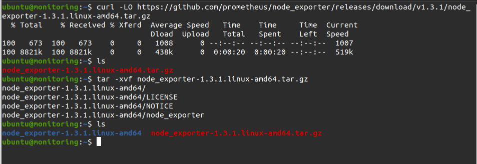

3. Pindahkan file node exporter kedalam usr/local/bin/

```
sudo mv node_exporter-1.3.1.linux-amd64/node_exporter /usr/local/bin/
sudo useradd -rs /bin/false node_exporter
```

4. Buat file dalam systemd node exporter `sudo nano /etc/systemd/system/node_exporter.service`

   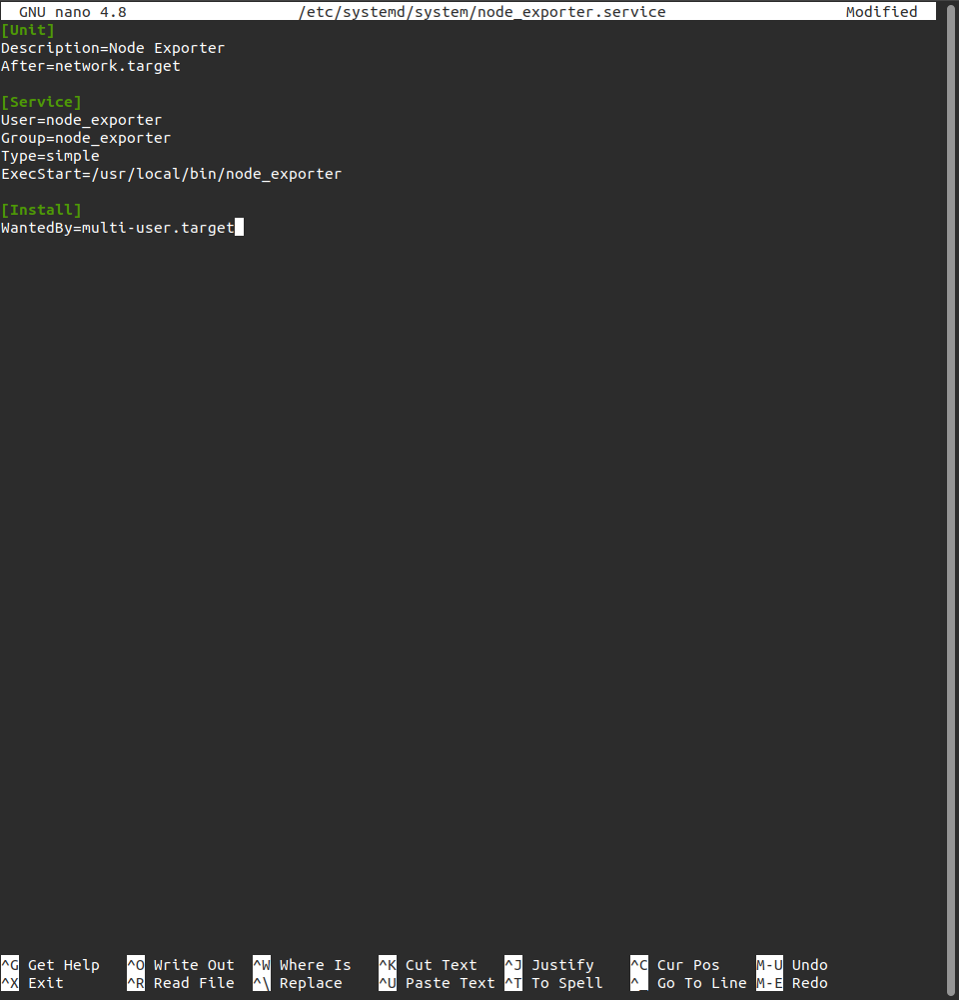

5. Melakukan reload daemon `sudo systemctl daemon-reload`

6. Menjalankan node exporter dan melakukan enable node_exporter

```
sudo systemctl start node_exporter
sudo systemctl enable node_exporter
```

7. Melakukan cek node_exporter yang berjalan dengan `sudo systemctl enable node_exporter`

   

8. Buka web browser umtuk megakses node exporter

   

### Install Prometheus

1. Melakukan download prometheus terlebih dahulu. `wget https://github.com/prometheus/prometheus/releases/download/v2.32.1/prometheus-2.32.1.linux-amd64.tar.gz`

2. Kemudian ekstrak prometheusnya `tar xvf prometheus-2.32.1.linux-amd64.tar.gz`

   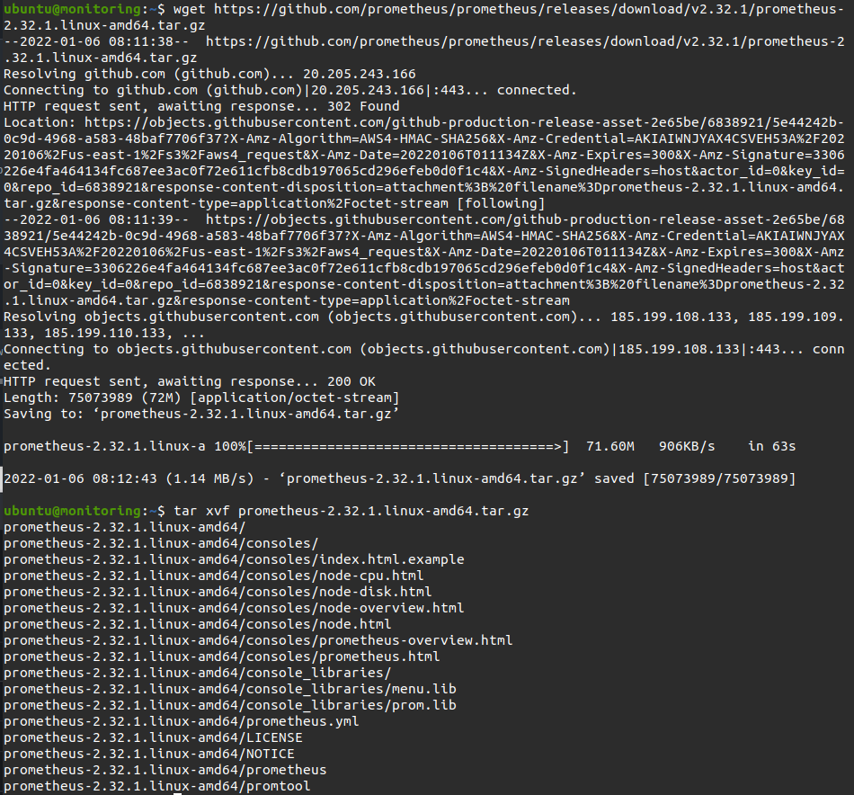

3. Membuat file di /etc dan /var/lib

```
sudo mkdir /etc/prometheus
sudo mkdir /var/lib/prometheus
```

4. copy file-file ke dalam folder etc/prometheus

```
sudo mv prometheus-2.32.1.linux-amd64/prometheus /usr/local/bin/
sudo mv prometheus-2.32.1.linux-amd64/promtool /usr
/local/bin/
sudo mv prometheus-2.32.1.linux-amd64/consoles /etc/prometheus
sudo mv prometheus-2.32.1.linux-amd64/console_libraries /etc/prometheus
```

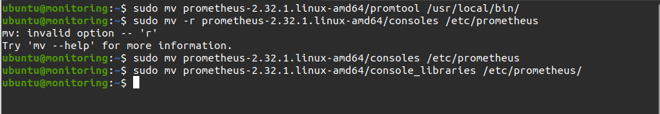

5. Membuat konfigurasi prometheus `sudo nano /etc/systemd/system/prometheus.service`

- Service prometheus

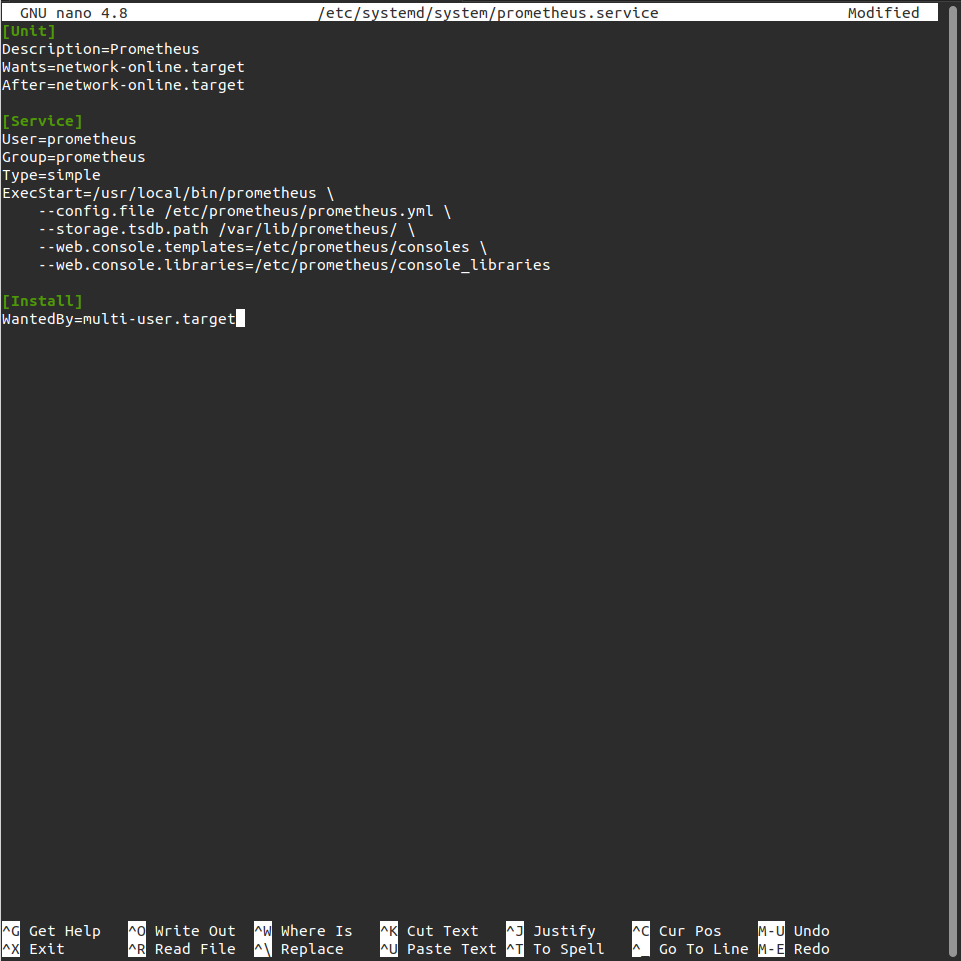

- Prometheus.yml `sudo nano /etc/prometheus/prometheus.yml`

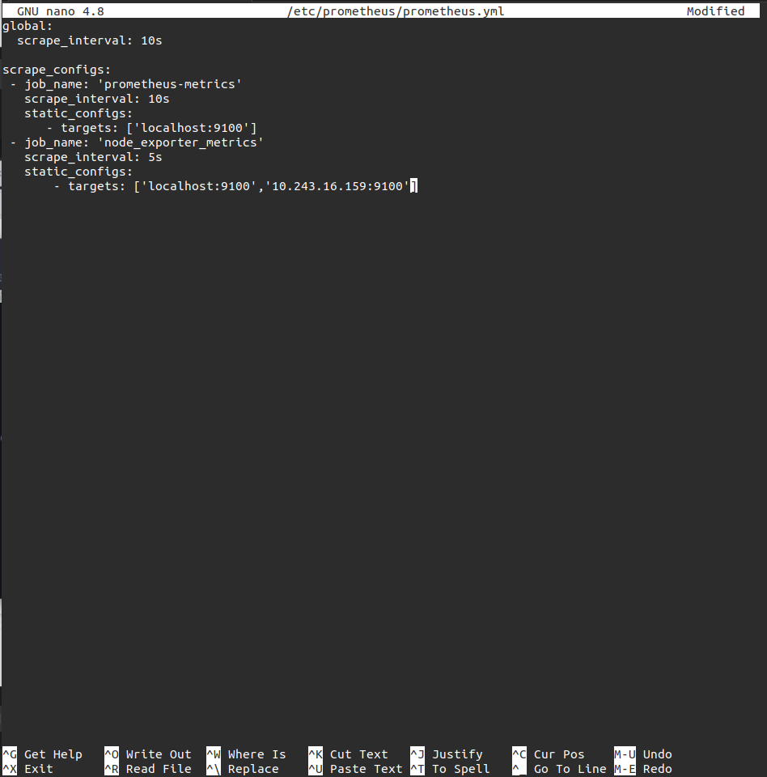

6. Membuat user prometheus `sudo useradd -rs /bin/false prometheus`
7. Mengubah konfigurasi agar bisa diakses oleh prometheus

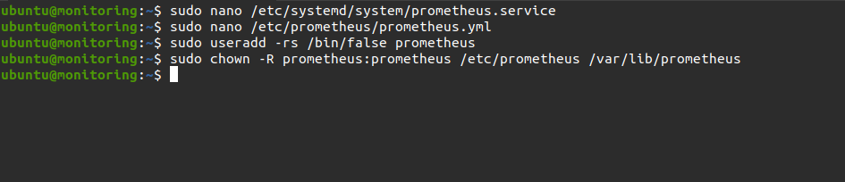

8. Save dan reload `sudo systemctl daemon-reload`
9. Enable service `sudo systemctl enable prometheus`
10. Menjalankan prometheus `sudo systemctl start prometheus`

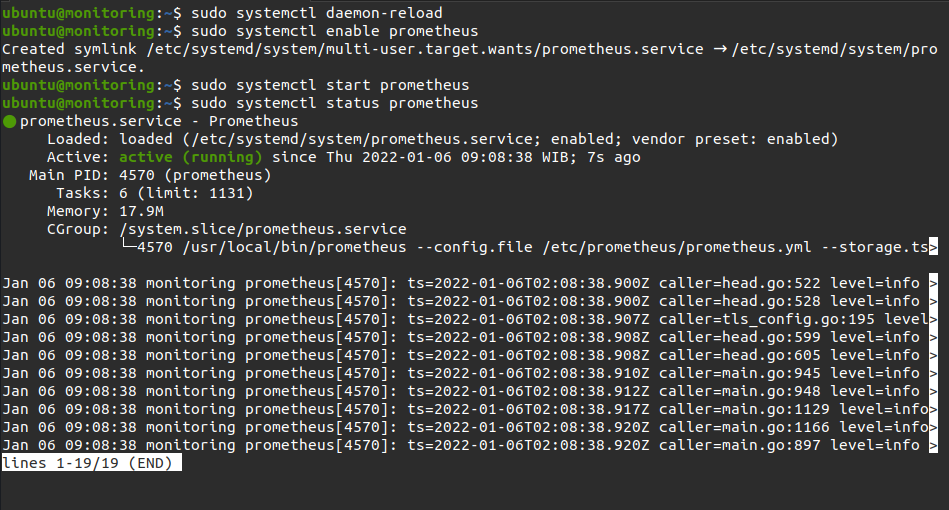

11. Buka web browser umtuk megakses prometheus

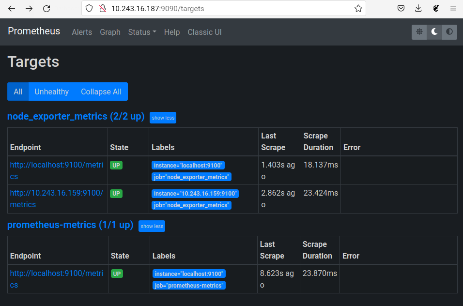

### Install Grafana

1. Tambahkan key gpg dan apt-repository grafana

```
wget -q -O - https://packages.grafana.com/gpg.key | sudo apt-key add -
echo "deb https://packages.grafana.com/oss/deb stable main" | sudo tee -a /etc/apt/sources.list.d/grafana.list
```

2. Update kemudian install grafana

```
sudo apt-get update
sudo apt-get install grafana
```

3. Enable grafana `systemctl enable grafana-server`
4. Start grafana `systemctl start grafana-server`
5. Kemudian cek status grafana `systemctl status grafana-server`

   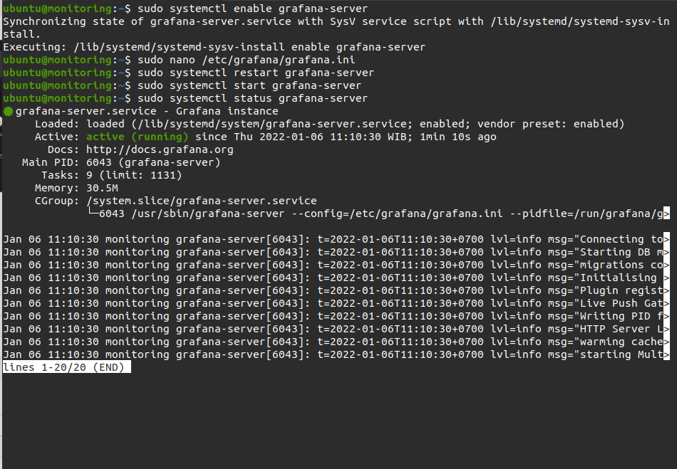

## Nonaktifkan signup grafana

6. Edit config file grafana.ini `sudo nano /etc/grafana/grafana.ini`
7. Pada bagian signup / registration ubah ke `false` menjadi -> `allow_sign_up = false`
8. Kemudian set `[auth.anonymous]` ke enabled = false

   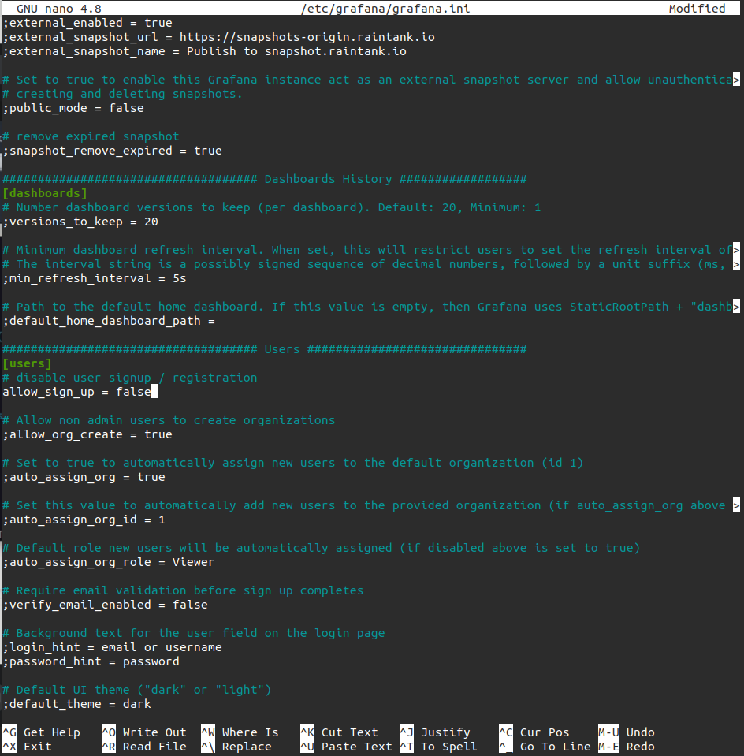

   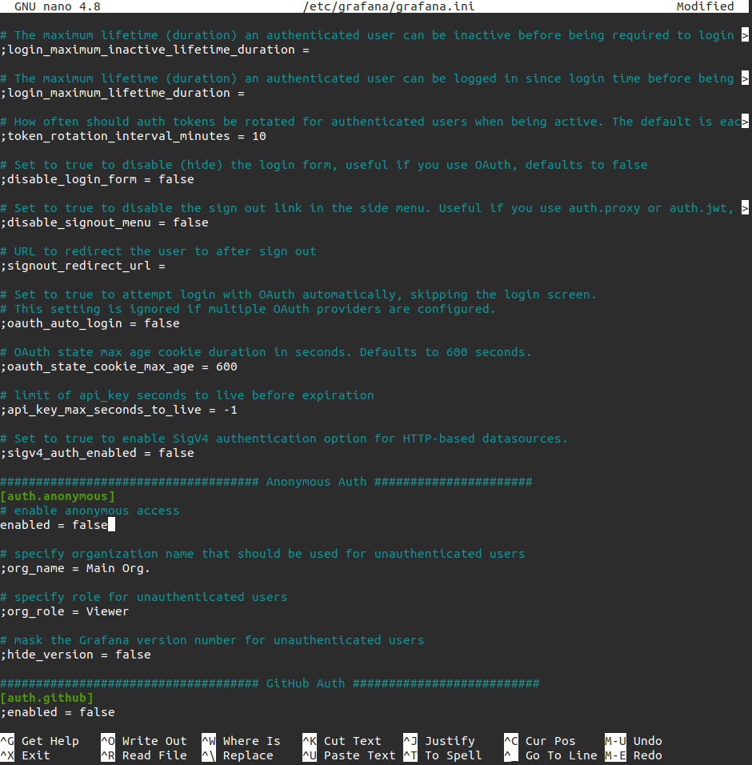

9. Save
10. Restart service grafana `sudo systemctl restart grafana-server.service`
11. Akses ip server monitor melalui port 3000

    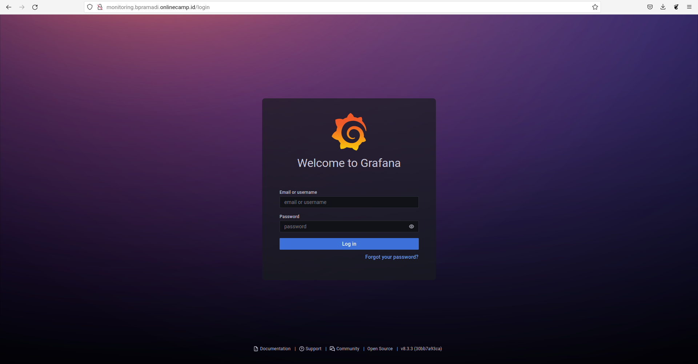

12. Kemudian login dengan user dan pass default `admin`
13. Setup password baru.

### Setup reverse proxy monitoring server

1. Buat subdomain `monitoring.bpramadi.onlinecamp.id`dan arahkan ke ip server gateway.
2. Login ke server gateway
3. Tambahkan config untuk subdomain monitoring

   ```
    server {
               listen 80;
               server_name monitoring.bpramadi.onlinecamp.id;

               location / {
                       proxy_pass http://10.243.16.187:3000;
               }
       }

   ```

4. Save
5. Restart nginx
6. Buka browser akses `monitoring.bpramadi.onlinecamp.id`
