# Microservices
Merupakan aplikasi kecil yang saling bekerjasama, setiap aplikasi tersebut memilki fokus untuk mengerjakan satu fitur saja. selain itu setiap aplikasi dapat di deploy pada server terpisah, yang akan saling berhubungan dengan service lain melalui network

<p align="center">
  
</p>

# Docker swarm 
Docker swarm merupakan teknologi yang dibuat untuk mempermudah distribusi aplikasi. Docker swarm mempermudah untuk memanajemen docker container yang dideploy pada beberapa server.

# Pemasangan Docker Swarm

## Membuat instance dengan multipass 
   
   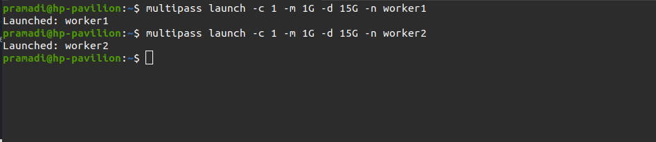
   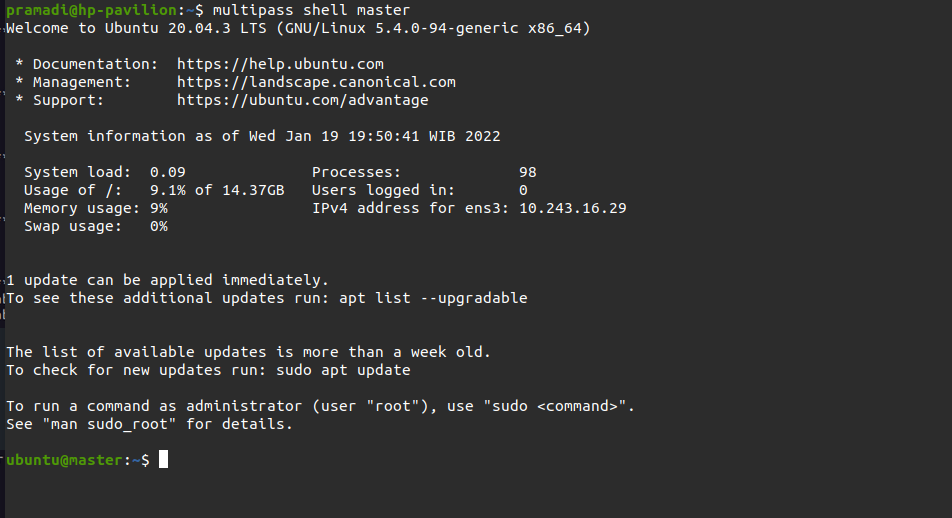

## Install Docker
1. Membuat file hosts  
2. Membuat task ansbile untuk install docker
 
   ```
    - name: Setup Docker & Docker Compose
      hosts: all
      become: true
      tasks:
         - name: Update system
            apt:
            update_cache: yes

         - name: Upgrade system
            apt:
            upgrade: yes

         - name: Setup repository
            shell: "sudo apt-get install ca-certificates curl gnupg lsb-release"
            args:
            executable: /bin/bash

         - name: Add docker GPG key
            apt_key:
            url: https://download.docker.com/linux/ubuntu/gpg
            state: present

         - name: Add docker repository
            apt_repository:
            repo: deb https://download.docker.com/linux/ubuntu focal stable
            state: present

         - name: Update system
            apt:
            update_cache: yes

         - name: Install docker engine
            apt:
            name: "{{item}}"
            state: latest
            update_cache: yes
            loop:
            - docker-ce
            - docker-ce-cli
            - containerd.io

         - name: Install stable release docker compose
            shell: sudo curl -L "https://github.com/docker/compose/releases/download/1.29.2/docker-compose-$(uname -s)-$(uname -m)" -o /usr/local/bin/docker-compose
            args:
            executable: /bin/bash

         - name: Apply executable permission to the binary
            shell: "sudo chmod +x /usr/local/bin/docker-compose"
            args:
            executable: /bin/bash
   ```

2. Run ansible-playbook
   
   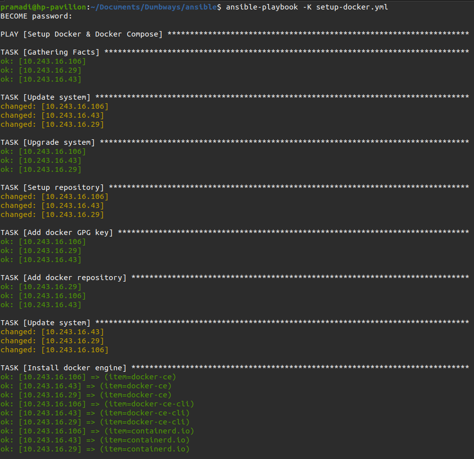

## Setup docker swarm pada manager server 
1. Login ke master server
2. Menjalankan perintah docker swarm init --advertise-addr [ip] <ipServerManager>
   
   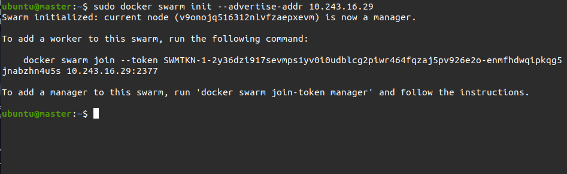

3. Menyalin docker swarm join token

## Join Docker Swarm
1. Membuat file setup-docker-swarm.yml untuk melakukan join worker ke docker swarm
   
   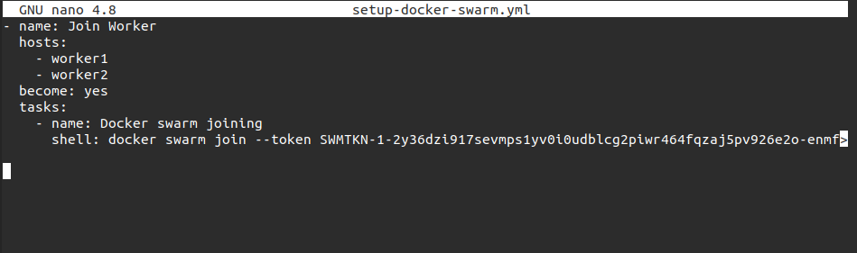

2. Run ansible-playbook
   
   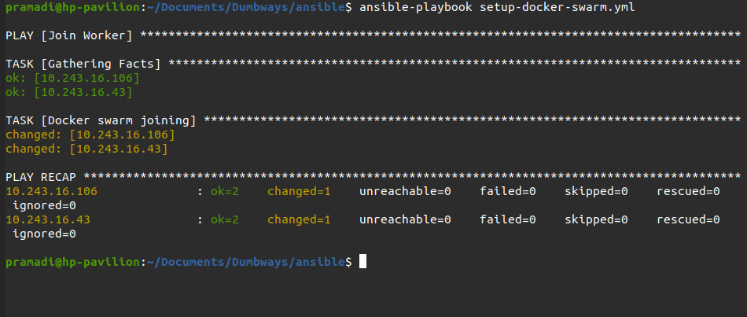

3. Mengakses master server
4. Melakukan cek docker node `sudo docker node ls` untuk memastikan server worker telah terdaftar di docker swarm
   
   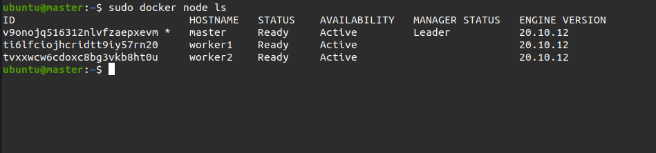

## Build & Push image ke Docker hub
1. Melakukan clone app dengan perintah `https://github.com/sgnd/dumbways-microservice.git`
2. Melakukan build image `docker-compose build`
   
   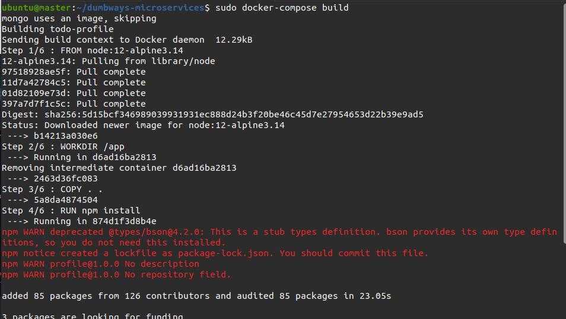

3. Menjalankan perintah `sudo docker login` dan masukan username serta password sesuai akun yang terdaftar pada Docker hub

4. Push image ke Docker hub
   
   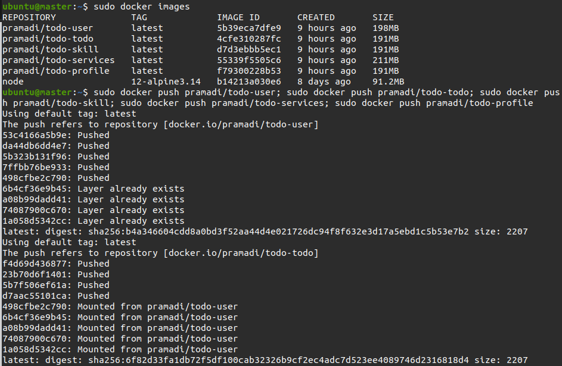

5. Tampilan image yang telah di upload
   
   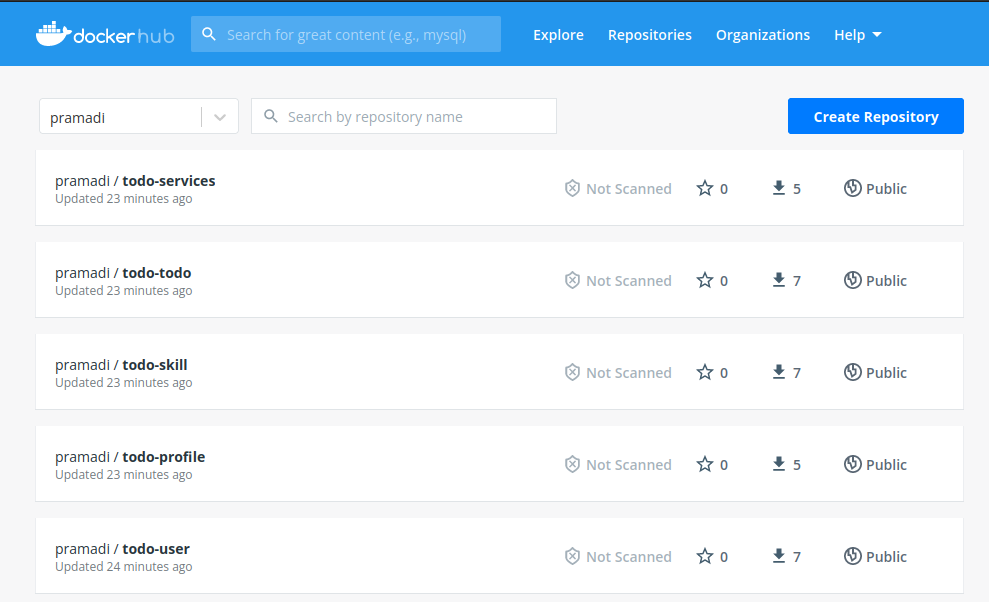

# Deploy App
1. Login ke manager server
2. Pada server worker lakukan login terminal akun docker hub, agar dapat melakukan pull images
3. Masuk ke folder app
4. Menjalankan perintah `sudo docker stack deploy --compose-file docker-compose.yml stack-apps`
   
   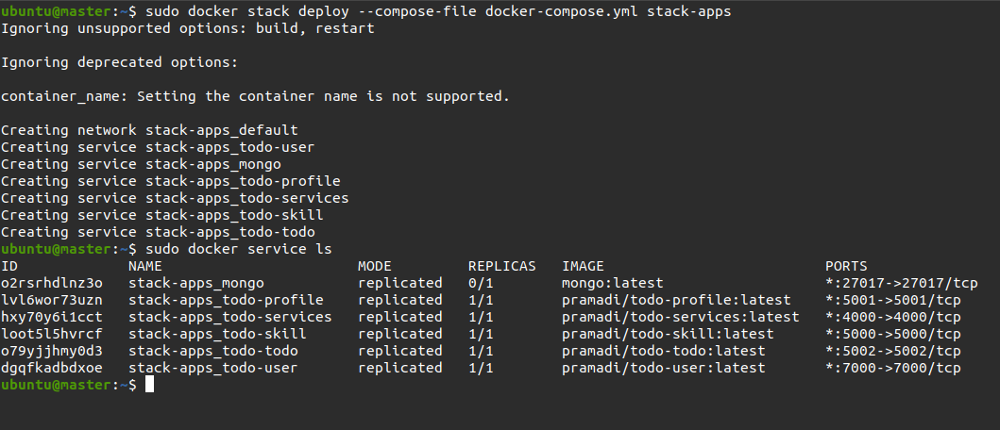

5. Melakukan replicate pada container `sudo docker service scale ID_Container/name_container=jumlah_replica`
   
   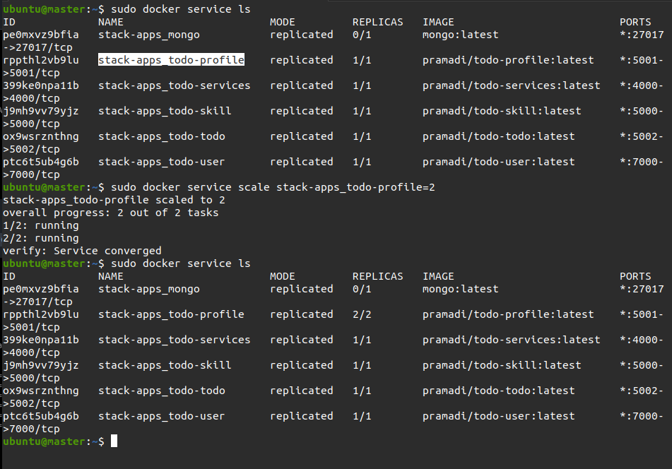

6. Cek container `sudo docker service ls`
   
7. Membuka web browser dan masukan salah satu ip server beserta port app.
  
   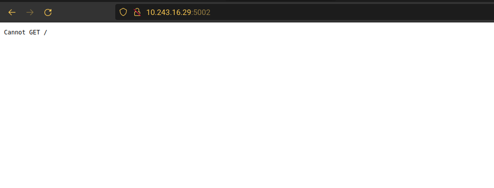

# Setup Nginx Reverse Proxy & Load Balance

1. Login Webserver instance
2. Buat folder config `micro` dan simpan di `/etc/nginx/`
3. Masuk ke dalam folder config.
4. Buat dan Edit file config app 

   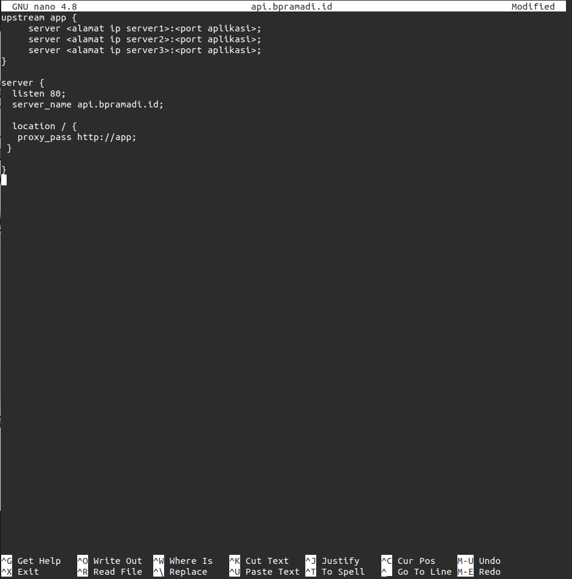 <br />

5. Save
6. Include folder config ke dalam ``nginx.conf``
7. Test config ``sudo nginx -t``
8. Jalankan `sudo systemctl restart nginx`

