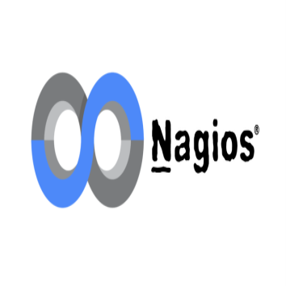

# Penerapan Kultur DevOps di perusahaan Minaqu

PT Minaqu merupakan perusahaan yang bergerak di bidang penjualan tanaman hias. Adapun perusahaan tersebut membutuhkan pengembangan pada aplikasi yang dimiliki, oleh karena itu untuk membantu dalam pengembangannya saya mencoba menerapkan kultur DevOps didalamnya.

Flow kerja DevOps beserta tools yang akan diterapkan :

## Flow DevOps

## Continuous Development

Pada fase ini kita akan melibatkan tahap perencanaan ("Plan") dengan menentukan visi/alur proyek dan tahap pengkodean ("Code") dengan melakukan pengembangan kode untuk aplikasi. Untuk proses pemantauan/pemeliharaan kode kita dapat menggunakan Version Control tools.

### OS

Ubuntu adalah sebuah sistem operasi dan distribusi Linux berbasis Debian yang gratis dan open-source. Sistem operasi ini dibangun dengan menggunakan infrastruktur Debian dan terdiri dari server, desktop, dan sistem operasi Linux.

### Alasan penggunaan

- Open source
- Memiliki Keamanan yang Unggul
- Mendukung kustomisasi

### IP Publik dan IP Statis

### Alasan penggunaan

- Agar dapat diakses oleh banyak pengguna
- Kecepatan data transfer

### Tools

### Alasan penggunaan

- Open source
- Repositori dapat disimpan dan diakses secara online/offline
- Mendukung dalam pengembangan proyek besar

## Continuous Integration

Continuous Integration (CI) merupakan serangkaian proses otomatisasi untuk developer ketika melakukan perubahan code agar dapat diperiksa dahulu sebelum masuk kedalam tahap Continuous Deployment. Hal ini diperlukan agar dapat mengetahui terjadinya error lebih cepat.

### Tools

Jenkins adalah sebuah server otomatisasi berbasis open-source, dengan integrasi berkelanjutan dalam melakukan pengujian pada perangkat lunak yang dibuat secara terus menerus sehingga memudahkan dan mempercepat developers dalam melakukan pengembangan perangkat lunak / aplikasi

### Alasan penggunaan jenkins

- Open Source
- Memiliki banyak sekali plugins yang dapat mengintegrasi dengan banyak tools untuk membantu proses build, test, dan deploy.

## Continuous Deployment

Continuous deployment merupakan proses otomatisasi agar aplikasi yang telah siap di deploy ke server dapat diteruskan sampai aplikasi dapat diakses secara publik.

### Tools

Docker adalah layanan yang menyediakan kemampuan untuk mengemas dan menjalankan sebuah aplikasi dalam sebuah lingkungan terisolasi yang disebut dengan container.

### Alasan penggunaan docker

- Dapat digunakan pada berbagai sistem operasi
- Memiliki konfigurasi yang sederhana
- Dapat Melakukan Pengujian dan Distribusi Aplikasi Secara Terus Menerus

## Continuous Monitoring

Continuous Monitoring merupakan proses mengawasi dan menjaga produk aplikasi yang telah dibuat, untuk mengetahui bagaimana aplikasi digunakan oleh pengguna. Dalam praktek DevOps, monitoring merupakan hal yang sangat penting. Tim pengembang harus mengetahui bagaimana perubahan kodenya berdampak pada produk juga penggunanya melalui monitoring tools.

### Tools

Nagios merupakan sebuah sistem dan aplikasi monitoring jaringan, Nagios menawarkan pemantauan dan layanan peringatan untuk server, switch, aplikasi, layanan, dan proses bisnis. Nagios juga dapat mengingatkan pengguna apabila ada sesuatu yang salah dan mengingatkan untuk kedua kalinya ketika masalah telah diselesaikan.

### Alasan penggunaan Nagios

- Menggunakan web interface, sehingga bisa diakses secara mudah dan remote dari tempat lain
- Mempunyai fitur Schedule downtime, dimana sangat diperlukan ketika server di maintenance atau di upgrade.
