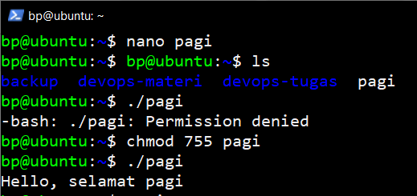

# Basic Shell Linux

Pada tugas ini akan menjelaskan tentang basic penggunaan Bash Linux berikut penjelasan nya :

## mkdir

mkdir dapat digunakan dalam membuat folder atau direktori, berikut contoh penggunaan nya :

- mkdir nama-folder

## cd

cd atau (change directory) dapat digunakan dalam berpindah dari satu direktori ke direktori lain, berikut contoh penggunaan nya :

- cd nama-folder

## touch

touch dapat digunakan ketika membuat sebuah file

berikut contoh penggunaan nya :

- touch nama-file

## ls

fungsi ls di gunakan untuk melihat atau menampilkan isi dari file atau direktor, berikut contoh penggunaan nya :

- ls or ls -la

## cat

fungsi cat digunakan untuk menampilkan isi konten dari suatu file, berikut contoh penggunaan nya :

- cat nama-file

## cp

perintah untuk menyalin file dan direktori dari satu lokasi menuju lokasi yang dipilih, berikut contoh penggunaan nya :

- cp nama-file new-nama-file or cp -r nama-folder new-nama-folder

## mv

perintah untuk memindahkan file atau folder dari satu lokasi ke lokasi yang dipilih, berikut contoh penggunaan nya :

- mv nama-file new-nama-file or mv nama-folder new-nama-folder

## rm

perintah yang digunakan untuk menghapus file atau folder, berikut contoh penggunaan nya :

- rm nama-file or rm -r nama-folder

## find

perintah yang memungkinkan untuk mencari dan menemukan daftar file dan direktori berdasarkan kondisi yang ditentukan oleh user/pengguna, berikut contoh penggunaan nya :

- find /your/path -type f -name nama-file or find /your/path -type d -name nama-folder

## grep

perintah untuk untuk mencari string (teks) dalam file, berikut contoh penggunaan nya :

- grep text namafile or grep text \*

## sudo

Sudo merupakan program yang terdapat dalam linux yang digunakan untuk menjalankan perintah yang membutuhkan akses dari akun root, berikut contoh penggunaan nya :

- sudo su
- sudo apt update

## df

perintah untuk mengetahui tentang penggunaan ruang disk pada Sistem Linux. Perintah df menampilkan jumlah ruang disk yang tersedia pada sistem file, berikut contoh penggunaan nya :

- df or df -h

## chmod

perintah untuk mendefinisikan permission/hak akses, berikut contoh penggunaan nya :

- sudo chmod 777 nama-folder or file-name
- sudo chmod 755 nama-folder or file-name

## chmod

perintah yang digunakan untuk mengubah kepemilikan pada suatu file atau folder kepada user tertentu, berikut contoh penggunaan nya :

- sudo chown users:users nama-folder or nama-file

## kill

perintah yang digunakan untuk mematikan service atau program yang sedang berajalan, berikut cara penggunaan nya

- kill -9 PID

## ping

fungsi dari ping adalah untuk mengecek apakah server kita terhubung ke jaringan atau tidak, bisa jaringan internet ataupun IP Address, berikut cara penggunaan nya

## wget

untuk mengunduh file dari web. Dengan Wget, Anda dapat mengunduh file menggunakan protokol HTTP, HTTPS, dan FTP. berikut cara penggunaan wget

## adduser dan deluser

perintah adduser digunakan untuk membuat user baru di linux sedangkan deluser digunakan untuk Untuk menghapus akun pengguna, berikut contoh penggunaan nya :

- adduser nama-user
- deluser nama-user

