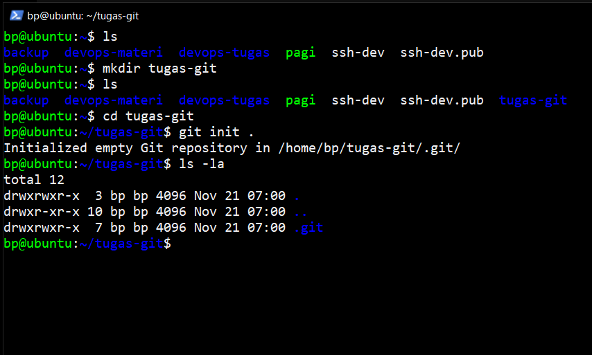

# Dokumentasi Git

Git merupakan version control system yang bertugas untuk mencatat perubahan seluruh file atau repository. Developers menggunakan git untuk menyimpan database tidak hanya ke satu tempat, sehingga semua yang terlibat dalam penyusunan kode dapat menyimpan database tersebut

Adapun langkah basic penerapan dan penggunaanya sebagai berikut :

## Konfigurasi git

Membuka terminal lalu menjalankan perintah berikut :

- git config --global user.name "nama_user"
- git config --global user.email email_anda
- git config --list

## konfigurasi SSH key

- Menjalankan perintah ssh-keygen hingga seperti tampilan tahap 1
- Menjalankan perintah cd .ssh
- Menjalankan perintah cat id_rsa.pub hingga seperti tampilan tahap 3
- Menyalin teks, lalu memasukannya ke github setting
- pilih New SSH Key
- Memasukan teks yang disalin ke kolom key dan memasukan title sesuai kebutuhan
- lalu klik save

### Tahap 1

### Tahap 2

### Tahap 3

### Tahap 4

## Membuat repository

Adapun langkah penerapan dan penggunaanya sebagai berikut :

- git init .

## Git gitiginore

gitignore dapat mencegah file atau direktori yang sudah di masukkan ke gitignore agar tidak berubah, berikut cara pengunaan nya :

- Membuat file .gitignore
- Membuat file baru seperti test.html, test-2.html
- Masukkan file test.html ke dalam gitignore agar ketika ada perubahan pada file tidak dicatat oleh git
- setelah itu jalankan perintah git status untuk melihat status perubahan yang terjadi

## Git Add dan Commit

- Modified : Tahap ketika setiap perubahan sudah dilakukan, namun belum disimpan dalam database git
- Staged : Tahap ketika setiap perubahan sudah ditandai, namun belum disimpan dalam database git, adapun perintah yang digunakan git add
- Commited : Tahap ketika setiap perubahan sudah disimpan dalam database git, adapun perintah yang digunakan git commit

Adapun langkah penerapan dan penggunaanya sebagai berikut :

## Git Remote

Adapun langkah penerapan dan penggunaanya sebagai berikut :

- Membuat repository baru pada halaman github seperti pada gambar
- Menjalankan perintah git branch -M main
- Menjalankan perintah remote add github git@github.com:BCHTRPRMD/devops-git.git
- Menjalankan perintah push -u github main

## Git Branch dan Checkout

Git branch merupakan perintah yang digunakan untuk membuat versi dari sebuah repository sedangkan git checkout perintah yang digunakan ketika melakukan pindah ke branch yang dituju

Adapun langkah penerapan dan penggunaanya sebagai berikut :

- Menjalankan perintah git branch -a
- Menjalankan perintah git branch stag
- Menjalankan perintah git checkout stag
- Menjalankan perintah git branch -M staging

## Git push

Perintah untuk mengunggah repository dari komputer ke repository online

Adapun langkah penerapan dan penggunaanya sebagai berikut :

- git push -u github main

## Git pull

Perintah untuk memperbaharui perubahan yang terjadi pada server git

Adapun langkah penerapan dan penggunaanya sebagai berikut :

- git pull origin nama-branch

