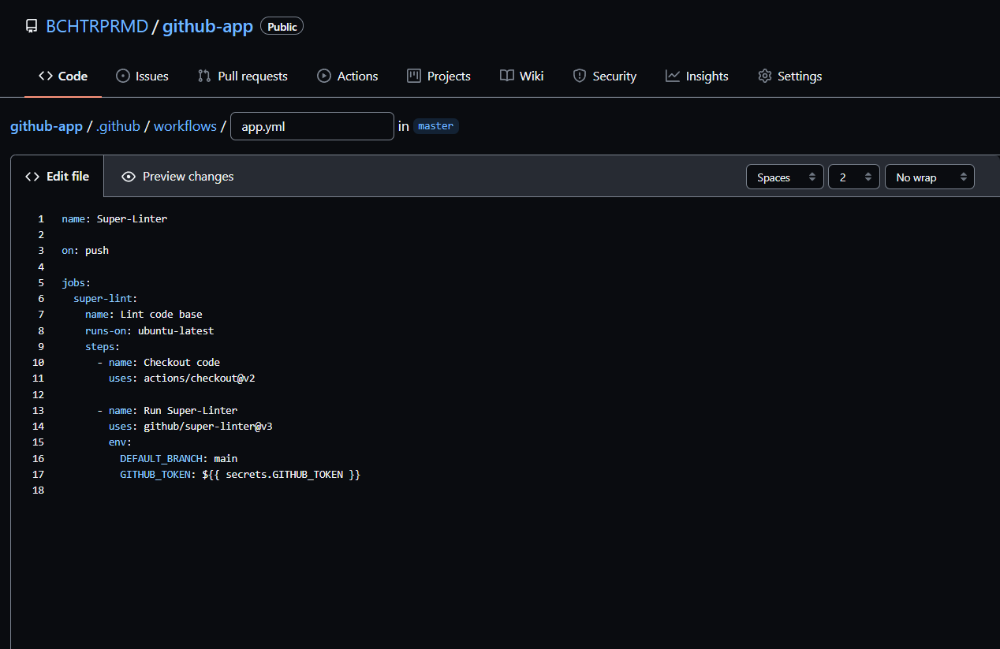
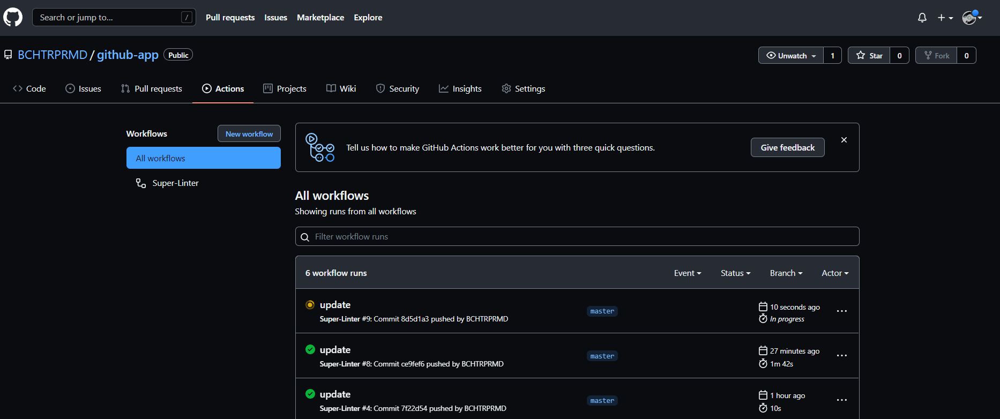
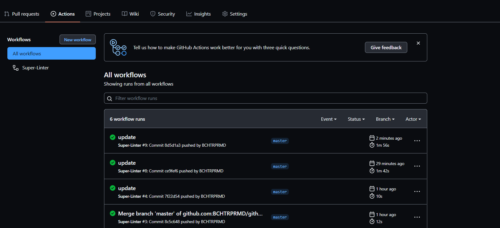
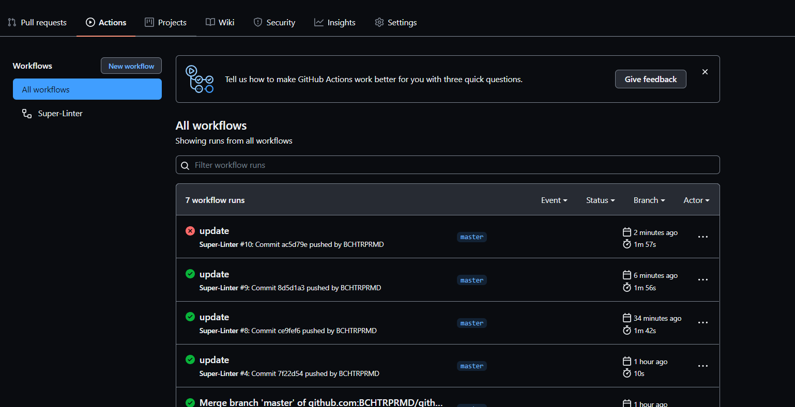
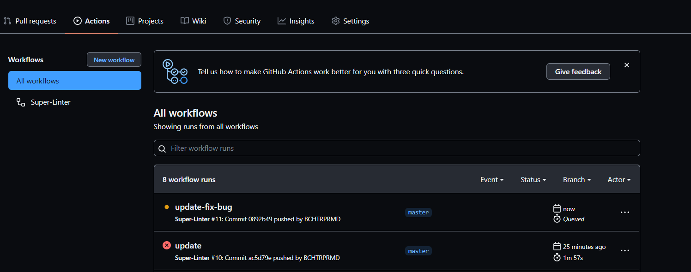
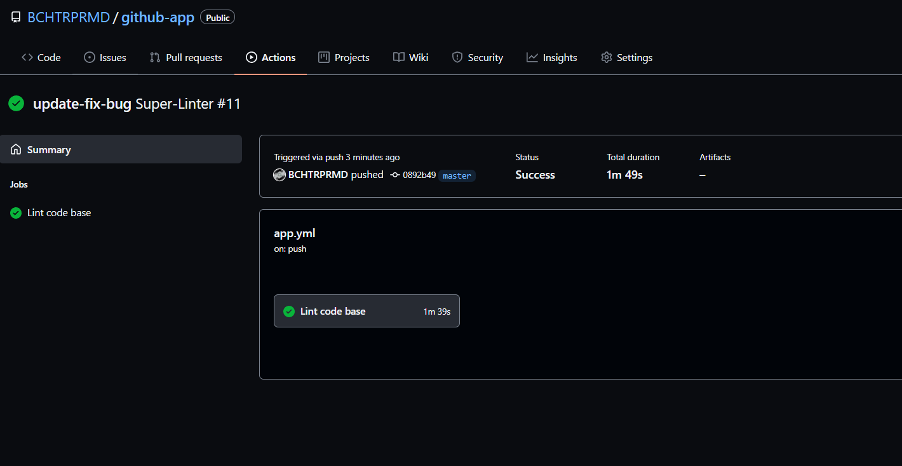

# Github Actions

Berikut penjelasan proses dan langkah CI/CD dengan menggunakan github actions:

## Step 1

- Membuat sebuah repository baru sebagai tempat CI/CD, lalu push project aplikasinya ke repository tersebut.

## Step 2

- kemudian membuat Workflow baru, disini pembuatan workflow dilakukan secara manual. workflow dibuat dengan ekstension .yml, lalu edit template source code .yml sesuai dengan kebutuhan. Setelah setup selesai langkah selanjutnya adalah commit.
  

## Step 3

- Kemudian masuk ke menu Github Actions disana akan terlihat workflow yang telah dibuat sebelumnya.

- Jika proses workflow berjalan akan menampilkan indikator kuning
  

- Jika workflow telah berhasil dibuat maka akan ada indikator checklist hijau dengan begitu tandanya kita telah berhasil.
  

## Step 4

- Selanjutnya kita akan melakukan pengecekan dan pengujian terhadap CI workflow yang telah dibuat dengan melakukan push dan commit suatu program ke repository yang telah dibuat.
- Kemudian kita melakukan check di Github action untuk melihat running job berlangsung.
- Apabila terdapat error dan indikator tanda silang, maka hal tersebut merupakan penanda bahwa harus dilakukan perbaikan pada bug/error sebelum dilakukan push kembali.
  

## Step 5

- Setelah dilakukan perbaikan pada app, selanjutnya adalah melakukan push ke repository yang telah dibuat.
- Jika app telah sesuai dengan format maka akan ada indikator checklist hijau dengan begitu tandanya kita telah berhasil melakukan CI/CD menggunakan GitHub action.

