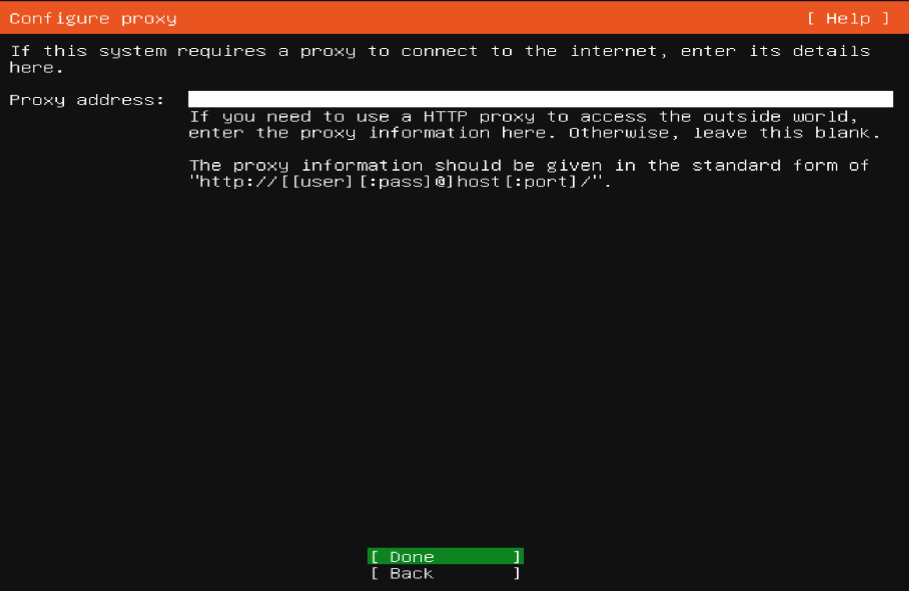

# Instalasi linux server dan Bash script

## OS

Ubuntu adalah sebuah sistem operasi dan distribusi Linux berbasis Debian yang gratis dan open-source. Sistem operasi ini dibangun dengan menggunakan infrastruktur Debian dan terdiri dari server, desktop, dan sistem operasi Linux.

## Tahapan instalasi Ubuntu server

### Pilih bahasa yang akan digunakan pada sistem operasi

### Pilih Keyboard layout

### Melakukan konfigurasi IPv4 untuk penggunaan IP Statis

### Melakukan konfigurasi IPv4 Method dari Automatic DHCP menjadi Static IP

### Konfigurasi proxy dan ubuntu archive mirror

### Membuat partisi server dengan memilih custom storage layout

### Membuat partisi swap dan root sesuai dengan keperluan

### Berikut merupakan hasil swap dan root

### Melakukan konfigurasi profile untuk login ke dalam sistem

### Melakukan install OpenSSH dengan memilih Install OpenSSH server

### Berikut merupakan proses instalasi ketika berlangsung hingga proses reboot

### Melakukan login menggunakan username dan password yang telah dibuat dan ubuntu server sudah dapat digunakan

