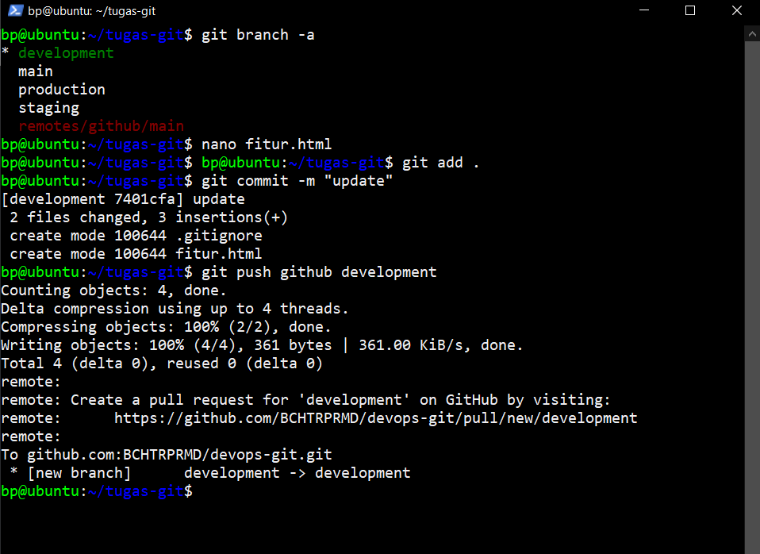
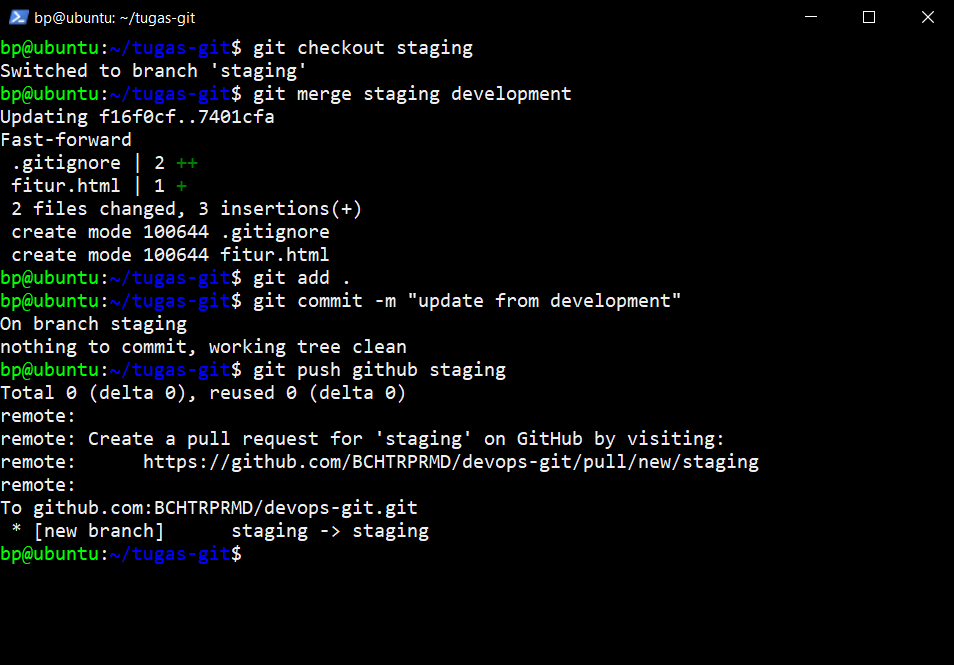
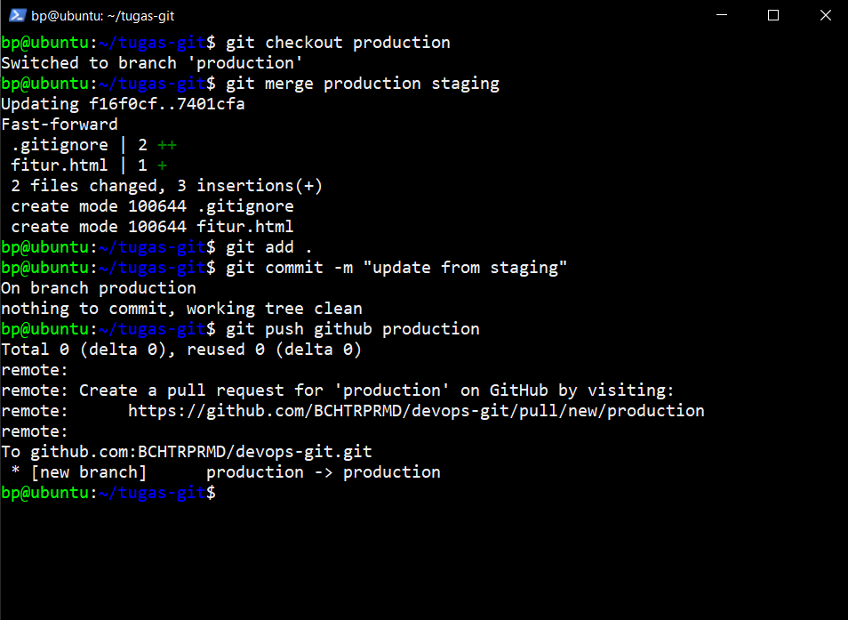

## Study Case

Pada pengembangan sebuah aplikasi dibutuhkan sebuah pembaharuan fitur yang digunakan untuk riwayat transaksi dalam aplikasi tersebut.

Adapun Langkah proses pengembangan nya sebagai berikut :

  

### Development

Tahap pengembangan fitur oleh programmer menggunakan bahasa pemrograman yang sesuai kebutuhan, yang nantinya akan diterapkan pada aplikasi

### Staging

Tahap untuk testing dan QA (Quality assurance) semua fungsi dan fitur pada aplikasi yang telah dibuat dan dikembangkan sebelumnya, hingga sesuai dengan kebutuhan dan bekerja dengan baik.

### Production

Tahap dimana fitur telah siap digunakan dan sudah masuk ke aplikasi, kemudian oleh pengguna dapat digunakan untuk melihat riwayat pada setiap transaksi. Namun apabila pada penambahan fitur terjadi masalah atau error maka bisa dilakukan pengembalian kedalam versi sebelumnya.

