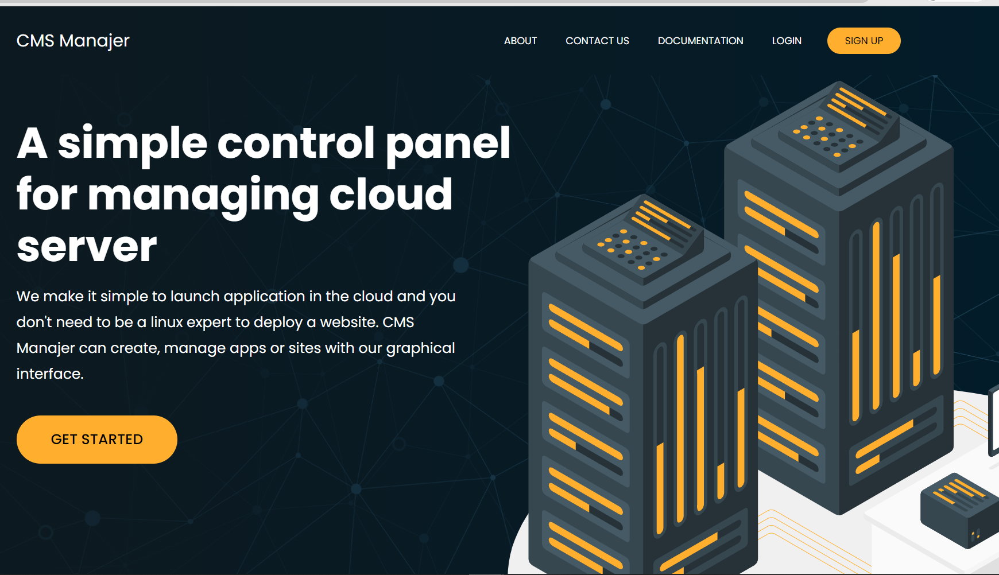
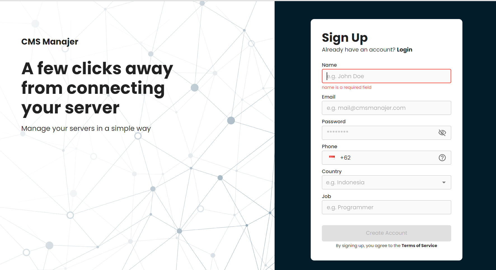
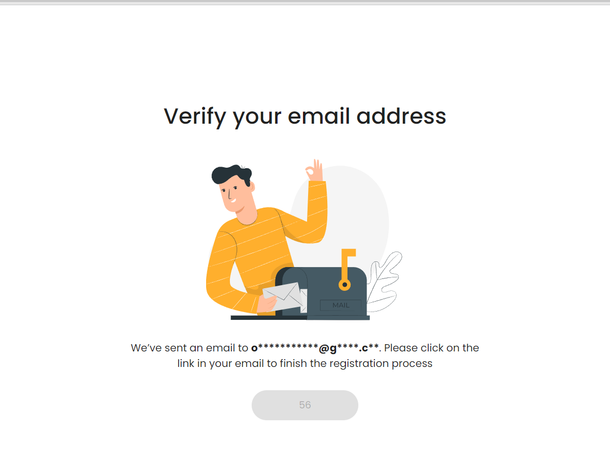
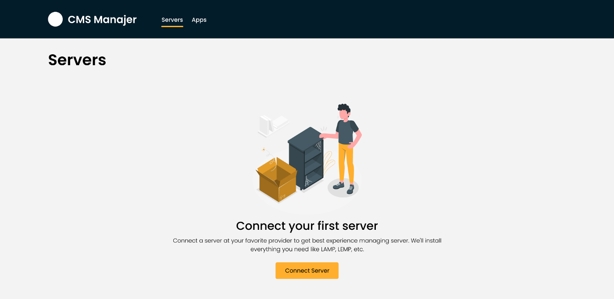
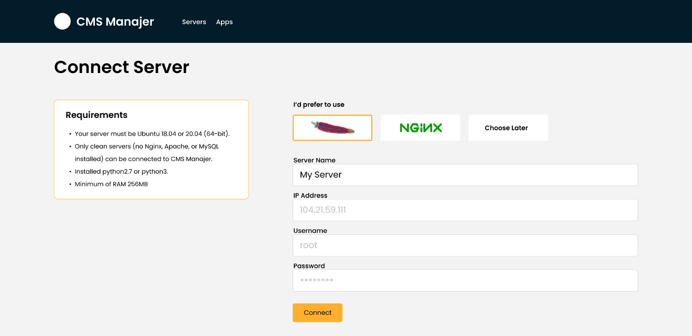
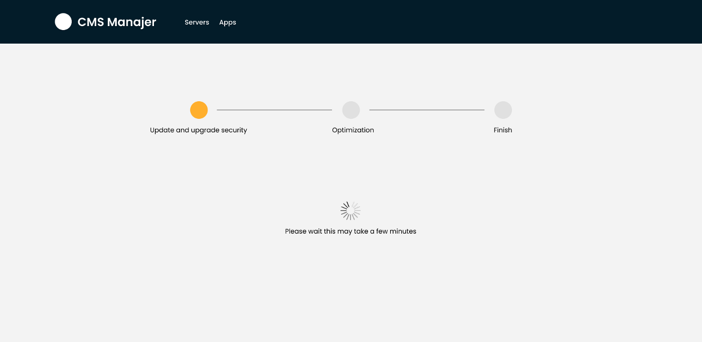
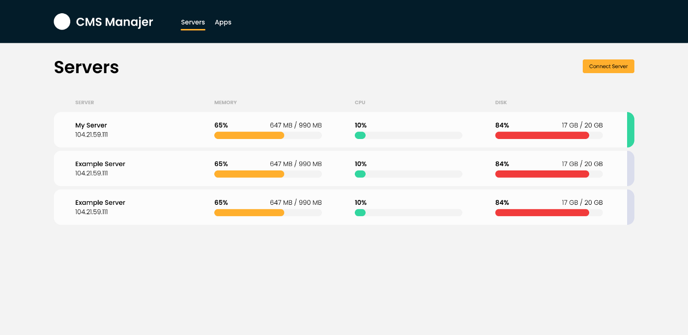
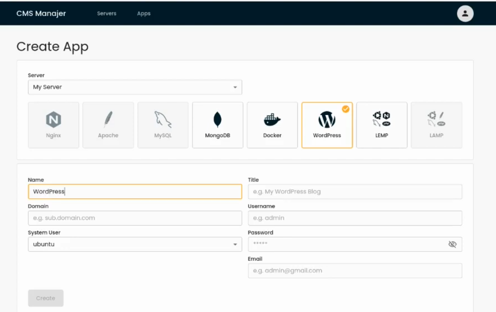

# Dokumentasi cmsmanajer

CMS Manajer atau Cadabra Multiple Server Manajer merupakan platform yang berguna untuk memanajemen server-server yang telah dimiliki dalam satu dashboard dan memudahkan ketika melakukan pemasangan aplikasi yang dibutuhkan dengan sekali klik, serta dapat menginstal CMS (Content Management System) seperti WordPress. Selain itu CMS Manajer juga mengoptimalkan konfigurasi kernel, security dan performance pada server.

# Registrasi

- Melakukan `registrasi` dengan mengakses website resminya di https://cmsmanajer.com.

  

- Mengisi informasi yang dibutuhkan seperti `Nama, Email, Password, Country, job` pada form signup
  

- Membuka email yang telah didaftarkan dan lakukan klik untuk konfirmasi email
  

- Jika telah berhasil proses verifikasi tersebut, maka akan dialihkan ke dashboard CMS Manajer.

# Connect server

- Memilih `Connect server` untuk mengkoneksikan server dengan CMS Manajer

  

- Mengisi detail informasi ke dalam form diantaranya `Name server yang akan dibuat, IP Address, Username, Password`
  

- Memilih `connect` untuk melanjutkan proses koneksi dengan CMS manajer dan meunggu prosesnya hingga selesai dimana akan mengatur firewall, optimasi kernel dan lainnya
  

- Apabila sudah berhasil, maka akan tampil server dan terlihat seperti pada gambar di bawah
  

# Instalasi aplikasi

- Memilih server pada menu dashboard

- Membuka menu `create app` untuk melakukan instalasi aplikasi yang akan dipilih

- Mengisi detail informasi seperti `name, domain, system user, title, username, password dan email
- Memilih `create`

  
