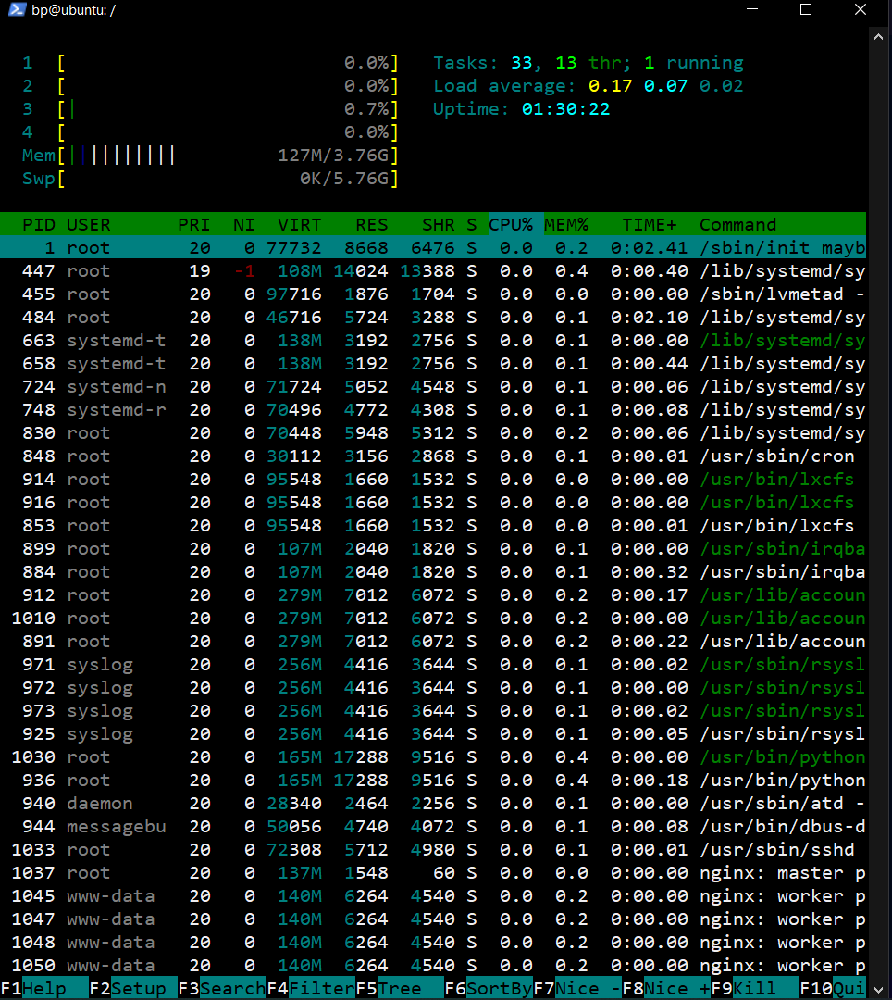

# Dokumentasi Manage Server

# Perintah Nano

Memeriksa nano yang telah terpasang :

- `nano --version`

Membuka file menggunakan nano :

- `nano nama-file`
- `nano /lokasi/folder/nama-file`

  
  

Penggunaan shortcut pada nano :

- `CTRL + W` berfungsi untuk mencari text

- `CTRL + O` berfungsi untuk melakukan save
- `CTRL + x` berfungsi untuk keluar dari editor

- `ALT + A` berfungsi untuk memilih teks
- `CTRL + K` berfungsi untuk melakukan cut pada teks yang telah di select
- `ALT + 6` berfungsi untuk melakukan copy teks yang telah di select
- `CTRL + U` berfungsi untuk melakukan paste teks yang telah di salin
- `CTRL + A` berfungsi untuk melakukan pindah cursor ke awal baris
- `CTRL + E` berfungsi untuk melakukan pindah cursor ke akhir baris

# Text Manipulation

- `cat` merupakan perintah yang digunakan untuk membuat daftar konten / isi file pada standard output (sdout), berikut contoh penggunaannya :

  - `cat nama-file` digunakan dalam melihat isi file
  - `cat > nama-file` digunakan dalam membuat file baru dan memasukan teks
  - `cat file1 file2 > file3` digunakan dalam menggabungkan dua file dan menyimpan di file3

    

- `sort` merupakan perintah yang digunakan untuk mengurutkan data, baik secara ascending ataupun descending, berikut contoh penggunaannya :

  - `sort nama-file` digunakan dalam mengurutkan secara ascending
  - `sort -r nama-file` digunakan dalam mengurutkan secara descending

    

- `sed` atau stream editor merupakan perintah yang digunakan untuk memanipulasi teks dasar pada file dengan cepat, berikut contoh penggunaanya :

  - `sed -i 's/adalah/menjadi/g' nama-file` digunakan untuk mengganti semua kata "adalah" menjadi "menjadi" pada suatu file

    

- `grep` merupakan perintah untuk melakukan pencarian sebuah text pada sebuah file yang telah dibuat, berikut contoh penggunaanya :

  - `grep teks nama-file` digunakan mencari kata pada suatu file
  - `grep -c teks nama-file` digunakan untuk menghitung jumlah kata pada suatu file
  - `grep teks *` digunakan untuk mencari semua file yang berisi suatu kata

    

- `Echo` merupakan perintah untuk mencetak string / pesan dari hasil perintah lain, berikut contoh penggunaanya :

  - `echo "teks"`
  - `echo "membuat teks" >> nama-file`
  - `echo "replace teks" > nama-file`

    

# Monitoring

Aktivitas untuk melihat kinerja suatu sistem secara realtime

- `htop` merupakan perintah untuk memonitoring penggunaan memory, cpu, swap pada suatu sistem, berikut contoh penggunaanya :

  - `sudo apt install htop -y` digunakan ketikan melakukan pemasangan htop
  - `htop` digunakan untuk menjalankan htop

    

- `lsof` atau list open files merupakan perintah untuk melihat seluruh file yang terbuka berdasarkan proses aktif yang berjalan di sistem, berikut contoh penggunaannya :n

  - `lsof` digunakan untuk menampilkan seluruh proses

    

  - `lsof -u user` digunakan untuk menampilkan proses yang dilakukan oleh user

    

  - `lsof -i port` digunakan untuk menampilkan proses pada port yang dipilih

    

- `ps` atau process status merupakan perintah untuk mengetahui daftar proses yang berjalan pada sistem, berikut contoh penggunaanya :

  - `ps -f -u user` digunakan untuk menampilkan proses pada user

    

  - `ps -aux` digunakan untuk menampilkan seluruh proses secara lengkap

    

# Network Firewall

Perintah yang dapat digunakan untuk mengamankan sebuah server

- `iptables` merupakan sebuah modul di linux yang memberikan dukungan langsung terhadap kernel untuk keamanan sistem serta beberapa keperluan jaringan

  

- `ufw` atau uncomplicated firewall merupakan salah satu fitur frontend iptables pada linux untuk mengkonfigurasi sistem firewall, berikut contoh penggunaannya :

  - `sudo ufw --version` digunakan untuk memeriksa ufw yang telah terpasang
  - `sudo ufw default deny incoming` digunakan untuk memblokir semua akases yang masuk
  - `sudo ufw default allow outgoing` digunakan untuk membuka semua akses yang keluar
  - `sudo ufw app list` digunakan untuk menampilkan aplikasi yang didukung oleh ufw pada server
  - `sudo ufw allow "nama-aplikasi"` digunakan untuk mengizinkan akses dari luar ke dalam untuk suatu aplikasi

    

  - `sudo ufw allow 80` digunakan untuk membuka akses pada port 80

    

  - `sudo ufw allow 80/tcp` digunakan untuk membuka akses pada port 22 dengan koneksi tcp

    

  - `sudo ufw deny 80` digunakan untuk memblokir semua akses ke port 80

    
