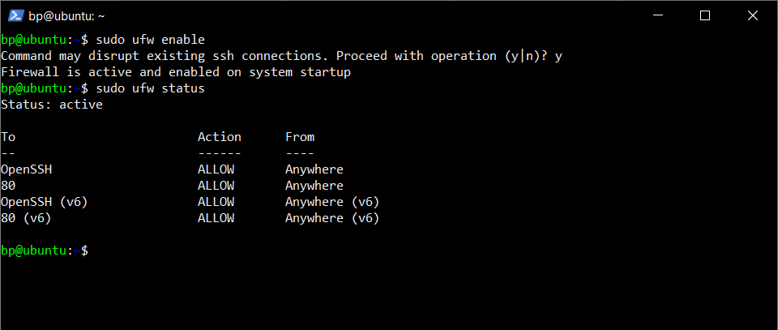
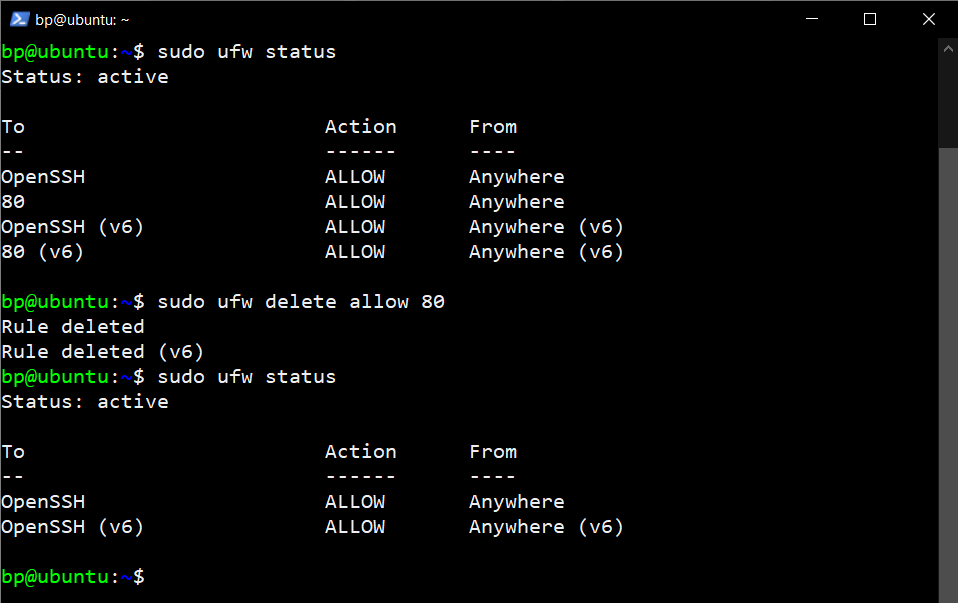
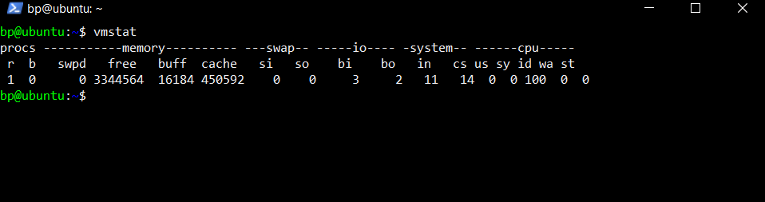
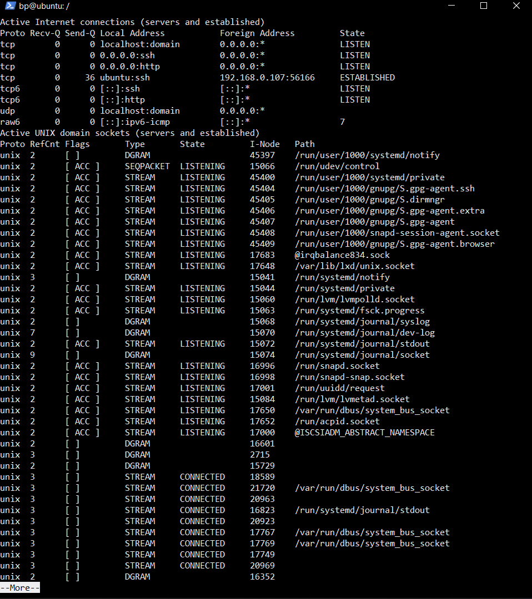

# Perintah Tambahan

- `sudo ufw enable` merupakan perintah yang digunakan untuk mengaktifkan ufw
- `sudo ufw status` merupakan perintah yang digunakan untuk menampilkan status dari ufw atau firewall

  

- `sudo ufw delete allow 80` merupakan perintah yang digunakan untuk menghapus akses pada port 80

  

- `vmstat` merupakan perintah yang digunakan untuk menampilkan statistik memori virtual, kernerl threads, disk, proses sistem, blok I/O, interupsi, aktivitas CPU

  

- `sudo netstat -a | more` merupakan perintah yang digunakan untuk mmemantau statistik paket jaringan yang masuk dan keluar serta statistik interface itu sendiri

  
