# Dokumentasi Pembuatan Aplikasi

# Node Js

Melakukan Instalasi dan Konfigurasi aplikasi sederhana, adapun contoh penerapannya sebagai berikut :

- Melakukan perintah `curl -o- https://raw.githubusercontent.com/nvm-sh/nvm/v0.39.0/install.sh | bash`
- `nvm install 16` digunakan untuk pemasangan node js versi 16
- `nvm use 16` digunakan untuk memilih node js sesuai denga versi yang telah dipasang / yang akan digunakan
- `node -v` digunakan untuk mengecek pemasangan dan versi node yang telah terpasang
- `npm -v` digunakan untuk mengecek pemasangan dan versi npm yang telah terpasang
- `exec bash` digunakan apabila nvm belum terdeteksi

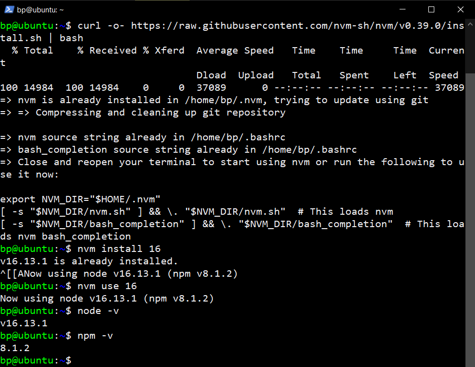

- Membuat direktori dengan menjalankan perintah `mkdir myapp-nodejs`
- Menjalankan perintah `cd myapp-nodejs` untuk pindah ke direktori yang telah dibuat
- Menjalankan perintah `npm init -y` untuk membuat file package.json
- Menjalankan perintah `npm install express --save` untuk melakukan pemasangan express
- Menjalankan perintah `nano index.js` untuk melakukan edit dan pembuatan file index.js

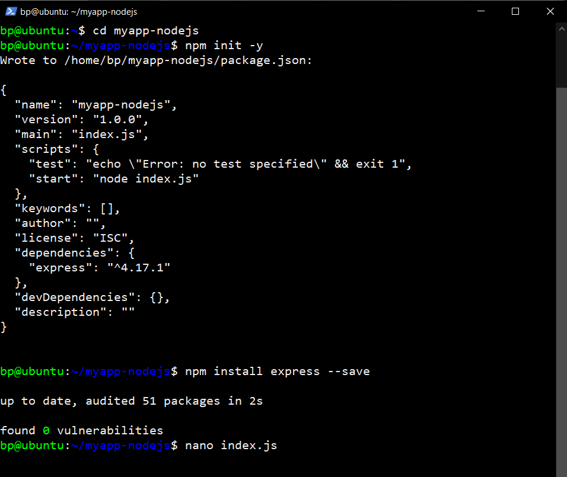

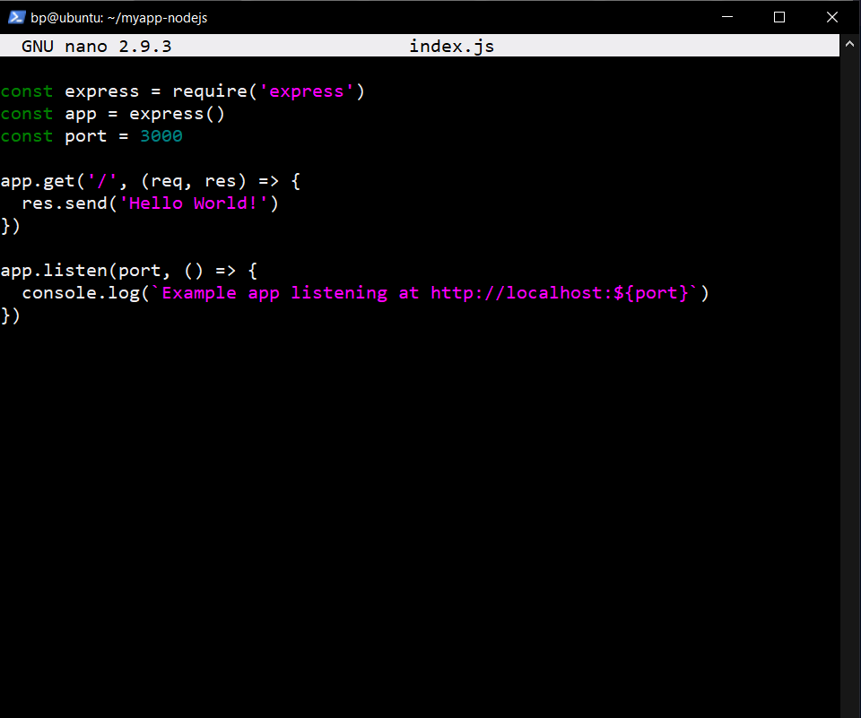

- Menjalankan perintah `node index.js` untuk menjalankan aplikasi yang telah dibuat

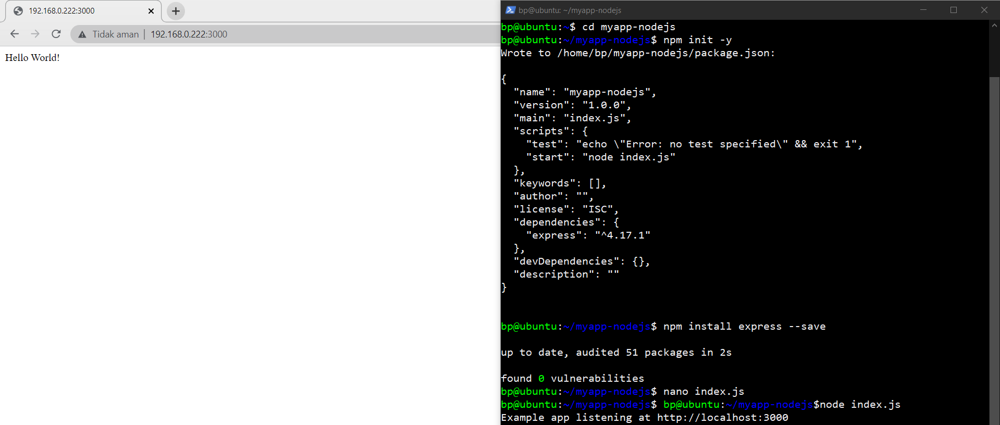

# Python

Melakukan Instalasi dan Konfigurasi aplikasi sederhana, adapun contoh penerapannya sebagai berikut :

- Melakukan perintah `sudo apt update` untuk update sistem
- Melakukan perintah `sudo apt upgrade -y` untuk upgrade sistem
- Menjalankan perintah `python3 -V` untuk mengecek versi yang sudah terinstall
- Menjalankan perintah `sudo apt install python3-pip` untuk melakukan pemasangan package manager
- Menjalankan perintah `pip install flask` untuk melakukan pemasangan flask

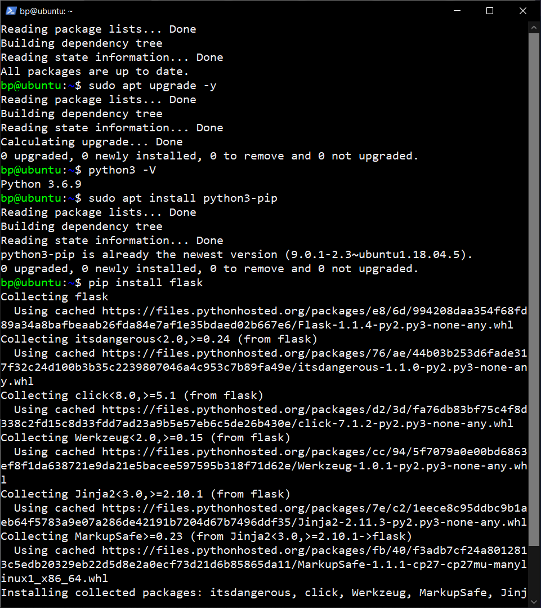

- Membuat direktori dengan menjalankan perintah `mkdir myapp-python`
- Menjalankan perintah `cd myapp-python` untuk pindah ke direktori yang telah dibuat
- Menjalankan perintah `nano index.py` untuk melakukan edit dan pembuatan file index.py

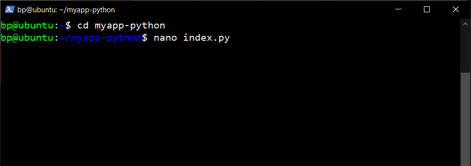

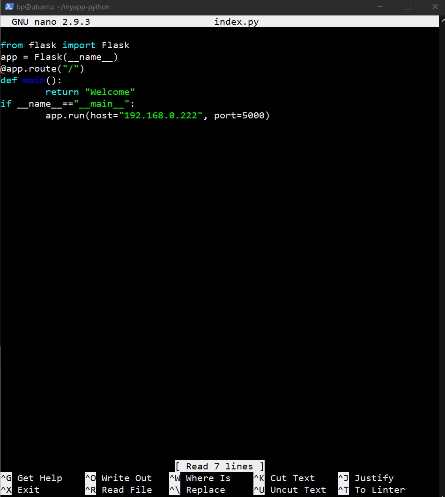

- Menjalankan perintah `python3 index.py` untuk menjalankan aplikasi yang telah dibuat

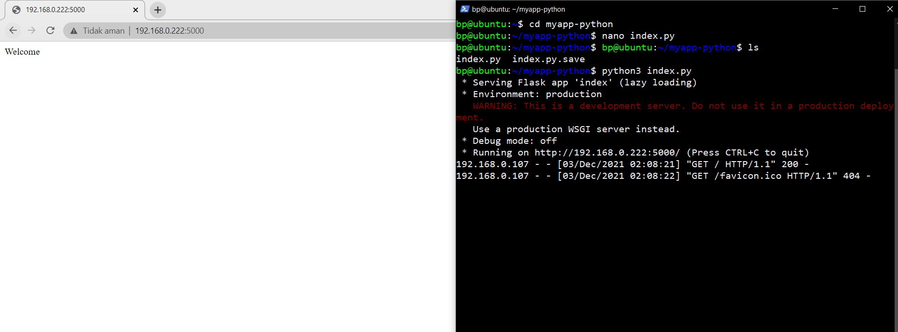

# Golang

Melakukan Instalasi dan Konfigurasi aplikasi sederhana, adapun contoh penerapannya sebagai berikut :

- Melakukan perintah `wget https://go.dev/dl/go1.17.4.linux-amd64.tar.gz`
- Menjalankan perintah `rm -rf /usr/local/go && tar -C /usr/local -xzf go1.17.4.linux-amd64.tar.gz && exit` untuk melakukan extract dan menyalin data
- Menjalankan perintah `nano .bashrc` untuk memasukan `export PATH=$PATH:/usr/local/go/bin` didalamnya
- Menjalankan perintah `go version` untuk mengecek pemasangan dan versi yang telah terpasang

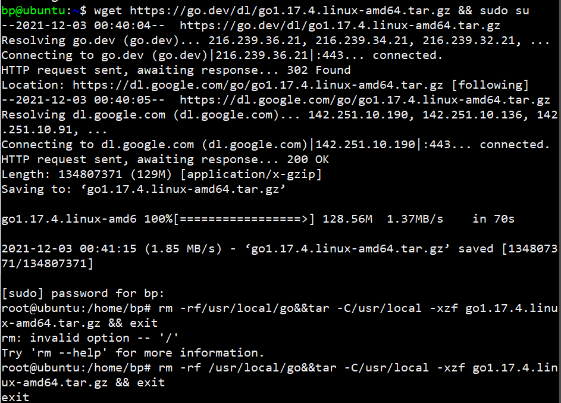

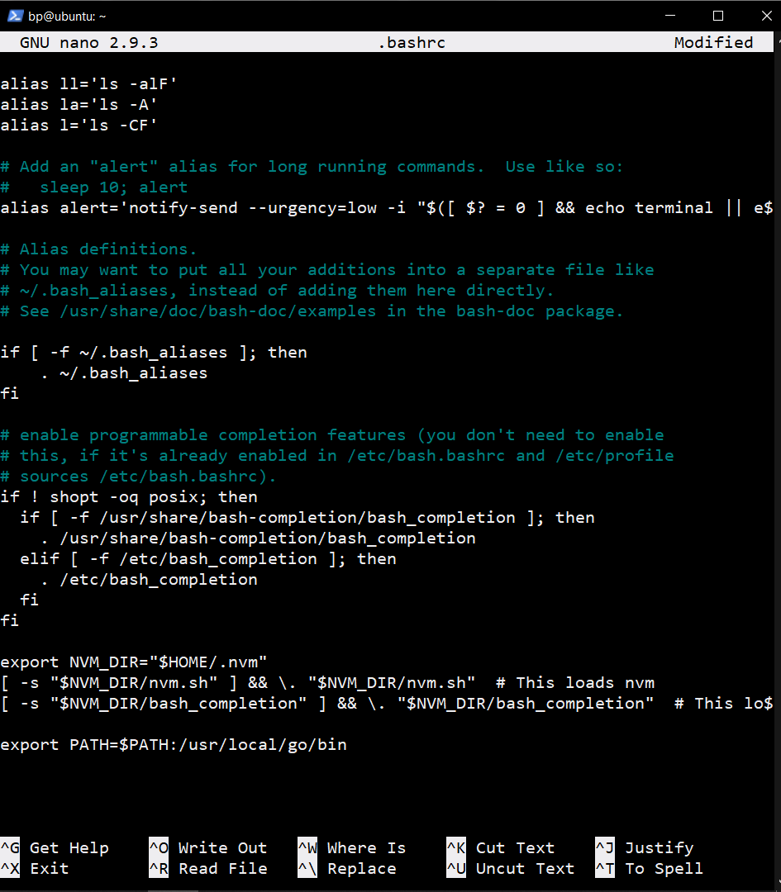

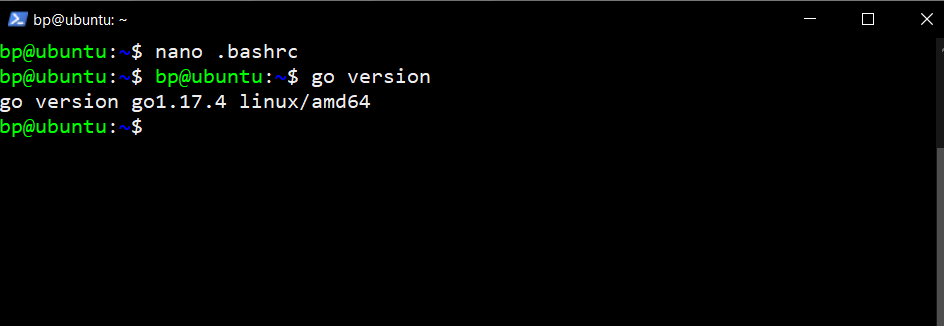

- Membuat direktori dengan menjalankan perintah `mkdir myapp-golang`
- Menjalankan perintah `cd myapp-golang` untuk pindah ke direktori yang telah dibuat
- Menjalankan perintah `nano index.go` untuk melakukan edit dan pembuatan file index.go
- Menjalankan perintah `go run index.go` untuk menjalankan aplikasi yang telah dibuat

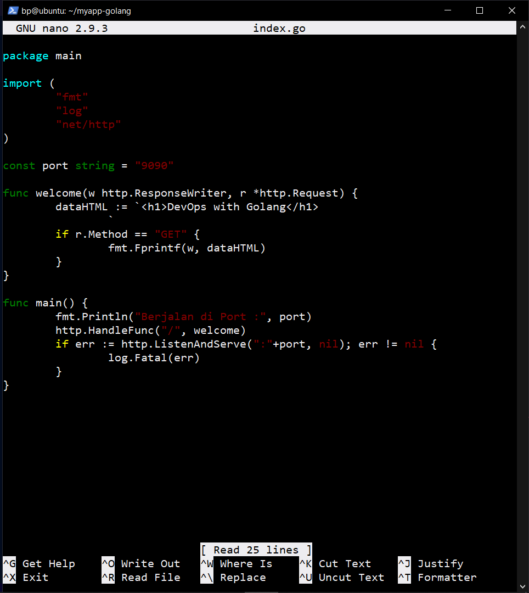

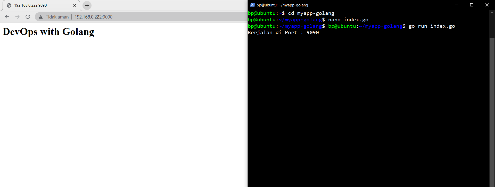
