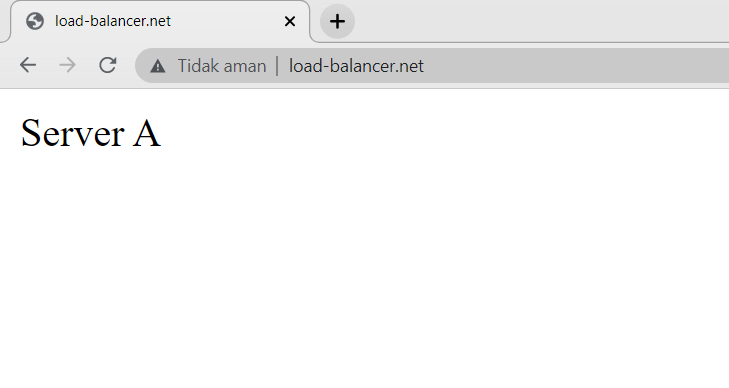

# Dokumentasi Load Balancing

Merupakan proses pembagian beban traffic sebuah aplikasi atau server. Dengan load balancer, salah satu server tidak akan menanggung terlalu banyak beban permintaan.

  

# Metode Load Balancing

- Least Connection : Membagikan beban server berdasarkan server yang mempunyai koneksi paling sedikit di daftar server yang ada.

- Ratio : Membagikan beban server berdasarkan oleh ratio yang diberikan kepada server yang ada. Semakin besar rasio yang dimiliki server, semakin besar beban yang akan diberikan kepada server .

- IP Hash: Alamat IP dari klien menentukan server mana yang akan menerima permintaan.

- Round Robin: Membagikan beban server ke setiap server secara bergantian

# Contoh penerapan metode Round Robin menggunakan Nginx

- Menjalankan perintah `cd /etc/nginx` untuk mengakses direktori nginx

- Menjalankan perintah `sudo mkdir load-balancing` untuk membuat sebuah direktori `load-balancing`

- Menjalankan perintah `sudo nano nginx.conf` untuk melakukan penambahan folder yang telah dibuat kedalam `nginx.conf` dengan memasukan `include /etc/nginx/load-balancing/*;` ke dalam file tersebut

  

  

- Menjalankan perintah `cd load-balancing` untuk berpindah direktori

- Membuat file `sudo nano load.conf` dan melakukan setup didalamnya sesuai kebutuhan

  

  

- Menjalankan perintah `sudo nginx -t` untuk melakukan pengecekan konfigurasi
- Menjalankan perintah `sudo systemctl reload nginx` untuk memuat ulang konfigurasi nginx

  

- Menjalankan server dengan `port 3000 dan port 5000` yang merupakan aplikasi yang telah dibuat sebelumnya

  

  

- Mengakses domain aplikasi `load-balancer.net` pada Web Browser dan memuat ulang pada halaman aplikasi, maka trafik akan diberikan secara bergantian sehingga membentuk sebuah rotation atau putaran dengan menampilkan halaman dari server A dan server B

  

  
