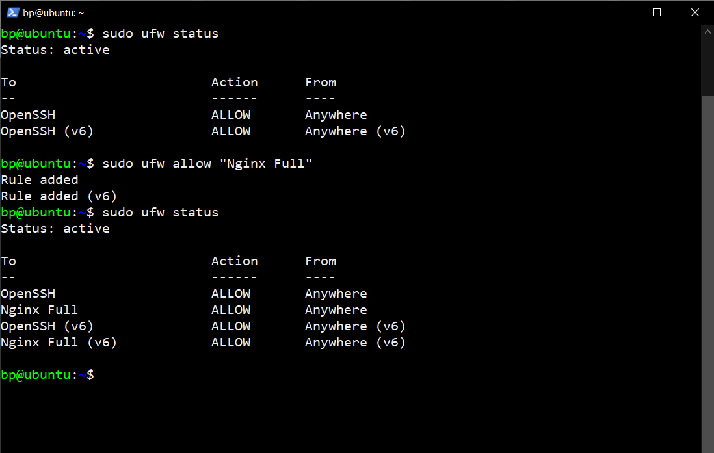

# Dokumentasi Monitoring Aplikasi

# Contoh Penerapan

Ketika akan mengakses suatu aplikasi dengan domain `http://python.bpramadi.net` ternyata aplikasi tersebut menjadi tidak dapat diakses atau mati,

Adapun contoh tahapan untuk melakukan pemantauan dan pengecekan terhadap aplikasi sebagai berikut :

- Mengakses htop dengan menjalankan perintah `htop`
- Melakukan pencarian atau filter apakah aplikasi yang telah dibuat aktif atau tidak dengan menjalankan perintah `f3` atau `F4` dengan pencarian semisal index.py

  

- Apabila terdapat aplikasi yang dimaksud pada list, berarti aplikasi telah berjalan

  

- Jika aplikasi telah berjalan namun pada saat mengakses domain masih belum bisa, maka dapat mengaktifkan web server / nginx terlebih dahulu

  

- Menjalankan perintah `sudo systemctl status nginx` untuk menampilkan status aktif/tidak pada nginx

  

- Menerapkan perintah `sudo systemctl start nginx` untuk menjalankan nginx jika belum dijalankan

  

- Menjalankan perintah `sudo ufw status` untuk menampilkan apakah firewall aktif dan apakah nginx telah berada di list dan memiliki status allow untuk membuka akses

- Menjalankan perintah `sudo ufw allow "Nginx Full` untuk membuka akses

  

- Melakukan pengecekan dengan mengakses aplikasi menggunakan domain tujuan pada web browser apakah sudah aktif atau belum, apabila sudah maka tahapan pemantauan dan pengaktifan aplikasi telah berhasil dilakukan

  
