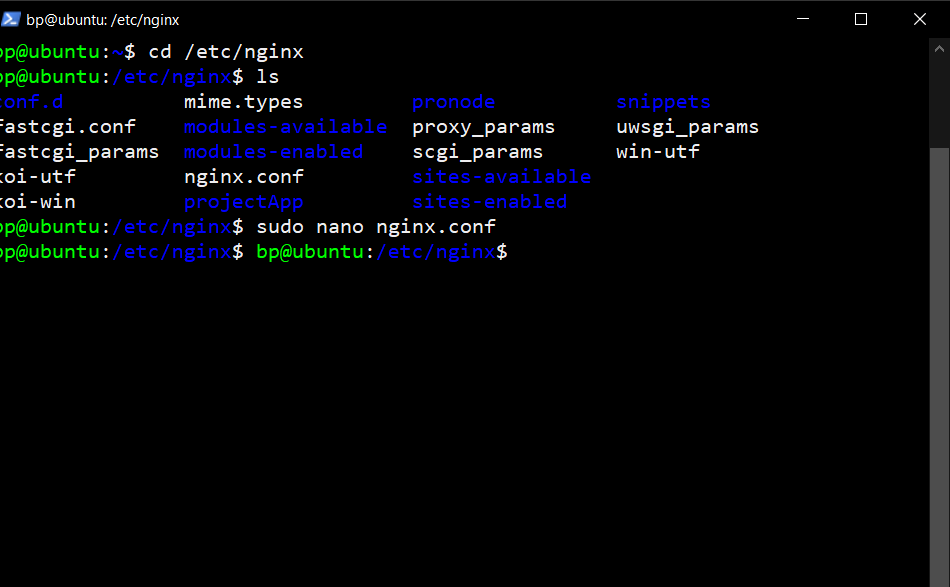
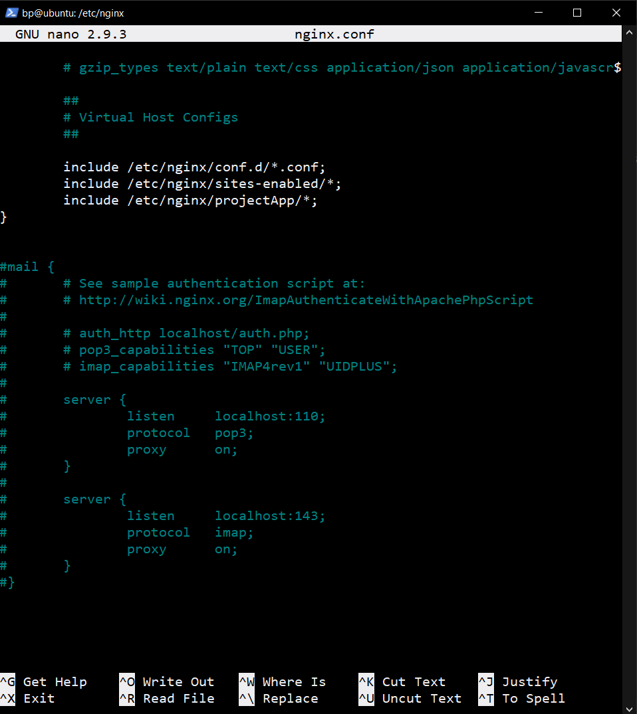
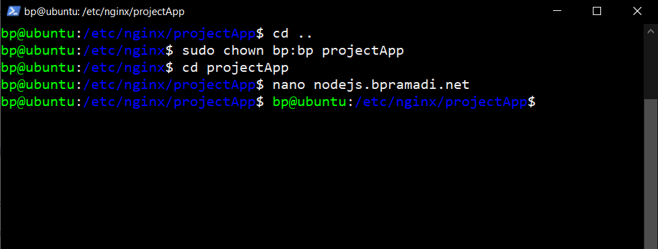
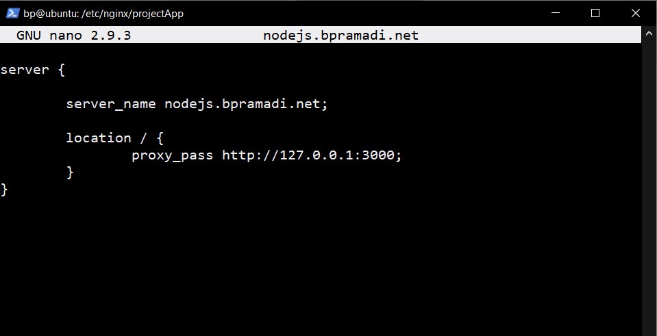
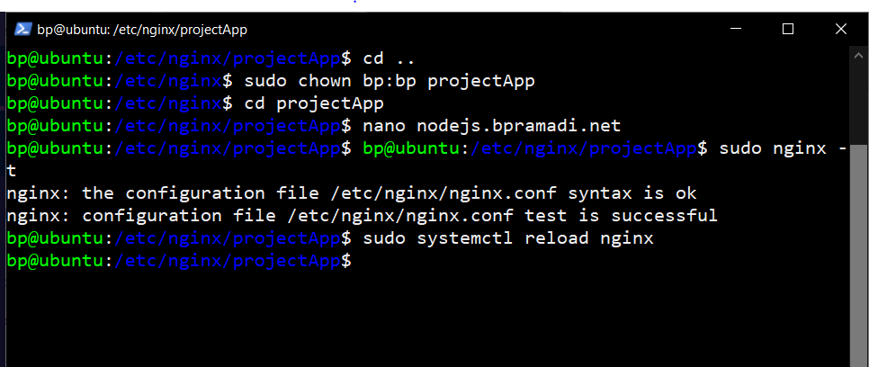
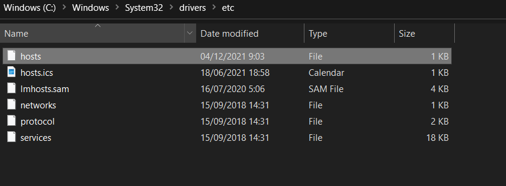
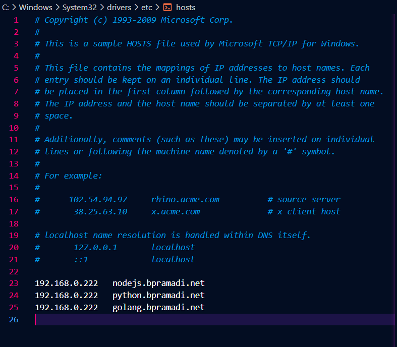
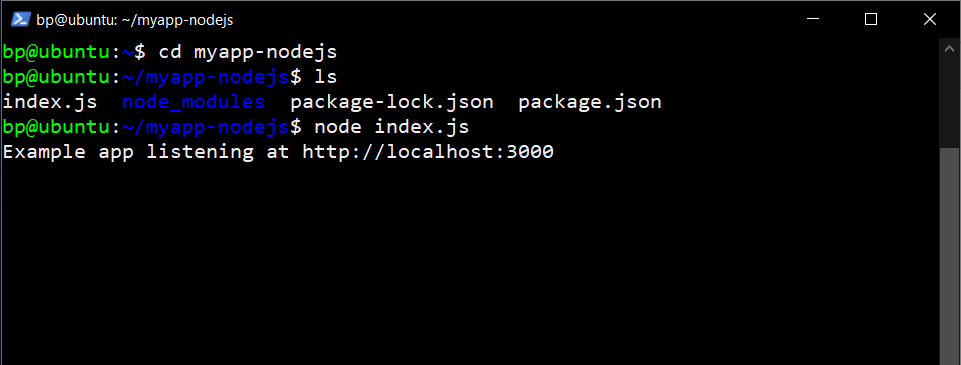
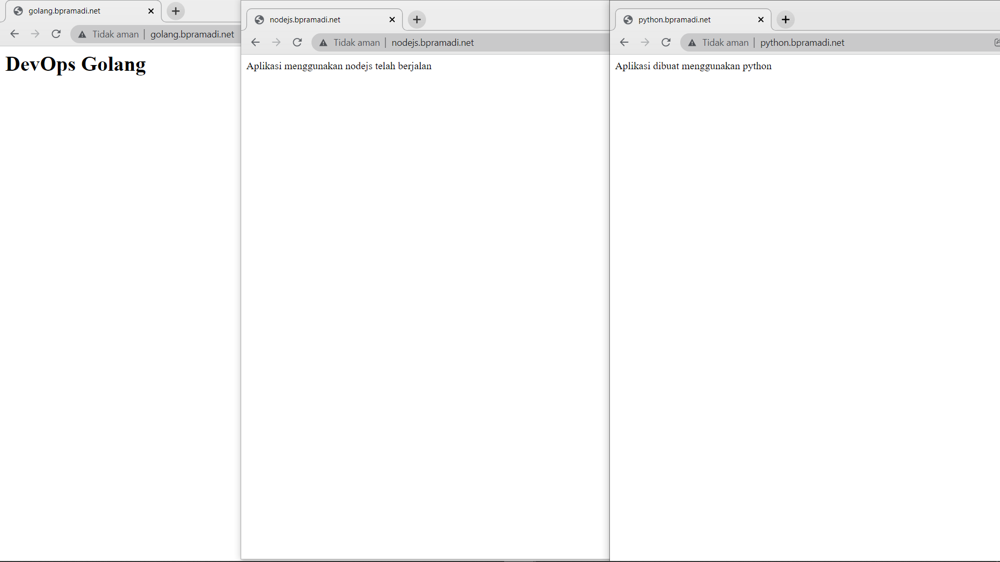

# Dokumentasi Reverse Proxy

Merupakan konfigurasi standar yang digunakan untuk mengubah jalur traffic

# Instalasi dan Konfigurasi

## Adapun langkah-langkah dan contoh penerapannya sebagai berikut :

- Menjalankan perintah `cd /etc/nginx` untuk berpindah direktori
- Menjalankan perintah `sudo mkdir projectApp` untuk membuat sebuah direktori `projectApp`
- Menjalankan perintah `sudo nano nginx.conf` untuk melakukan penambahan folder yang telah dibuat kedalam `nginx.conf` dengan memasukan `include /etc/nginx/projectApp/*;` ke dalam file tersebut

  

  

- Menjalankan perintah `sudo chown user:user folder` untuk mengganti permission pada folder dari root menjadi user ubuntu
- Menjalankan perintah `cd projectApp` untuk berpindah direktori
- Membuat file dan melakukan setup didalamnya sesuai kebutuhan dengan menjalankan perintah `nano nodejs.bpramadi.net` , `nano python.bpramadi.net`. `nano golang.bpramadi.net`

  

  

- Menjalankan perintah `sudo nginx -t` untuk melakukan pengecekan konfigurasi
- Menjalankan perintah `sudo systemctl reload nginx` untuk memuat ulang konfigurasi nginx

# Membuat Domain local

- Menjalankan perintah `sudo nano /etc/hosts`
- Menambahkan ip server dan domain yang akan digunakan ke dalam file `etc/hosts`

### Membuat Domain local OS Windows

- Melakukan penambahan pada file host dengan mengakses `C:\Windows\System32\drivers\etc` pada computer
- Menambahkan ip server dan domain yang akan digunakan ke dalamnya
- Save setiap perubahan pada file

  

  

# Mengakses aplikasi menggunakan Domain

- Menjalankan perintah `node index.js` atau `python3 index.py` atau `go run index.go` sesuai aplikasi yang akan dijalankan pada direktori yang telah dibuat
- Mengakses web browse dan mencatumkan domain yang telah dibuat `nodejs.bpramadi.net` atau `python.bpramadi.net` atau `golang.bpramadi.net`

  

  
